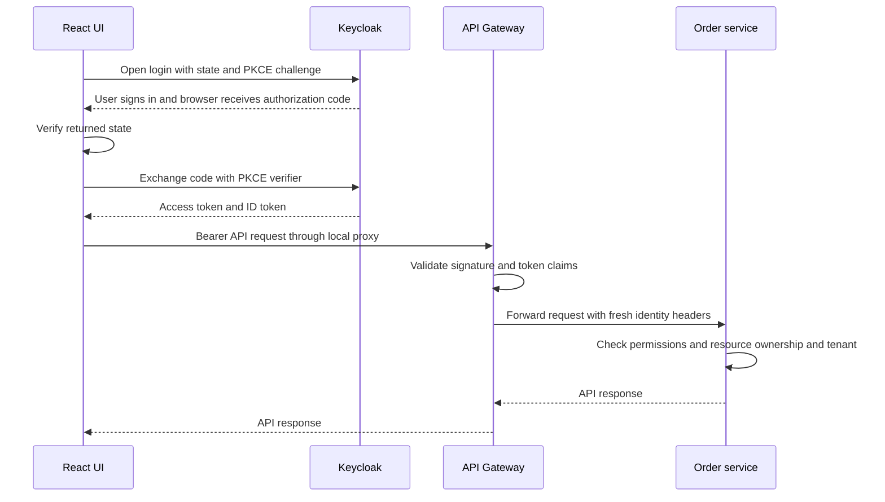
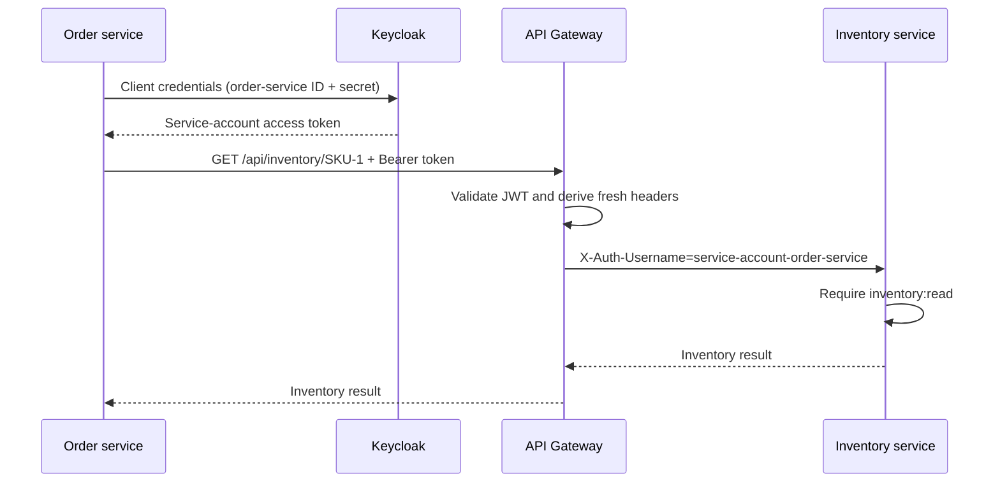

# 05 — Gateway security: from browser login to microservice authorization

Follow one request through this application's security implementation:
**Browser → Keycloak login → Browser → API Gateway → Downstream service → Gateway → Browser**.
Then follow an order-service call to inventory through the same gateway.

This guide explains the concepts, the code that implements them, and how to test
the behavior. Installation, users, credentials and Keycloak configuration live
in the [Keycloak setup guide](../infra-setup/keycloak-setup.md).

## Reading order

1. [Understand the participants and security terms](#1-understand-the-participants-and-security-terms).
2. [Open the UI and sign in with Keycloak](#2-open-the-ui-and-sign-in-with-keycloak).
3. [Send the UI request to the API Gateway](#3-send-the-ui-request-to-the-api-gateway).
4. [Validate the access token at the gateway](#4-validate-the-access-token-at-the-gateway).
5. [Build trusted identity headers at the gateway](#5-build-trusted-identity-headers-at-the-gateway).
6. [Route the request to a downstream service](#6-route-the-request-to-a-downstream-service).
7. [Authorize the operation inside the downstream service](#7-authorize-the-operation-inside-the-downstream-service).
8. [Return the response through the gateway](#8-return-the-response-through-the-gateway).
9. [Call another microservice through the gateway](#9-call-another-microservice-through-the-gateway).
10. [Perform manual verification](#manual-verification--intellij-local-profile).

## 1. Understand the participants and security terms

| Participant | Responsibility in this application |
| --- | --- |
| Browser demo | Sign the user in and send an access token with API requests |
| Keycloak | Authenticate users or service clients and issue signed tokens |
| API Gateway | Validate the token, replace identity headers and route requests |
| Downstream microservice | Check whether this caller may perform the requested operation |

**Authentication** establishes who the caller is. **Authorization** decides what
that caller may do. A valid login does not automatically permit every operation.
For example, `customer1` can read their own order but cannot use the admin endpoint.

| Term | Meaning in this guide |
| --- | --- |
| OAuth 2.0 | The framework used to obtain access tokens for calling APIs |
| OpenID Connect (OIDC) | The identity layer used for user login on top of OAuth 2.0 |
| Access token | The credential sent to the gateway to access an API |
| ID token | Information about the login for the browser client; not the API credential |
| JWT | A signed token format containing claims such as subject, issuer and expiry |
| Claim | A named value inside a token, such as username, tenant or audience |
| Role | A business category such as `customer`, `admin` or `service` |
| Permission | An allowed action such as `orders:read` or `inventory:read` |
| Tenant | A boundary between groups of application data, such as `demo` and `other` |

## 2. Open the UI and sign in with Keycloak

The browser first opens the React application on port 5173. Clicking
**Sign in to your account** redirects the browser to Keycloak. The user enters
credentials on Keycloak's login page; the gateway does not process that password.

After login, Keycloak redirects the browser back with a short-lived authorization
code. The demo checks `state` to associate the response with the login it started,
then exchanges the code with a PKCE verifier for tokens. PKCE binds that code
exchange to the browser that initiated the login. A public browser client cannot
keep a client secret, so this flow uses no secret.

### Complete browser request sequence



The React browser demo runs separately at
`http://localhost:5173/`. It uses public Keycloak client
`security-demo-ui`, Authorization Code with PKCE S256, and an OAuth state value.
It contains no client secret. The Keycloak JavaScript adapter keeps access and
refresh tokens in memory, checks the existing SSO session on reload, and refreshes
the access token before API calls when needed. Vite proxies API requests to the
gateway, so they are same-origin from the browser's perspective. Keycloak allows
the React origin for token exchange.

The frontend implementation is in
[App.jsx](../../ecom-ui/src/App.jsx), with authentication in
[auth.js](../../ecom-ui/src/auth.js) and gateway calls in
[api.js](../../ecom-ui/src/api.js). The
[React project guide](../../ecom-ui/README.md) covers frontend startup and configuration.
The diagram shows the complete journey; the following topics explain each API
request stage in order.

## 3. Send the UI request to the API Gateway

After login, React loads the caller identity with this request:

```http
GET /api/orders/security/me HTTP/1.1
Host: localhost:5173
Authorization: Bearer <access_token>
```

The UI sends same-origin business requests to port **5173**. The Vite proxy
forwards them to gateway port **9100**, preserving the Bearer header. It sends the access
token on each request; the gateway does not use a browser login session to
authenticate subsequent API calls. The UI does not need to construct identity
headers. The gateway derives those from the verified token.

The gateway protects the APIs. The React application's Keycloak adapter performs
the authorization-code exchange directly with Keycloak.

## 4. Validate the access token at the gateway

Before a protected request reaches a downstream service, Spring Security checks
the Bearer token. Reading or decoding a JWT alone is not validation: the signature
must verify, and the token's claims must satisfy the gateway's rules.

| Check | What it establishes |
| --- | --- |
| Signature | The token was signed with a key trusted by this gateway and was not modified |
| Expiry and not-before | The token is within its accepted validity period |
| Issuer (`iss`) | The token came from the expected Keycloak realm |
| Audience (`aud`) | The token is intended for this gateway |

Keycloak publishes public signing keys through a JWK endpoint. The gateway uses
those keys for JWT validation; it does not send the user's password or request
a new token from Keycloak for every API call.

[GatewaySecurity.java](../../gateway-service/src/main/java/com/tip/ecommerce/gateway/security/GatewaySecurity.java)
configures Spring Security's reactive resource server with:

- RSA signature verification through Keycloak's JWK endpoint.
- Standard expiry and not-before timestamp validation.
- Exact issuer `http://localhost:8180/realms/ecommerce`.
- Required audience `gateway-service`, added by a Keycloak audience mapper.
- Stateless Bearer authentication; no form login or HTTP Basic.

The issuer remains the same in both profiles. The signing-key URL is
`http://localhost:8180/realms/ecommerce/protocol/openid-connect/certs` locally and
`http://host.minikube.internal:8180/realms/ecommerce/protocol/openid-connect/certs` in Minikube. A Pod does not fetch
keys from its own localhost. An ID token for `security-demo-ui` is not a gateway
access token and fails the audience check.

Only health endpoints are public on the gateway. All other gateway requests
require a valid JWT. CSRF is disabled for this stateless Bearer API; the browser
authorization flow separately uses PKCE and state.
[Spring reactive JWT resource server](https://docs.spring.io/spring-security/reference/reactive/oauth2/resource-server/jwt.html).

## 5. Build trusted identity headers at the gateway

[IdentityHeadersFilter.java](../../gateway-service/src/main/java/com/tip/ecommerce/gateway/security/IdentityHeadersFilter.java)
runs for routed requests after Spring Security authenticates them. It removes
**all** incoming `X-Auth-*` headers, including unknown ones and duplicate values,
and writes these headers from the validated token:

| Header | Source |
| --- | --- |
| `X-Auth-Subject` | JWT `sub` |
| `X-Auth-Username` | JWT `preferred_username` |
| `X-Auth-Roles` | Business realm roles `admin`, `customer`, `service`; comma-separated |
| `X-Auth-Permissions` | Realm roles containing `:`; comma-separated |
| `X-Auth-Tenant` | Administrator-managed `tenant` claim |
| `X-Auth-Client` | JWT `azp` (authorized client) |

The original `Authorization` header is removed before forwarding. Required
identity claims are checked before being written as HTTP headers. The gateway
does not accept a caller's claimed username, tenant or admin role, even when
they send those headers alongside a valid customer token.

The gateway authenticates and establishes identity. Fine-grained authorization
lives downstream, where resource data is available. Keycloak permissions in
this lab are realm roles such as `orders:read`; they are not UMA/RPT permission
tickets or a Keycloak Authorization Services policy engine.

## 6. Route the request to a downstream service

The gateway uses the request path to select the service. For example,
`/api/orders/security/me` goes to order-service after authentication and identity
header replacement.

| Gateway path | Downstream service | Local port |
| --- | --- | --- |
| `/api/orders/**` | `order-service` | 9101 |
| `/payments/**` | `payment-service` | 9102 |
| `/notifications/**` | `notification-service` | 9103 |
| `/api/products/**` | `product-service` | 9104 |
| `/api/inventory/**` | `inventory-service` | 9105 |

The gateway's profile configuration supplies the downstream addresses. The
`local` profile uses local application ports; the `k8s` profile uses Kubernetes
service names. Order/payment HTTP client configuration points to the gateway
instead of the destination microservice.

### Why downstream services can trust these headers in this POC

Downstream services do not validate JWTs. They assume requests reach them from a
trusted gateway. Their local ports remain callable for learning, and the headers
are not signed: a direct caller can impersonate a user by supplying them.
Gateway header replacement protects requests that pass through the gateway; it
does not protect a service reached directly. Network isolation is a deployment
requirement for this trust model and is not enforced by this implementation.

## 7. Authorize the operation inside the downstream service

Once the request arrives, the service reads the identity headers and evaluates
its own policy. This is where access to business operations and data is decided.

In order-service,
[HeaderAuthorizationConfig.java](../../order-service/src/main/java/com/tip/ecommerce/order/security/HeaderAuthorizationConfig.java)
checks the endpoint's `@RequireAccess` policy, and
[Caller.java](../../order-service/src/main/java/com/tip/ecommerce/order/security/Caller.java)
represents the caller and checks ownership/tenant rules. The other downstream
services implement the same header-based contract.

### Role-based access control (RBAC)

An endpoint can require a role. `/api/orders/security/admin` requires `admin`.
A valid customer token authenticates successfully at the gateway, but the
order-service role check rejects this operation with **403**.

### Permission checks

An endpoint can require an action permission. Creating an order requires
`orders:create`; reading inventory requires `inventory:read`. In this lab,
permissions are Keycloak realm roles with colon-separated names. Customer and
admin composite roles group several permissions together.

If a policy specifies both a role and permissions, both checks must pass.
When several permissions are listed, the interceptor accepts any one of them.
Application controller methods without an explicit policy are denied.

### Attribute-based access control (ABAC)

A role or permission alone is not enough to read a particular order. The service
also compares caller attributes with resource attributes:

- The caller's tenant must match the order's tenant.
- The caller must own the order, unless they have `orders:read:any`.
- Read-any still respects the tenant boundary.

Consequently, customer1 can read their own order, customer2 cannot read it,
and admin1 can read it within tenant `demo`. Admin1 cannot read an order belonging
to tenant `other`. These checks live downstream because that service owns the
order data required to make the decision.

For the full endpoint policies, see
[Authentication and Authorization at Microservice](../security/Authentication%20and%20Authorization%20at%20Microservice.md).

## 8. Return the response through the gateway

When authorization succeeds, the service executes the operation and returns its
response to the gateway, which returns it to the browser. A rejection stops the
operation at the component performing that check.

| Result | Typical meaning in this flow |
| --- | --- |
| `200` / `201` / `202` | Request succeeded, created a resource, or was accepted |
| `401` | Missing or invalid JWT at the gateway; missing identity on a direct downstream call |
| `403` | Required identity claims are invalid, or a role, permission, ownership or tenant check failed |
| `404` | The requested resource does not exist |
| `502` / `503` | A downstream call or machine-token acquisition failed |

For example, an absent token is rejected at the gateway with **401** before
order-service handles the request. A valid customer token calling the admin
endpoint reaches order-service and is rejected there with **403**.

## 9. Call another microservice through the gateway

Sometimes a downstream operation needs another service. For example, the user
calls `/api/orders/{id}/inventory/SKU-1`. After order-service verifies access to
that order, it makes a second HTTP request as its own service account.

**Client credentials** is the OAuth flow for this machine identity. Order-service
sends its client ID and secret to Keycloak, receives an access token, and sends
that token to the gateway. The gateway repeats the same validation, header
replacement and routing steps described above.



Order-service first checks the original user's ownership/tenant for the order.
Only then does it use its own machine credential. It does not copy the original
user's headers into the machine call. The downstream inventory service sees the
service identity, not the original user. This is client credentials, not token
relay or user delegation.

Payment-service's existing order lookup now also travels through the gateway
using payment-service's token. Both HTTP clients use bounded timeouts and cache
service tokens until shortly before expiry. Secrets are sent only to Keycloak,
never as credentials to another application service.

All implemented synchronous HTTP calls use the gateway. Existing asynchronous
`payment-completed` Kafka messages still go through Kafka; they are not HTTP
calls and do not carry these headers. A Kafka listener's trusted processing is
separate from HTTP endpoint authorization.

## Manual verification — IntelliJ local profile

### 1. Test prerequisites

This guide covers security concepts, implementation and verification. Install
infrastructure and configure Keycloak using the
[Keycloak setup guide](../infra-setup/keycloak-setup.md) and the other
[infrastructure setup guides](../infra-setup/README.md). User creation, passwords,
client secrets, role assignments and redirect URI configuration belong there.

For manual testing, use a browser and a terminal with curl; Python 3 is needed
for the machine-token example and automated checks. Postman is optional.
Run the separate [React frontend](../../ecom-ui/README.md) on port 5173.
The gateway no longer contains static demo HTML or JavaScript.

Before testing, shared infrastructure must be running and the following
applications must be running in IntelliJ with JDK 17 and profile `local`.
Minikube and Jenkins are not needed. See the
[local startup checklist](../infra-setup/keycloak-setup.md#local-startup-checklist-for-security-testing)
for startup commands and run configuration instructions.

| Application | Port | Used for |
| --- | --- | --- |
| `product-service` | 9104 | Product permission examples |
| `inventory-service` | 9105 | Inventory permission and machine-call tests |
| `order-service` | 9101 | Identity, RBAC, order ownership and tenant tests |
| `notification-service` | 9103 | Notification API and Kafka consumer |
| `payment-service` | 9102 | Payment API, order lookup and Kafka producer |
| `gateway-service` | 9100 | All API entry points |
| `ecom-ui` | 5173 | React login and authorization test UI |

Check all six backend applications after IntelliJ shows startup completed.
Start React using its project guide; the loop below checks the backend only:

```sh
for port in 9100 9101 9102 9103 9104 9105; do
  printf '\nService on port %s: ' "$port"
  curl --fail --silent --show-error "http://localhost:$port/actuator/health"
done
```

Expect `"status":"UP"` from each. These direct ports are only used for health
checks here; send the business API requests below through port **9100**.

### 2. Test URLs and accounts

| Purpose | URL |
| --- | --- |
| Browser demo — open this to begin | http://localhost:5173/ |
| API base URL | http://localhost:9100 |
| Realm discovery | http://localhost:8180/realms/ecommerce/.well-known/openid-configuration |
| Authorization endpoint — the demo builds its query parameters | http://localhost:8180/realms/ecommerce/protocol/openid-connect/auth |
| Token endpoint | http://localhost:8180/realms/ecommerce/protocol/openid-connect/token |
| Kafka UI — optional for payment events | http://localhost:8089 |

Use the preconfigured accounts `customer1`, `customer2`, `admin1` and
`othercustomer`. Their passwords, assigned roles and tenants are maintained in
[Keycloak setup — Application roles and users](../infra-setup/keycloak-setup.md#application-roles-and-users).
Machine client secrets are maintained in
[Keycloak setup — Client IDs and secrets](../infra-setup/keycloak-setup.md#client-ids-and-secrets).

Open the exact localhost demo URL above. Its sign-in button generates the
OAuth state and PKCE values for the public `security-demo-ui` client. You do not
need to construct the authorization URL manually. These tests use existing
accounts and client registrations; they do not change Keycloak configuration.

### 3. Customer dashboard and order creation

1. Open **http://localhost:5173/** and click **Sign in to your account**.
2. Sign in as `customer1`, using the password in the Keycloak setup guide.
3. Expect a customer dashboard with **My orders**, **Create order**, order counts,
   recent orders and total order value. **Customers** administration is not shown.
4. Click **Create order**. The customer username is read-only and set to `customer1`.
5. Enter `37.50` in **Order amount (USD)** and click **Place order**. The API returns
   **201** and React opens the new order's detail screen. Save the order ID.
6. Open **My orders**, search for the ID and click **View details**. Expect **200**
   for your own order. Use the status filter and pagination to browse other orders.
7. Reload the detail page: the Keycloak session restores login and the route.

The backend also validates positive order amounts, at most two decimal places,
and customer username format. The form reflects these rules. Dashboard totals
are order values, including pending/failed orders, not payment revenue.

### 4. Payment and service-to-service authentication

1. In customer1's pending order detail screen, click **Pay now**.
2. The browser sends `POST /payments` through the gateway. Expect **201** and a
   payment receipt. No card information or real money is involved.
3. Payment-service uses its own client-credentials token to call order-service
   through the gateway; owner/tenant checks still protect the operation.
4. Order confirmation is asynchronous via Kafka. Click **Refresh order** to load
   the server's updated status. Do not assume payment completion and order-status
   change are simultaneous. A repeat successful payment is rejected with **400**.

Payment-service and Kafka must be available for this test. Notification-service
can be run to observe its consumer logs. The order-to-inventory machine-call
example remains available through the API smoke suite; it is not a shopping UI
feature because the current order model has no product line items.

### 5. Ownership and tenant isolation through real screens

Click **Sign out** before switching accounts. Use the saved order ID in these tests.

| User | Action | Expected result |
| --- | --- | --- |
| `customer2` | Open My orders | Customer1's order is absent |
| `customer2` | Open `http://localhost:5173/#/orders/ORDER_ID` | Order unavailable; backend **403** |
| `customer2` | Open `http://localhost:5173/#/customers` | Access restricted; no customer data displayed |
| `admin1` | Search All orders for customer1's order | Visible, with **200** on detail lookup |
| `othercustomer` | List orders or open customer1's detail URL | Order absent from list; detail **403** |

For the reverse tenant check, create an order as `othercustomer`, then open its
ID as `admin1`: expect **403**. An admin can read all customers' orders in their
own tenant; `orders:read:any` never removes the tenant boundary.

### 6. Administrator dashboard and order management

1. Sign in as `admin1`. Expect **Admin dashboard**, **All orders**, **Customers**
   and **Create order** navigation.
2. Inspect counts, pending/confirmed summaries, total order value and recent
   orders across customers in tenant `demo`.
3. Open **Customers** to see summaries derived from existing orders and links
   to each customer's orders. This is not a directory of all Keycloak users.
4. Click **Create order**, enter customer username `customer1`, enter an amount,
   and click **Place order**. Expect **201**, owned by customer1 in tenant `demo`.
5. In order details, select a different **Order status** and click **Update status**.
   Expect **200** and a success message. Supported values are Pending, Confirmed
   and Failed; the current backend does not impose fulfillment transitions.
6. Sign in as customer1 and find the admin-created order and updated status.
   Customers do not see the status-edit form, and a direct customer PATCH is
   rejected by the backend with **403**.

Admin-created owners must be existing usernames from the setup guide. The order
API validates username format but does not query Keycloak to confirm existence.
An order's tenant is always taken from the authenticated caller, never the form.

### 7. Inspect the flow and verify backend protection

Open browser Developer Tools → Network, enable **Preserve log**, then sign in.
The authorization request contains PKCE S256 and state, the redirect returns a
code, and the token exchange happens directly with Keycloak. Requests to port
5173 under `/api` or `/payments` are forwarded by Vite to the gateway on 9100.
The browser sends a Bearer access token; the gateway adds downstream identity
headers. Those server-added headers are not visible as browser-sent headers.

For manual curl/Postman API checks, copy the access token from an authenticated
API request's Authorization header in Developer Tools (omit the `Bearer ` prefix
when setting the variable below). Tokens are credentials; copied values expire
independently of React's automatic refresh.

```sh
ACCESS_TOKEN='PASTE_CUSTOMER1_ACCESS_TOKEN'
curl -i http://localhost:9100/api/orders/security/me \
  -H "Authorization: Bearer $ACCESS_TOKEN" \
  -H 'X-Auth-Username: admin1' -H 'X-Auth-Roles: admin'
curl -i http://localhost:9100/api/orders/security/admin \
  -H "Authorization: Bearer $ACCESS_TOKEN"
unset ACCESS_TOKEN
curl -i http://localhost:9100/api/orders
```

Expect customer1's identity with **200** for the spoofed-header request, **403**
for the customer calling the admin endpoint, and **401** without a token.
In Postman, use **Authorization → Bearer Token** with the same copied value.
Machine token acquisition instructions and client secrets are in the
[Keycloak setup guide](../infra-setup/keycloak-setup.md#request-a-token-curl-or-postman).

### 8. Automated checks and troubleshooting

With the services running, the backend security suite checks JWT validation,
spoofed headers, endpoint permissions, ownership, tenants and machine calls:

```sh
python3 docker/keycloak/security-smoke-test.py
```

The React project's `npm run test:e2e` exercises real customer/admin screens,
including creation, payments, status updates, SSO, refresh, access-denied pages
and mobile layout. See [the React project guide](../../ecom-ui/README.md#verification).
Both suites create persistent learning records.

| Symptom | Check |
| --- | --- |
| Login succeeds but workspace does not load | Gateway and order-service must be running with `local` profile |
| Login redirect is rejected | Use exact URL `http://localhost:5173/` and the current Keycloak setup |
| Empty customer dashboard | This user may have no orders; create a new order |
| Other customers' orders are absent | Expected for customers; admins see all owners only within their tenant |
| Detail shows Order unavailable | Check ID, ownership and tenant; inspect Network for 403 versus 404 |
| Payment fails | Check payment-service, Kafka and the calling service's Keycloak credentials |
| Payment succeeded but status is pending | Confirmation is asynchronous; refresh and check Kafka/order consumer logs |
| Form accepts a request that the backend rejects | Check amount limits, username and permissions; backend remains authoritative |
| Session expired | Sign in again; an invalid refresh session clears the browser's token |

Installation and application startup belong in the
[setup guide](../infra-setup/keycloak-setup.md#local-startup-checklist-for-security-testing).
Detailed screen behavior and current domain limitations are in the
[React project guide](../../ecom-ui/README.md).
