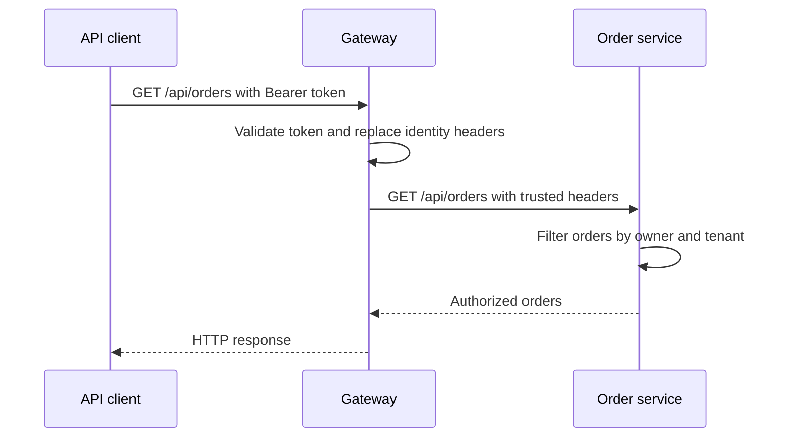

# API gateway: route a business request

## Problem and scenario

The browser should not need the address of every microservice. When a customer
opens My orders, it calls one API entry point. Gateway owns routing; order-service
owns orders. Both customer and service-account calls follow this rule in this POC.

## Core routing flow

The browser calls gateway directly. Vite serves React files only; it does not
forward API requests.



## Browser origin and API destination

React runs at `http://localhost:5173` and sends API requests directly to
`http://localhost:9100`. Gateway allows the UI origin through its CORS policy.
The [API helper](../../ecom-ui/src/api.js) combines the configured `VITE_GATEWAY_URL`
with a validated API path. Product image URLs use the same gateway origin.

For example, My orders sends `GET http://localhost:9100/api/orders`. Browser
DevTools shows port **9100**, and an `OPTIONS` preflight may precede the GET
because the request carries an Authorization header. Gateway answers preflight
before JWT authentication; the subsequent GET still requires a valid token.
See [CORS and preflight](09-cors-preflight-and-browser-security.md) for the code,
configuration and manual tests. Postman and service clients call the same gateway
without browser CORS enforcement.

## Gateway configuration

Shared routes are declared under `spring.cloud.gateway.server.webflux.routes`.
The default profile is `local`; minikube explicitly activates `k8s`. Service
addresses, JWT/CORS settings and gateway logging levels belong to the profile
files, while route paths and the common server port remain shared.

Excerpt from [application.yml](../../gateway-service/src/main/resources/application.yml) (surrounding code omitted):

```yaml
- id: order-service
  uri: ${services.order.url}
  predicates:
    - Path=/api/orders/**
```

`Path` selects a route. `${services.order.url}` selects the destination for the
active profile. The original `/api/orders` path is preserved; there is no
`StripPrefix` or `RewritePath` in these routes.

Excerpt from [application-local.yml](../../gateway-service/src/main/resources/application-local.yml) (surrounding code omitted):

```yaml
services:
  order:
    url: http://localhost:9101
```

Excerpt from [application-k8s.yml](../../gateway-service/src/main/resources/application-k8s.yml) (surrounding code omitted):

```yaml
services:
  order:
    url: http://order-service:9101
```

The local address reaches IntelliJ. The k8s address reaches a Kubernetes Service;
`localhost` in a gateway Pod would refer to that Pod instead of order-service.

## Downstream implementation

Excerpt from [OrderController.java](../../order-service/src/main/java/com/tip/ecommerce/order/controller/OrderController.java) (surrounding code omitted):

```java
@RequestMapping("/api/orders")
public class OrderController {
```

The controller mapping matches the gateway's forwarded path. Authentication is
explained in [gateway security](03-gateway-security-oauth2-oidc-jwt.md); business
policies are explained in [downstream authorization](../security/Authentication%20and%20Authorization%20at%20Microservice.md).

## Observe and diagnose

Run Portal base from the [flow checklist](../project-docs/business-flows-and-service-dependencies.md).
Sign in, open My orders, and inspect Network for `/api/orders`. Expect the request
URL `http://localhost:9100/api/orders`. A direct Postman check uses the same URL
and a valid Bearer token. A missing token
is rejected before routing to business code. With valid authentication, an unmatched
path normally returns 404; a matched route with a stopped backend fails instead
of creating an order. Inspect logs for the actual status rather than assuming
every unavailable dependency maps to the same HTTP code.

All eight downstream routes are in the linked YAML. More advanced predicates,
route rewriting and load-balancer URIs are not currently configured.
