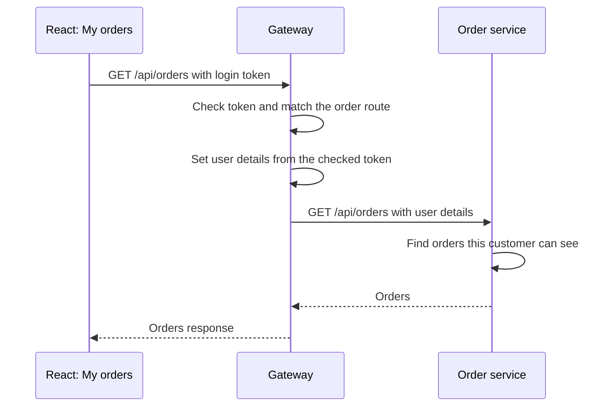

# 01. Basic routing: sending a request to the right service

## 1. Problem and scenario

An online shop has different services for orders, payments and products. The
frontend needs data from these services, but it should not need to know each
service's address.

We give the frontend one address: **API gateway**. Gateway receives a request and
sends it to the right service. This is called **routing**. A route is a rule that
connects a request path to a service address.

For example, when a customer opens My orders, React asks gateway for `/api/orders`.
Gateway sends that request to order-service. Order-service finds the orders and
returns them through gateway.

## 2. Core routing flow



Gateway checks the login token before allowing this protected request. It then
uses the request path to choose order-service. It replaces user details sent by
the caller with details from the checked token.

Order-service decides which orders the customer can see. Gateway does not read
the order database or decide who owns an order. It sends the service's response
back to React. This is a normal HTTP call: React waits for a response. Kafka is
not involved in reading the orders.

## 3. Browser address and API address

React runs at `http://localhost:5173`. It calls gateway directly at
`http://localhost:9100`, for example:

```text
GET http://localhost:9100/api/orders
```

The [React API helper](../../ecom-ui/src/api.js) adds the configured gateway address
to the API path. Vite serves the React files; it does not forward API requests.

The browser also checks whether the frontend is allowed to read gateway's response.
That is explained separately in [CORS and preflight](09-cors-preflight-and-browser-security.md).

## 4. Gateway configuration

The routes are defined in
[application.yml](../../gateway-service/src/main/resources/application.yml).
This excerpt shows only the order route; the other routes are omitted:

```yaml
spring:
  cloud:
    gateway:
      server:
        webflux:
          routes:
            # A name used to identify this route.
            - id: order-service
              # Read the destination address from the active profile.
              uri: ${services.order.url}
              predicates:
                # Match /api/orders and paths below it, such as /api/orders/41.
                - Path=/api/orders/**
```

A **predicate** is a condition used to choose a route. Here, `Path` checks the URL
path. `uri` tells gateway where to send the matching request.

The same route is used in both environments. Only the destination address changes.
These are excerpts from the profile files:

[application-local.yml](../../gateway-service/src/main/resources/application-local.yml):

```yaml
services:
  order:
    # Reach order-service running locally, for example from IntelliJ.
    url: http://localhost:9101
```

[application-k8s.yml](../../gateway-service/src/main/resources/application-k8s.yml):

```yaml
services:
  order:
    # Reach order-service by its Kubernetes Service name inside minikube.
    url: http://order-service:9101
```

The default profile is `local`. The Kubernetes deployment selects `k8s`.
Inside a gateway Pod, `localhost` points back to that Pod, so it cannot be used
as the address of a separate order-service Pod.

Gateway keeps the path unchanged. `/api/orders/41` reaches order-service as
`/api/orders/41`. Our routes do not remove `/api` or rename the path.

## 5. How order-service receives the request

[OrderController.java](../../order-service/src/main/java/com/tip/ecommerce/order/controller/OrderController.java)
uses the same path. This shortened excerpt shows the class mapping:

```java
@RequestMapping("/api/orders") // Receive order requests at this path.
public class OrderController {
    // ... methods omitted ...
}
```

Its `@GetMapping` method handles the list request. Because the gateway path and
controller path agree, gateway does not need to change the URL.

For the token checks, see [gateway security](03-gateway-security-oauth2-oidc-jwt.md).

## 6. How to test

Run React, gateway, order-service, Keycloak and PostgreSQL. Use the
[setup guide](../infra-setup/commerce-setup.md) for startup steps and
[Keycloak guide](../infra-setup/keycloak-setup.md#application-roles-and-users) for login details.

1. Open `http://localhost:5173/` and sign in as `customer1`.
2. Open browser **Developer Tools → Network** and filter for `/api/orders`.
3. Open **My orders**. If the page has already loaded, reload it with Network open.
4. Select the **GET** request. Its URL should be
   `http://localhost:9100/api/orders`, and its response status should be `200`.
5. Open **Response**. Expect the customer's orders, or an empty list if no orders
   exist. The My orders page should show the same result.
6. In the gateway console, look for the route match named `order-service`.
   The local profile enables gateway debug logs so you can see this selection.

The browser shows the gateway URL, not the internal call to order-service.
The route match and the returned orders help you follow both parts of the flow.
If you receive `401`, sign in again. If the service call fails, first check that
order-service is running at the address in the active gateway profile.

## 7. Summary and interview explanation

> Consider an e-commerce application with separate services for orders, products
> and payments. If the frontend calls each service directly, it needs to know
> several addresses. A change in a service address can then affect the frontend.
>
> An API gateway gives the frontend one entry point. For example, customers use
> `shop.example.com`, and the frontend calls APIs through `api.example.com`.
> When a customer opens My Orders, it sends a GET request for `/api/orders` to
> gateway. It does not need to know where order-service is running.
>
> Gateway has route rules. Each rule has a name, a condition and a destination.
> The condition decides whether the request belongs to that route. The destination
> tells gateway where to send it. In our project, the order route uses a Path
> condition that matches `/api/orders` and paths below it.
>
> For a protected request, gateway first checks the login token. After the route
> is selected, our filter adds the verified user details before the request reaches
> order-service. Order-service then checks which orders the user can see and reads
> the data. The response travels back through gateway to the frontend.
>
> Routing and business work have different responsibilities. Gateway chooses the
> service. Order-service owns the order data and access rules. Gateway does not
> fetch orders from the database itself.
>
> We keep route paths in the common configuration and service addresses in
> environment-specific profiles. This lets us use the same API path while changing
> where the service runs. In Kubernetes, gateway uses the order service's internal
> Service name. The frontend continues to call the gateway address.
