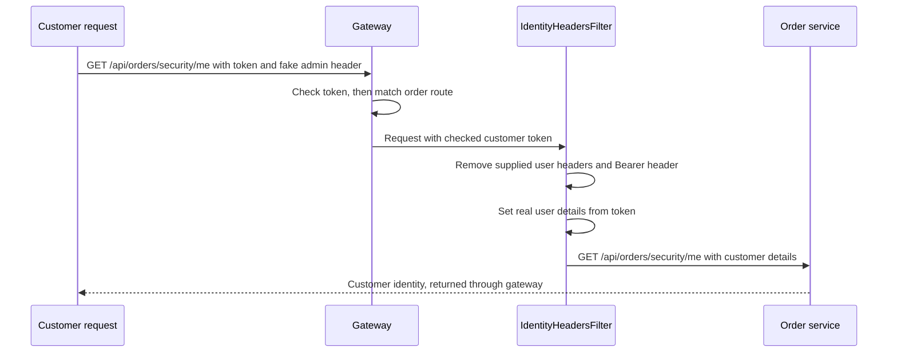

# 02. Predicates and filters: choosing a service and preparing the request

## 1. Problem and scenario

Gateway needs to answer two different questions:

- **Where should this request go?** A predicate checks a condition, such as the
  request path, to help choose a route.
- **What should happen before or after forwarding it?** A filter can check or
  change the request or response.

Our example uses both. A request for `/api/orders` must go to order-service.
Before sending it there, gateway must provide the correct user details.

Suppose a customer sends a header saying `X-Auth-Roles: admin`. A header is extra
information sent with an HTTP request. The customer must not become an admin just
because they typed that value. Our filter removes the supplied user details and
sets them again using the checked login token.

## 2. Route predicate in gateway-service

This excerpt from
[application.yml](../../gateway-service/src/main/resources/application.yml)
shows one entry in `spring.cloud.gateway.server.webflux.routes`:

```yaml
- id: order-service
  # Send matching requests to this service address.
  uri: ${services.order.url}
  predicates:
    # Choose this route for /api/orders and paths below it.
    - Path=/api/orders/**
```

For example, both `/api/orders` and `/api/orders/41` match this rule.
`/api/products` does not match it; that path has a separate route.

Our route configuration uses only `Path` conditions. It does not select routes
by HTTP method, headers or query values. A path match chooses a service; it does
not give the caller permission to use that service's APIs.

## 3. Global identity filter in gateway-service

A **global filter** applies to all matched gateway routes. Our
`IdentityHeadersFilter` prepares the user details for the receiving service.



Spring Security checks the token first. After gateway chooses the route,
`IdentityHeadersFilter` removes every incoming header whose name starts with
`X-Auth-`. It then adds the real username, role and other details from the token.
The customer-supplied `admin` value is replaced.

The filter also removes `Authorization` before forwarding the request. In this
POC, the receiving service uses gateway's user headers rather than checking the
token again.

The following is a shortened excerpt from
[IdentityHeadersFilter.java](../../gateway-service/src/main/java/com/tip/ecommerce/gateway/security/IdentityHeadersFilter.java).
It shows only the header changes inside `filter()`; it is not a complete class:

```java
public class IdentityHeadersFilter implements GlobalFilter, Ordered {
    // ... filter() gets user details from the checked token above this code ...

    // Inside the request's headers callback:
    new ArrayList<>(headers.keySet())
        .stream()
        // Find all user-detail headers supplied by the caller.
        .filter(k -> k.toLowerCase(Locale.ROOT).startsWith("x-auth-"))
        .forEach(headers::remove);

    // The receiving service uses our user headers, not the original token.
    headers.remove("Authorization");
    // Set these values using the checked token, not the caller's headers.
    headers.set("X-Auth-Subject", subject);
    headers.set("X-Auth-Username", username);
    headers.set("X-Auth-Tenant", tenant);

    // ... role, permission and client headers are also set ...
    // ... filter() passes the updated request to the next filter ...
}
```

The filter's `getOrder()` returns `-100`. This controls its position among gateway
filters; lower numbers run earlier on the request. It does not replace Spring
Security's token check, which happens separately before this routing work.

Public product images use a separate branch in this filter. That branch removes
user and token headers without requiring a login. It does not make the other
product APIs public.

## 4. How order-service uses the result

[Caller.java](../../order-service/src/main/java/com/tip/ecommerce/order/security/Caller.java)
reads the headers. This is an excerpt from its `from()` method; the record
fields and remaining methods are omitted:

```java
public record Caller(/* ... fields omitted ... */) {
    public static Caller from(HttpServletRequest request) {
        // Read the user details supplied by gateway.
        String subject = request.getHeader("X-Auth-Subject");
        String username = request.getHeader("X-Auth-Username");
        String tenant = request.getHeader("X-Auth-Tenant");

        // Reject the request if required user details are missing.
        if (subject == null || subject.isBlank() || username == null || username.isBlank()
                || tenant == null || tenant.isBlank()) {
            throw new ResponseStatusException(
                HttpStatus.UNAUTHORIZED, "Gateway identity headers required");
        }
        // ... return the caller details, including roles and permissions ...
    }
}
```

`subject` is the user's ID. `tenant` identifies the group or organisation the user
belongs to; our example uses `demo`. Order-service uses these details for its
access checks. For example, its admin API requires the `admin` role.

This design assumes requests reach the service through gateway. The service cannot
prove that these headers came from gateway. Our POC allows direct service access
for learning; a production setup also needs network rules to prevent callers from
bypassing gateway.

## 5. How to test

Run React, gateway, order-service, Keycloak and PostgreSQL. Startup steps are in
[commerce setup](../infra-setup/commerce-setup.md), and login details are in
[Keycloak setup](../infra-setup/keycloak-setup.md#application-roles-and-users).
Use the browser to get your customer token and Postman to add the test header.

1. Sign in as `customer1` at `http://localhost:5173/`. In browser
   **Developer Tools → Network**, open My orders and select its GET request.
2. Under **Request Headers**, copy the token after `Bearer` in `Authorization`.
3. In Postman, create a GET request to
   `http://localhost:9100/api/orders/security/me`. In **Authorization**, select
   **Bearer Token** and paste the token.
4. In **Headers**, add `X-Auth-Roles` with value `admin`, then send the request.
   Expect `200`. The response should still show username `customer1` and the
   `customer` role, not `admin`.
5. Keep the same token and fake header. Change the URL to
   `http://localhost:9100/api/orders/security/admin` and send it. Expect `403`:
   order-service does not allow this customer to use the admin API.

Both paths match the order route. The first result shows that gateway replaced
the fake header. The second shows that order-service still applies its role check.
If you receive `401`, copy a fresh token after signing in again.

## 6. Summary and interview explanation

> In an e-commerce application, gateway receives requests for many services. It
> needs a way to choose the correct service and a way to prepare the request before
> forwarding it. Predicates and filters help with these two tasks.
>
> A predicate is a condition used to select a route. For example, our order route
> checks whether the path is `/api/orders` or a path below it. If it matches, gateway
> chooses the configured order-service address. This condition only chooses where
> to send the request. It does not decide whether the user is allowed to access
> the orders.
>
> A filter performs work on a request or response. In our project, an important
> example is the identity filter. After Spring Security checks the login token,
> the filter takes the user details from that token and adds them as headers for
> the receiving service. These details include the username, role, permissions
> and tenant, which identifies the user's group or organisation.
>
> We cannot simply trust user details sent by the caller. For example, a customer
> could send a header saying their role is admin. Our filter first removes the
> supplied identity headers. It then sets them again using the checked token.
> The customer remains a customer, even if the request contains a fake admin header.
>
> This is a global filter, so we do not need to repeat the same header-handling
> code in every route. Token validation is still a separate responsibility handled
> by Spring Security. The filter uses the result of that check; it does not check
> the token's signature itself.
>
> Order-service reads the user headers and applies its own access rules. For
> example, the admin API requires an admin role. This means route selection, user
> verification and business access checks each have a clear job.
>
> To test this, I would send a customer token and a fake admin header through
> gateway. The identity API should still show the customer, and the admin API
> should return 403. That demonstrates both header replacement and the role check.
>
> One important condition is that services must be protected from direct access
> in a production setup. Otherwise, someone could skip gateway and send fake
> headers directly. Our POC leaves that access open for learning, so it demonstrates
> the application flow without claiming to have that production network protection.
