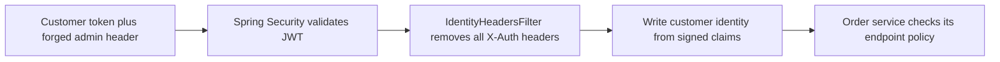

# Predicates and filters: choose a route, then prepare the request

## Problem and scenario

A route predicate answers “does this request belong here?” A filter modifies or
examines a routed request/response. Our security scenario needs both: select
order-service by path, then ensure the caller cannot impersonate an admin by
supplying `X-Auth-Roles: admin`.

## Route predicate in gateway-service

Excerpt from [application.yml](../../gateway-service/src/main/resources/application.yml) (surrounding code omitted):

```yaml
- id: order-service
  uri: ${services.order.url}
  predicates:
    - Path=/api/orders/**
```

Only `Path` predicates are configured. There are no method/header/query predicates,
path-rewrite filters or route-specific rate limiters in the current YAML.

## Global identity filter in gateway-service

Excerpt from [IdentityHeadersFilter.java](../../gateway-service/src/main/java/com/tip/ecommerce/gateway/security/IdentityHeadersFilter.java) (surrounding code omitted):

```java
new ArrayList<>(headers.keySet())
    .stream()
        .filter(k -> k.toLowerCase(Locale.ROOT).startsWith("x-auth-"))
        .forEach(headers::remove);
headers.remove("Authorization");
headers.set("X-Auth-Subject", subject);
headers.set("X-Auth-Username", username);
```

The excerpt deletes caller-supplied identity headers and the original Bearer
header before setting identity derived from the authenticated JWT. The rest of
the method sets tenant, business roles, permissions and authorized client.



Spring Security's `SecurityWebFilterChain` performs authentication; it is distinct
from Gateway's `GlobalFilter` chain. This global filter has order `-100` within
the Gateway filter chain. It does not replace JWT signature validation.

## How the receiving service uses the result

Excerpt from [Caller.java](../../order-service/src/main/java/com/tip/ecommerce/order/security/Caller.java) (surrounding code omitted):

```java
String subject = request.getHeader("X-Auth-Subject");
String username = request.getHeader("X-Auth-Username");
String tenant = request.getHeader("X-Auth-Tenant");
if (subject == null || subject.isBlank() || username == null || username.isBlank()
        || tenant == null || tenant.isBlank()) {
    throw new ResponseStatusException(HttpStatus.UNAUTHORIZED, "Gateway identity headers required");
}
```

Order-service requires these fields; it cannot independently prove who created
them. Direct downstream ports therefore remain an intentional header-spoofing
bypass in this local POC. ClusterIP alone does not enforce gateway-only access.

## Verify the concept

Use the spoofed-header curl request in [gateway security](03-gateway-security-oauth2-oidc-jwt.md#manual-verification).
The identity must remain customer1 and the admin endpoint must return 403.
Public image requests have a separate filter branch which strips both Bearer and
identity headers without requiring a logged-in principal. Health endpoints are
also public. There is no general public catalog API.

A future `StripPrefix=1` would remove `/api` and break the current order controller
mapping. Learn rewriting as a separate experiment rather than copying obsolete
`/orders` examples into this configuration.
