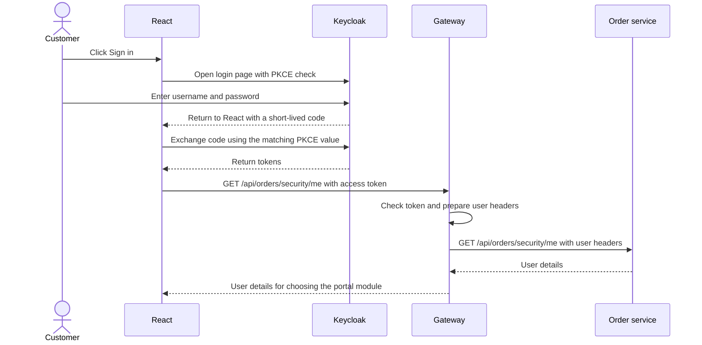

# 03. Gateway security: OAuth2, OIDC and JWT

## 1. Problem and business scenario

A customer signs in to an online shop and opens My orders. How does the application
know who is calling? How does it stop that customer from reading another
customer's orders?

We divide this work between three parts:

- **Keycloak** checks the login details and gives the application a token.
- **Gateway** checks the token before allowing a protected API request.
- **Order-service** checks which orders that user can see.

**Authentication** means checking who is calling. **Authorization** means checking
what that caller is allowed to do. Signing in does not give someone access to
everything.

These names describe different parts of the solution:

| Name | Simple meaning in this project                                                                                                   |
| --- |----------------------------------------------------------------------------------------------------------------------------------|
| OAuth2 | It's a Protocal or Rules for getting and using an access token to call an API.                                                   |
| OIDC (OpenID Connect) | Adds login and user identity to OAuth2. Our browser login uses it.                                                               |
| JWT (JSON Web Token) | The format of our access token. It contains details such as user ID and expiry time, with a digital signature to detect changes. |

A JWT is not a hidden password. Its contents can be read. Gateway must check its
signature and other required values before trusting it.

Installation, accounts, roles and passwords are in
[Keycloak setup](../infra-setup/keycloak-setup.md). This guide follows the request
from login to the service response.

## 2. Browser login: getting the token

The React app sends the customer to Keycloak to sign in. It does not collect the
password and send it to each microservice.



This login flow is called **Authorization Code with PKCE**. Instead of returning
the access token in the page URL, Keycloak returns a short-lived code. The React
Keycloak library exchanges that code for tokens.

**PKCE** adds a check to this exchange. The library creates a random value before
login and sends a value calculated from it. When exchanging the code, it sends
the original value. Keycloak checks that the values match. Someone who gets only
the code cannot complete the exchange without that original value.

The browser app has no client secret because code running in a browser cannot
keep such a secret from its users.

In [auth.js](../../ecom-ui/src/auth.js), the Keycloak library is started with these
settings. This is an excerpt from `initializeAuth()`:

```javascript
const authenticated = await auth.init({
  onLoad: 'check-sso', // Check whether a Keycloak login already exists.
  pkceMethod: 'S256', // Enable the PKCE check described above.
  responseMode: 'query', // Receive the login code in the return URL.
  checkLoginIframe: false, // Do not use a hidden frame to check login status.
  redirectUri, // Return to the React application after login.
});
```

The library keeps tokens in memory. The application does not save them in local
storage. Before an API call, `accessToken()` asks the library to refresh the token
if it has less than 30 seconds left. If that fails, the user must sign in again.

The **access token** is for API calls. The **ID token** describes the user's login;
we do not use it as the API token. The **refresh token** lets the library ask
Keycloak for a new access token.

Login and token requests go directly to Keycloak. Business API requests go to
gateway. Browser permission checks are explained in the separate
[CORS guide](09-cors-preflight-and-browser-security.md).

## 3. Attach the token to an API request

The [React API helper](../../ecom-ui/src/api.js) adds the access token to the
request headers. A header carries extra information with an HTTP request.

```javascript
const token = await getToken(); // Get a current access token.
const headers = { Authorization: `Bearer ${token}` }; // Send it to gateway.
```

`Bearer` means the caller is presenting this token to access the API. Our helper
uses the configured gateway address and accepts only the application's API paths.

After login, `SessionProvider` calls `/api/orders/security/me` to read the user
details. Both gateway and order-service must therefore run for the signed-in
portal to open. The frontend uses the role to choose the customer or admin module,
but backend checks still control access to the APIs.

## 4. Validate the token at gateway

[GatewaySecurity.java](../../gateway-service/src/main/java/com/tip/ecommerce/gateway/security/GatewaySecurity.java)
creates the token checker in `jwtDecoder()`. A token's stored values are called
**claims**. Gateway checks the following before accepting the token:

| Check | Question it answers |
| --- | --- |
| Signature | Was this token signed with the trusted Keycloak key, and has it stayed unchanged? |
| Issuer (`iss`) | Did it come from the Keycloak realm we trust? |
| Time values | Has it expired, or is it too early to use it? |
| Audience (`aud`) | Is it meant for `gateway-service`? |

Reading the token's contents alone does not perform these checks.

The following shows the full `jwtDecoder()` method with shorter imported type
names for readability. Imports and unrelated methods are omitted. The comments
are for this guide; the Java class is unchanged.

```java
@Configuration
public class GatewaySecurity {
    @Bean
    ReactiveJwtDecoder jwtDecoder(
            @Value("${security.jwt.issuer}") String issuer,
            @Value("${security.jwt.jwk-set-uri}") String keys,
            @Value("${security.jwt.audience}") String audience) {

        // Get Keycloak's public keys to check token signatures.
        var decoder = NimbusReactiveJwtDecoder.withJwkSetUri(keys).build();

        // Check that this token is meant for our gateway.
        OAuth2TokenValidator<Jwt> aud = jwt ->
                jwt.getAudience().contains(audience)
                    ? OAuth2TokenValidatorResult.success()
                    : OAuth2TokenValidatorResult.failure(
                        new OAuth2Error("invalid_token", "Wrong audience", null));

        // Require both checks: issuer/time checks and the audience check.
        decoder.setJwtValidator(new DelegatingOAuth2TokenValidator<>(
                JwtValidators.createDefaultWithIssuer(issuer),
                aud));
        return decoder;
    }

    // ... other methods omitted ...
}
```

Keycloak signs tokens with a private key. Gateway uses the matching public key
to check them. The `jwk-set-uri` setting points to the URL that provides these
public keys. Gateway does not send the user's password to Keycloak for each API
call.

The issuer, key URL and audience come from the active profile:
[local](../../gateway-service/src/main/resources/application-local.yml) or
[k8s](../../gateway-service/src/main/resources/application-k8s.yml). Both trust the
same Keycloak realm, but use a key URL they can reach from their environment.
The exact addresses are explained in
[Keycloak setup](../infra-setup/keycloak-setup.md#intellij-and-minikube-access-one-instance-one-issuer).

The `security()` method connects this token check to incoming requests. This is
only its relevant portion, not a replacement for the full method:

```java
// Inside GatewaySecurity.security():
.authorizeExchange(ex -> ex
    // Images and health checks can be requested without signing in.
    .pathMatchers("/api/products/images/**").permitAll()
    .pathMatchers("/actuator/health", "/actuator/health/**").permitAll()
    // All other requests need a valid login or service token.
    .anyExchange().authenticated())
// Use JWT access tokens and the jwtDecoder bean shown above.
.oauth2ResourceServer(oauth -> oauth.jwt(jwt -> {}))
```

Gateway does not save a login session for these API calls. Each protected request
must send its token. CORS runs before the token check so gateway can answer a
browser's OPTIONS permission request without requiring a token in that request.

## 5. Replace caller-supplied headers with checked user details

A caller could send `X-Auth-Roles: admin` even though they are a customer.
Gateway must not trust that value.

After token validation,
[IdentityHeadersFilter.java](../../gateway-service/src/main/java/com/tip/ecommerce/gateway/security/IdentityHeadersFilter.java)
removes the caller's `X-Auth-*` headers and writes user details from the checked
token. It also removes the original `Authorization` header before forwarding.
The receiving service uses the new headers rather than checking the token again.

| Header sent to the service | Meaning and source |
| --- | --- |
| `X-Auth-Subject` | User ID from `sub`. |
| `X-Auth-Username` | Username from `preferred_username`. |
| `X-Auth-Tenant` | User's group or organisation from `tenant`; our learning group is `demo`. |
| `X-Auth-Roles` | `admin`, `customer` or `service`, taken from Keycloak roles. |
| `X-Auth-Permissions` | Action names such as `orders:read`, also stored as roles in this project. |
| `X-Auth-Client` | Application that requested the token, from `azp`. |

For a newly registered customer, the token may not contain a tenant. Our code uses
`demo` only when the token belongs to the browser client, has the customer role
and has no admin role. Admin and service tokens must contain their configured
tenant. An existing tenant value is kept.

See [predicates and filters](02-predicates-and-filters.md) for the header-changing
code and its focused test.

## 6. Route, check access and return the response

The request path chooses the route. For example, `/api/orders/41` goes to
order-service. Its access checks use the user details passed by gateway.

A customer may have permission to read orders but still cannot read another
customer's order. Order-service checks the owner and tenant as well as the
required permissions. It returns the result through gateway to the frontend.

This is the difference between **RBAC**, checking a role such as admin, and
**ABAC**, checking details such as the order owner or tenant. The implementation
is explained in [microservice authorization](../security/Authentication%20and%20Authorization%20at%20Microservice.md).

Our services trust gateway's headers. In this POC, direct service ports remain
open for learning, so someone can bypass gateway and supply headers directly.
A production setup needs network protection to prevent that access. Header
replacement protects requests that actually pass through gateway.

## 7. When a service calls another service

Order-service can also call inventory through gateway. It gets its own token
from Keycloak using its client ID and secret. This is called the **client
credentials flow**: the caller is a service, not a signed-in customer.

Gateway checks that token and creates headers for the service identity. The
customer's original token is not forwarded. See
[service-to-service authentication](04-token-relay-service-to-service-security.md)
for that separate flow. Kafka messages travel through Kafka, not these HTTP routes.

<a id="manual-verification"></a>

## 8. How to test

Run React, gateway, order-service, Keycloak and PostgreSQL. Follow
[application setup](../infra-setup/commerce-setup.md) for startup steps and use the
[Keycloak credentials table](../infra-setup/keycloak-setup.md#application-roles-and-users)
for login details. These checks do not require placing an order.

### Browser: follow the login and API call

1. Open `http://localhost:5173/` and open **Developer Tools → Network**. Enable
   **Preserve log** so requests remain visible after the login redirect.
2. Click **Sign in** and log in as `customer1` on Keycloak's page. You should return
   to the customer module. If already signed in, sign out first to repeat the login.
3. Find the request ending in `/protocol/openid-connect/token`. Its form data
   should contain `grant_type=authorization_code`, a `code` and a `code_verifier`.
   This is the exchange after login, not a later refresh request.
4. Filter Network for `/api/orders/security/me`. Its GET request should go to
   `http://localhost:9100` and contain `Authorization: Bearer ...`.
5. Open its **Response**. Expect `200` and user details for `customer1`, including
   the `customer` role. These details have passed through gateway and order-service.

### Postman: check that protected APIs reject the wrong request

1. Copy the access token from the browser's API request, without the word `Bearer`.
2. In Postman, send GET `http://localhost:9100/api/orders/security/me`. Choose
   **Bearer Token** under Authorization and paste the token. Expect `200`.
3. Change Authorization to **No Auth** and send again. Expect `401`: gateway
   requires a token. An invalid token should also return `401`.
4. Restore the customer token and call
   `http://localhost:9100/api/orders/security/admin`. Expect `403`: the token is
   valid, but this customer does not have the required admin role.

For the fake-header test, use the steps in
[predicates and filters](02-predicates-and-filters.md#5-how-to-test). Order ownership
and other business tests belong in the
[business verification guide](../project-docs/manual-verification.md).

## 9. If the test does not work

| What you see | What to check |
| --- | --- |
| Keycloak rejects the return address | Check the browser client's redirect settings in the Keycloak setup guide. |
| Login works, but the portal does not open | Make sure gateway and order-service are running. Check `/api/orders/security/me`. |
| API returns `401` | Get a fresh token. If it still fails, check gateway logs for issuer, audience, signature or key URL errors. |
| API returns `403` | Check the role, permissions and required user details. For an order, also check its owner and tenant. |

## 10. Summary and interview explanation

> Consider an e-commerce application where a customer signs in and opens My Orders.
> We need to know who the customer is and which orders they can access. These are
> two different checks: authentication checks identity, and authorization checks
> what that identity is allowed to do.
>
> In our design, Keycloak handles login. The React app redirects the user to
> Keycloak, so it does not send the password to every microservice. After login,
> Keycloak returns a short-lived code. The browser exchanges that code for tokens
> using PKCE, which checks that the exchange includes the value created before
> login. A browser application does not keep a client secret.
>
> OAuth2 describes how access tokens are obtained and used. OpenID Connect adds
> login and identity information. JWT is the format of the access token in this
> project. These names describe different parts of the same flow.
>
> When the customer opens My Orders, React sends the access token in the
> Authorization header to API gateway. Gateway checks the signature using
> Keycloak's public keys. It also checks who issued the token, whether it is still
> valid and whether it is meant for this gateway. Reading a token's contents alone
> is not enough to trust it.
>
> After those checks, gateway removes any user-detail headers supplied by the
> caller. It adds the username, role, permissions and tenant from the checked token.
> This prevents a customer from becoming an admin by sending a fake role header.
> Gateway then forwards the request to order-service.
>
> Order-service makes the business access decision. A valid customer token does
> not allow reading every order. The service checks permissions, ownership and
> tenant before returning the data. The response goes back through gateway to
> the frontend.
>
> Each protected API request supplies its token; gateway does not keep a login
> session for these calls. The frontend library refreshes the access token when
> needed. Service-to-service calls use a separate service token obtained with
> client credentials, rather than forwarding the customer's token.
>
> I would test a successful customer call, a call without a token and a customer
> call to an admin API. The expected results are 200, 401 and 403. This shows the
> difference between signing in and being allowed to perform an action.
>
> Because our services trust gateway's headers, a production deployment must also
> prevent callers from reaching those services directly. Our learning project
> demonstrates this flow while leaving direct access available for experiments.
