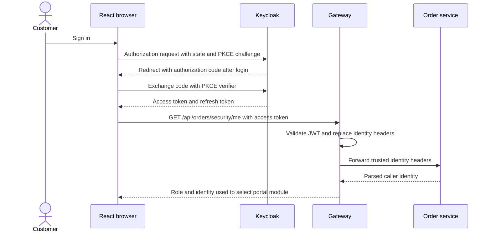

# Authentication: UI → gateway → downstream service

## 1. Problem and business scenario

Customer1 wants to view an order without sending their password to every service.
Keycloak authenticates the user, the gateway validates an access token, and the
owning service decides whether that identity may access the order.

Authentication answers **who is calling?** Authorization answers **may this caller
perform this action on this resource?** A valid token does not grant every action.

Install and configure accounts using [Keycloak setup](../infra-setup/keycloak-setup.md).
This guide explains the implementation and its tests; passwords and role setup
are intentionally maintained only in that setup guide.

## 2. Browser login: Authorization Code with PKCE

The React application is a public client: it cannot protect a client secret.
Its Keycloak adapter handles the authorization redirect, OAuth correlation state
and code exchange with a PKCE verifier. An **access token** is used for APIs;
an ID token describes the sign-in and is not used as the gateway credential.

Excerpt from [auth.js](../../ecom-ui/src/auth.js) (surrounding code omitted):

```javascript
const authenticated = await auth.init({
  onLoad: 'check-sso',
  pkceMethod: 'S256',
  responseMode: 'query',
  checkLoginIframe: false,
  redirectUri,
});
```

`S256` binds the authorization code to the initiating browser's verifier. Tokens
stay in adapter memory. `accessToken()` refreshes when less than 30 seconds of
validity remain. Only the desired page is stored by the app for the SSO round trip.



The browser calls gateway directly, with [CORS handled at gateway](09-cors-preflight-and-browser-security.md). Its login
and token-exchange requests go directly to Keycloak, not through gateway routes.

## 3. Attach the token to an application request

Excerpt from [api.js](../../ecom-ui/src/api.js) (surrounding code omitted):

```javascript
const token = await getToken();
const headers = { Authorization: `Bearer ${token}` };
```

The helper permits only the application's API paths and refuses redirects.
`SessionProvider` first calls `/api/orders/security/me`; therefore gateway **and
order-service** must run for any signed-in portal module to open.

## 4. Validate the token at the gateway

Excerpt from [GatewaySecurity.java](../../gateway-service/src/main/java/com/tip/ecommerce/gateway/security/GatewaySecurity.java) (surrounding code omitted):

```java
var decoder =
    org.springframework.security.oauth2.jwt.NimbusReactiveJwtDecoder.withJwkSetUri(keys)
        .build();
org.springframework.security.oauth2.core.OAuth2TokenValidator<
        org.springframework.security.oauth2.jwt.Jwt>
    aud =
        jwt ->
            jwt.getAudience().contains(audience)
                ? org.springframework.security.oauth2.core.OAuth2TokenValidatorResult.success()
                : org.springframework.security.oauth2.core.OAuth2TokenValidatorResult.failure(
                    new org.springframework.security.oauth2.core.OAuth2Error(
                        "invalid_token", "Wrong audience", null));
decoder.setJwtValidator(
    new org.springframework.security.oauth2.core.DelegatingOAuth2TokenValidator<>(
        org.springframework.security.oauth2.jwt.JwtValidators.createDefaultWithIssuer(issuer),
        aud));
```

The decoder checks the JWT signature using Keycloak's public keys. The configured
validators require the canonical issuer, token time validity and audience
`gateway-service`. Merely decoding Base64 claims would not provide these checks.

The issuer remains `http://localhost:8180/realms/ecommerce` for both profiles.
The JWK URL is separately reachable: localhost from IntelliJ and
`host.minikube.internal` from Minikube. The exact configuration is in
[Keycloak setup](../infra-setup/keycloak-setup.md#intellij-and-minikube-access-one-instance-one-issuer).

Only `/actuator/health`, its subpaths, and `/api/products/images/**` are public.
Every other gateway exchange requires authentication. The gateway is stateless;
its Bearer API does not use form login or an HTTP session security context.

## 5. Replace untrusted headers with validated identity

Excerpt from [IdentityHeadersFilter.java](../../gateway-service/src/main/java/com/tip/ecommerce/gateway/security/IdentityHeadersFilter.java) (surrounding code omitted):

```java
new ArrayList<>(headers.keySet())
    .stream()
        .filter(k -> k.toLowerCase(Locale.ROOT).startsWith("x-auth-"))
        .forEach(headers::remove);
headers.remove("Authorization");
headers.set("X-Auth-Subject", subject);
headers.set("X-Auth-Username", username);
```

| Downstream header    | Validated source                                    |
| -------------------- | --------------------------------------------------- |
| `X-Auth-Subject`     | `sub`                                               |
| `X-Auth-Username`    | `preferred_username`                                |
| `X-Auth-Tenant`      | `tenant`; controlled demo onboarding fallback below |
| `X-Auth-Roles`       | `admin`, `customer`, `service` from realm roles     |
| `X-Auth-Permissions` | Colon-named realm roles, such as `orders:read`      |
| `X-Auth-Client`      | `azp`                                               |

The public `security-demo-ui` customer token may lack `tenant` after self-registration.
Only that client with customer role and no admin role receives the `demo` fallback.
Explicit tenant claims take precedence. Admin/service identities must have their
configured tenant. Required identity strings are validated before becoming headers.

These permissions are realm roles interpreted by our code, not Keycloak UMA
permission tickets. The original Bearer token is removed downstream.

## 6. Route, authorize and return the response

The path selects a route in `application.yml`. Order-service checks endpoint
permissions and then owner/tenant attributes. For example, customer2 has
`orders:read` but cannot read customer1's order. The response returns through the
gateway. Read [RBAC and ABAC implementation](../security/Authentication%20and%20Authorization%20at%20Microservice.md)
for the downstream code and [routing](01-basic-routing.md) for destination profiles.

Direct calls to downstream local ports can forge these unsigned headers. This is
the chosen POC trust model; network isolation/mTLS is not implemented. Passing
through the gateway protects header integrity only on requests using that gateway.

## 7. A downstream service makes another call

Order-service obtains its own client-credentials token to call inventory through
the gateway. It does not relay customer1's token or headers. Gateway repeats the
same validation and header replacement, and inventory sees a service identity.
See [machine authentication](04-token-relay-service-to-service-security.md) for
snippets from both caller and receiver. Kafka events follow a separate path through
the broker and do not contain HTTP authentication headers.

## Manual verification

Use a browser and curl or Postman. Complete [application setup](../infra-setup/commerce-setup.md).
Portal base suffices for the identity checks; full shopping needs the
[checkout service set](../project-docs/business-flows-and-service-dependencies.md).
Open **http://localhost:5173/** and sign in as customer1 using the
[credentials table](../infra-setup/keycloak-setup.md#application-roles-and-users).

In Developer Tools → Network, copy the access token from an authenticated API
request's Authorization header. Set the variable without the `Bearer ` prefix:

```sh
ACCESS_TOKEN='PASTE_CUSTOMER1_ACCESS_TOKEN'
curl -i http://localhost:9100/api/orders/security/me \
  -H "Authorization: Bearer $ACCESS_TOKEN" \
  -H 'X-Auth-Username: admin1' -H 'X-Auth-Roles: admin'
curl -i http://localhost:9100/api/orders/security/admin \
  -H "Authorization: Bearer $ACCESS_TOKEN"
curl -i http://localhost:9100/api/inventory/ELEC-1 \
  -H "Authorization: Bearer $ACCESS_TOKEN"
unset ACCESS_TOKEN
curl -i http://localhost:9100/api/orders
```

| Check                                                | Expected result                                        | Concept demonstrated     |
| ---------------------------------------------------- | ------------------------------------------------------ | ------------------------ |
| Forged admin identity                                | 200; response identity remains customer1/customer/demo | Header replacement       |
| Customer calls admin endpoint                        | 403                                                    | Downstream RBAC          |
| Customer directly requests inventory through gateway | 403 when inventory-service runs                        | Permission boundary      |
| No Bearer token                                      | 401                                                    | Gateway authentication   |
| Customer2 reads customer1's order ID                 | 403                                                    | Owner ABAC               |
| Admin1 reads a demo customer's order                 | 200                                                    | Read-any within tenant   |
| Admin1 reads an other-tenant order                   | 403                                                    | Tenant remains mandatory |

Use `/api/orders/ORDER_ID` with the relevant user's token for the last three
checks. Create the other-tenant example through the legacy API/security smoke
suite; integrated shopping is demo-only. React guards alone do not prove API security.

```sh
python3 docker/keycloak/security-smoke-test.py --login-only
python3 docker/keycloak/security-smoke-test.py
```

The first command needs Keycloak only. The full suite needs its backend dependencies
and creates learning records. See [business verification](../project-docs/manual-verification.md)
for shopping, shipping, inboxes and failure exercises. There is no longer a UI
button named “My gateway headers” or a spoofing checkbox; use the requests above.

## Troubleshooting by boundary

| Symptom                            | Investigate                                                        |
| ---------------------------------- | ------------------------------------------------------------------ |
| Login redirect rejected            | Exact localhost callback/origin in Keycloak setup                  |
| Login succeeds, workspace fails    | Gateway and order-service identity endpoint                        |
| API 401                            | Expired/missing token, signature, issuer, audience, reachable keys |
| API 403                            | Identity claims, endpoint permission, role, owner and tenant       |
| Shop unavailable                   | PGS, customer, discount; ratings/stock preview have fallbacks      |
| Shopping order pending             | Persisted checkout state and inventory/payment calls               |
| Legacy order pending after payment | Payment outbox, Kafka and order listener                           |
| New inbox entry missing            | Order outbox, Kafka and notification consumer                      |

A stopped dependency's precise status depends on the caller's error mapping;
inspect its response/logs instead of assuming a universal 502/503 policy.
