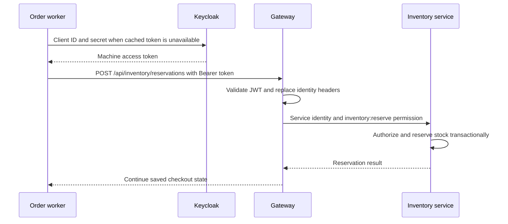

# Service-to-service security: client credentials through the gateway

## Problem and scenario

After customer1 submits checkout, order-service must reserve stock. Customers do
not have `inventory:reserve`, and a delayed worker may run after the browser closes.
Order-service therefore authenticates as a machine with its own limited grants.

**Implemented:** client credentials. **Not implemented:** forwarding the customer's
access token (token relay), token exchange/on-behalf-of delegation, or downstream
JWT validation. The filename is retained for existing links; its former token-relay
instructions did not describe this application.

## 1. Acquire the caller service's token

Excerpt from [ServiceTokenClient.java](../../order-service/src/main/java/com/tip/ecommerce/order/client/ServiceTokenClient.java) (surrounding code omitted):

```java
String body = "grant_type=client_credentials&client_id=" + encode(clientId) + "&client_secret=" + encode(clientSecret);
HttpResponse<String> response = http.send(HttpRequest.newBuilder(URI.create(tokenUrl))
        .timeout(Duration.ofSeconds(5)).header("Content-Type", "application/x-www-form-urlencoded")
        .POST(HttpRequest.BodyPublishers.ofString(body)).build(), HttpResponse.BodyHandlers.ofString());
```

The secret goes only to Keycloak. The token is cached until `expires_in - 30`
seconds. A missing secret or unsuccessful token request fails the call; there is
no fallback to an anonymous or admin identity.

## 2. Send the access token to the gateway

Excerpt from [CommerceGateway.java](../../order-service/src/main/java/com/tip/ecommerce/order/client/CommerceGateway.java) (surrounding code omitted):

```java
var builder =
    HttpRequest.newBuilder(URI.create(gateway + path))
        .timeout(Duration.ofSeconds(8))
        .header("Authorization", "Bearer " + tokens.accessToken())
        .header("Content-Type", "application/json")
        .method(
            body == null ? "GET" : "POST",
            body == null
                ? HttpRequest.BodyPublishers.noBody()
                : HttpRequest.BodyPublishers.ofString(json.writeValueAsString(body)));
```

`services.gateway-url` points at the gateway for either profile. The helper uses
bounded connect/request timeouts and maps dependency failures for the worker.
It uses Java's blocking HTTP client in the order worker; this is distinct from
PGS's reactive fan-out.



## 3. Authorize at the recipient

Excerpt from [InventoryController.java](../../inventory-service/src/main/java/com/tip/ecommerce/inventory/controller/InventoryController.java) (surrounding code omitted):

```java
@PostMapping("/reservations")
@RequireAccess(permissions = "inventory:reserve")
@Transactional(rollbackFor = Exception.class)
public Map<String, Object> reserve(@RequestBody Reservation req, HttpServletRequest r)
    throws Exception {
```

Inventory sees `service-account-order-service`, not customer1. The tenant is the
machine account's configured `demo`. Order-service must first validate the user's
right to start this operation; it cannot rely on inventory to reconstruct that user.

## 4. Other call chains use the same boundary

| Caller  | Recipient through gateway             | Why                                            |
| ------- | ------------------------------------- | ---------------------------------------------- |
| Order   | Customer and PGS                      | Complete profile and authoritative price       |
| Order   | Inventory and payment                 | Reservation, simulated payment, commit/release |
| Payment | Order                                 | Validate owner/tenant and amount/status        |
| PGS     | Customer, discount, rating, inventory | Aggregate product cards                        |

PGS's [GatewayClient](../../product-aggregator-service/src/main/java/com/tip/ecommerce/product/GatewayClient.java)
uses WebClient and caches successful tokens for 30 seconds. Payment's
[OrderServiceClient](../../payment-service/src/main/java/com/tip/ecommerce/payment/client/OrderServiceClient.java)
uses WebClient with a blocking boundary in the MVC service. These are not all
end-to-end reactive implementations.

## Verify and learn the tradeoff

Use the [Keycloak token request](../infra-setup/keycloak-setup.md#request-a-token-curl-or-postman)
with order-service credentials, then call `GET /api/inventory/ELEC-1` via gateway.
The response's `calledAs` identifies the machine account. A customer token calling
the same API receives 403. See the [security test guide](03-gateway-security-oauth2-oidc-jwt.md#manual-verification).

Centralized gateway authentication simplifies this learning model but adds a hop
and makes gateway availability a dependency of internal HTTP calls. There is no
automatic propagation of the original human actor for downstream auditing. Kafka
consumers operate separately and do not acquire these HTTP tokens to process events.
