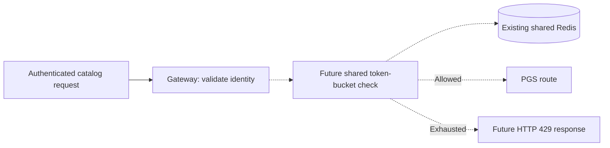

# Redis rate limiting: future exercise, not implemented

## Problem to solve

An authenticated client can still send too many requests. Replicating the gateway
can increase capacity, but it does not enforce a per-user request allowance.
A future shared rate limiter could apply one budget across gateway replicas.

## What exists in this project

Redis runs in shared-infra with password authentication. The gateway currently has
no Redis starter/configuration, `KeyResolver`, `RequestRateLimiter` filter or rate
limit response policy. There is no 429 behavior to demonstrate from current code.
The browser cart and service-token caches also do not use Redis.

See [Redis setup](../infra-setup/redis-setup.md) for the actual server configuration
and explicitly optional client examples. Do not deploy another Redis into Minikube.

## Proposed project scenario

A burst of catalog reads from customer1 should consume customer1's allowance across
all gateway instances while customer2 retains a separate allowance. Use a key
based on validated identity, not an untrusted username/header/query parameter.
Machine-token requests should have a deliberate client/tenant policy of their own.

Dashed arrows are proposed work. A token bucket replenishes tokens over time and
allows a bounded burst. Its limits need measurement; there are no correct project
rate values until the feature and its tests exist.

## Implementation exercise and acceptance criteria

1. Add the reactive Redis integration and the limiter to a selected gateway route.
2. Resolve the key only from authenticated identity and define anonymous behavior.
3. Configure existing Redis addresses/password through profiles and deployment secrets.
4. Test one user exhausting their budget, another remaining unaffected, refill,
   multiple gateway replicas and Redis outage behavior.
5. Choose and document fail-open/fail-closed behavior rather than assuming one.

Rate limiting, concurrency limits and circuit breakers solve different problems.
Current PGS connection-pool bounds are not user quotas. Return to
[implemented gateway filters](02-predicates-and-filters.md) for code that runs today.
