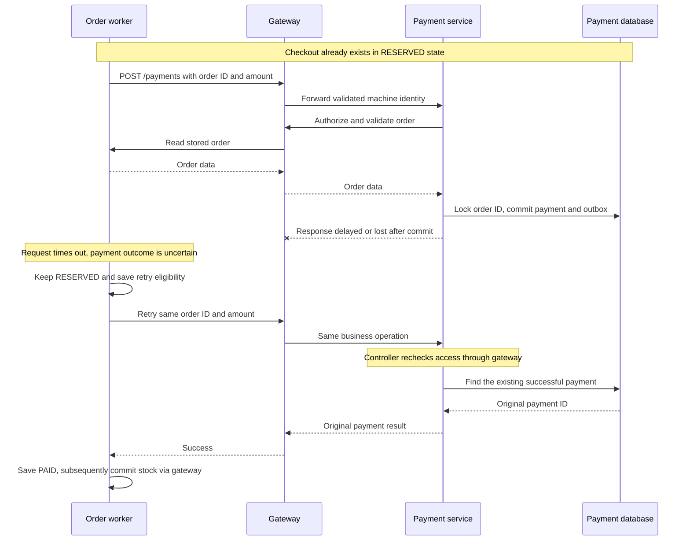

# 06. Timeouts, Safe Retries and Idempotency

**Topic name:** Timeouts, Safe Retries and Idempotency.  
**Project scenario:** a customer clicks Pay now, a dependency is slow, or a successful
response is lost. The next attempt must not create another order, payment or stock deduction.

**Implementation status:** client timeouts, durable checkout retries and database-backed
idempotency exist. Explicit gateway timeout overrides and a Gateway `Retry` filter
are **not configured**. This guide documents existing code; the optional gateway
example is labeled separately and has not been applied.

Read in order: [concepts](#2-three-concepts-three-different-jobs),
[project code](#3-where-this-is-implemented), [failure flow](#7-the-response-is-lost-after-payment-commits),
[testing](#9-how-to-test-the-current-implementation), and
[interview explanation](#12-how-to-explain-this-in-an-interview-34-minutes).
Setup and credentials stay in [application setup](../infra-setup/commerce-setup.md)
and [Keycloak setup](../infra-setup/keycloak-setup.md).

## 1. Purpose: what problem does this solve?

Imagine payment-service saves a successful payment, but order-service does not
receive its response. Order-service sees a timeout. The customer may also reload
or repeat a request after the browser stops waiting.

Without protection, either we give up on a successful purchase, or we retry and
create another payment. Neither a longer timeout nor a retry annotation alone
solves this. Each participant needs a stable operation identity and a way to
recognize that it already performed the operation.

This repository simulates the payment itself, but the records, transactions,
network calls and failure windows are real.

## 2. Three concepts, three different jobs

| Concept     | Simple meaning                                                               | Project example                                                            |
| ----------- | ---------------------------------------------------------------------------- | -------------------------------------------------------------------------- |
| Timeout     | Limit how long this caller waits for this operation.                         | Order's HTTP request to gateway has an eight-second timeout.               |
| Retry       | Try an operation again after a failure or uncertain outcome.                 | The checkout worker revisits a saved RESERVED checkout.                    |
| Idempotency | Repeating the same identified operation does not repeat its business effect. | Payment returns the existing successful payment for that order and amount. |

A timeout is **not proof that the server failed or rolled back**. The server may
still be running or may already have committed. Aborting a browser fetch does not
undo another service's database transaction.

Idempotency means the effect is stable, not necessarily that every response byte
is identical. A checkout replay returns the same order ID with its **current**
fulfillment state; the state can have advanced since the first response.

### Timeout types and budgets

- **Connection timeout:** limits establishing a new connection. It does not bound
  an already-connected server's business processing.
- **Pool acquisition timeout:** limits waiting for a reusable connection slot.
- **Response/read timeout:** bounds the relevant HTTP response/read wait. Its exact
  scope depends on the client; it is not automatically an end-to-end deadline.
- **Operation timeout:** wraps a larger operation, such as PGS's token-plus-lookup Mono.
- **Business deadline:** bounds how long the whole checkout may remain unresolved.
  A persisted business deadline is not implemented here.

Choose a total request budget, then allocate time for authentication, queued work,
downstream calls, database work, response handling and any retries. For example,
two attempts of at most two seconds plus a 200 ms pause already consume about
4.2 seconds before other overhead. This is a design illustration, not our configured SLA.

The current timeouts are local guards, not a coordinated deadline propagated through
the whole service chain. A browser request can perform sequential work longer than
its own wait budget; idempotent recovery is therefore still necessary.

## 3. Where this is implemented

| Component                          | Actual implementation and scope                                                                                                                                                    |
| ---------------------------------- | ---------------------------------------------------------------------------------------------------------------------------------------------------------------------------------- |
| React `api.js`                     | `AbortSignal.timeout(15000)` for each fetch, after token acquisition. It does not cover the preceding token refresh.                                                               |
| React `CartPage`                   | Saves a checkout key in session storage and reuses it while the cart/address signature is unchanged.                                                                               |
| Gateway                            | Routes and authenticates; no explicit HTTP timeout override or Gateway `Retry` filter in the route YAML.                                                                           |
| Order `CommerceGateway`            | Three-second connect timeout and eight-second request timeout; token acquisition occurs separately before send.                                                                    |
| Order/payment `ServiceTokenClient` | Three-second connect and five-second token-request timeout; caches the token and synchronizes acquisition. Lock waiting is not a separate end-to-end budget.                       |
| PGS `GatewayClient`                | Two-second pool wait, two-second connect, three-second response timeout; four-second overall lookup Mono and three-second token Mono timeout.                                      |
| Payment `OrderServiceClient`       | `.block(Duration.ofSeconds(8))` bounds waiting for the order lookup; synchronous token acquisition is outside that wait. Its WebClient bean has no custom connect-timeout setting. |
| Order `CheckoutWorker`             | Stores workflow progress/retry eligibility in PostgreSQL and retries through the gateway.                                                                                          |
| Order/inventory/payment            | Different database mechanisms prevent repeated order creation, stock deduction and payment creation.                                                                               |

Source links and excerpts follow. A missing Gateway retry filter does not prove a
network request can never be replayed: Reactor Netty documents a transport-level
retry for certain TCP aborts. That differs from a configured business retry policy.
[Reactor Netty HTTP client reference](https://projectreactor.io/docs/netty/release/reference/http-client.html#_retry_strategies).

## 4. Timeouts on the actual request chain

### 4.1 Browser → gateway

Excerpt from [api.js](../../ecom-ui/src/api.js) (surrounding code omitted):

```javascript
const response = await fetcher(gatewayUrl(path), {
  method,
  headers,
  ...(method !== 'GET' ? { body } : {}),
  redirect: 'error',
  credentials: 'omit',
  signal: AbortSignal.timeout(15000),
});
```

The helper first obtains the token, then starts the timed fetch. It does not
silently retry a failed checkout. The user can retry with the saved checkout key.
Each fetch has its own timer; this is not a timer for the entire Pay now workflow.

### 4.2 Order-service → gateway → another service

Excerpt from [CommerceGateway.java](../../order-service/src/main/java/com/tip/ecommerce/order/client/CommerceGateway.java) (surrounding code omitted):

```java
private final HttpClient http =
    HttpClient.newBuilder().connectTimeout(Duration.ofSeconds(3)).build();
```

Excerpt from [CommerceGateway.java](../../order-service/src/main/java/com/tip/ecommerce/order/client/CommerceGateway.java) (surrounding code omitted):

```java
var builder =
    HttpRequest.newBuilder(URI.create(gateway + path))
        .timeout(Duration.ofSeconds(8))
        .header("Authorization", "Bearer " + tokens.accessToken())
        .header("Content-Type", "application/json")
        .method(
            body == null ? "GET" : "POST",
            body == null
                ? HttpRequest.BodyPublishers.noBody()
                : HttpRequest.BodyPublishers.ofString(json.writeValueAsString(body)));
```

The request timeout applies to this HTTP request; it does not include all preceding
work. The call to `tokens.accessToken()` can itself wait for Keycloak before the
business request is sent. Order has separate calls for profile, quote, reservation,
payment and reservation commit, not one shared eight-second budget for all of them.

The helper preserves a received HTTP error as a `ResponseStatusException`. Network
and other caught failures become 503 with a retry-oriented message. That message
does not itself retry anything; the worker makes the decision.

### 4.3 PGS → gateway → customer, discount, rating and inventory

Excerpt from [GatewayClient.java](../../product-aggregator-service/src/main/java/com/tip/ecommerce/product/GatewayClient.java) (surrounding code omitted):

```java
private final reactor.netty.resources.ConnectionProvider pool =
    reactor.netty.resources.ConnectionProvider.builder("pgs-http")
        .maxConnections(32)
        .pendingAcquireMaxCount(64)
        .pendingAcquireTimeout(Duration.ofSeconds(2))
        .build();
private final WebClient http =
    WebClient.builder()
        .clientConnector(
            new org.springframework.http.client.reactive.ReactorClientHttpConnector(
                reactor.netty.http.client.HttpClient.create(pool)
                    .option(io.netty.channel.ChannelOption.CONNECT_TIMEOUT_MILLIS, 2000)
                    .responseTimeout(Duration.ofSeconds(3))))
        .codecs(c -> c.defaultCodecs().maxInMemorySize(1024 * 1024))
        .build();
```

The connection pool is bounded so fan-out cannot create unlimited outgoing
connections. `get()` ends with `.timeout(Duration.ofSeconds(4))`; that outer Mono
covers token acquisition and the lookup. A timeout cancels the local subscription;
it cannot promise a remote database rollback.

PGS uses empty-result fallbacks for ratings and availability only. Price/profile
failures remain errors. Missing optional enrichment is acceptable; inventing a
successful payment or reservation is not. See [aggregation](../project-docs/catalog-aggregation-and-preferences.md)
for its `Mono.zip` and fallback code.

### 4.4 Payment-service → gateway → order-service

Excerpt from [OrderServiceClient.java](../../payment-service/src/main/java/com/tip/ecommerce/payment/client/OrderServiceClient.java) (surrounding code omitted):

```java
return webClient.get()
        .uri(orderServiceUrl + "/api/orders/{id}", orderId)
        .headers(h -> h.setBearerAuth(tokens.accessToken()))
        .retrieve()
        .bodyToMono(OrderView.class)
        .block(java.time.Duration.ofSeconds(8));
```

Payment validates the stored order through gateway. It is an MVC/JPA service using
a blocking boundary; returning a WebClient type internally does not make the whole
payment transaction reactive.

The controller authorizes the request through an order lookup, and the service
performs another lookup for a **new** payment's amount/status. Each lookup has its
own wait limit. An already-successful payment skips the service-layer lookup, but
still passes controller authorization. Account for these nested calls when
setting an outer order-to-payment timeout.

## 5. Safe retries: the saved checkout worker owns the decision

The browser receives 202 after order/items/checkout are committed. Subsequent
reservation/payment/commit work is independent of the original browser connection.

Excerpt from [CheckoutWorker.java](../../order-service/src/main/java/com/tip/ecommerce/order/service/CheckoutWorker.java) (surrounding code omitted):

```java
@Transactional(rollbackFor = Exception.class)
public void step() throws Exception {
  var rows =
      db.queryForList(
          "SELECT * FROM checkout WHERE state IN ('CREATED','RESERVED','PAID','RELEASING') AND"
              + " next_attempt<=now() ORDER BY order_id LIMIT 1 FOR UPDATE SKIP LOCKED");
```

`FOR UPDATE SKIP LOCKED` prevents two workers from processing the same checkout
row simultaneously. Other workers can choose other eligible rows. The lock and
transaction span the remote call in this small implementation, which consumes a
database connection and holds the lock while waiting.

Excerpt from [CheckoutWorker.java](../../order-service/src/main/java/com/tip/ecommerce/order/service/CheckoutWorker.java) (surrounding code omitted):

```java
} else if (state.equals("RESERVED") && e.getStatusCode().value() == 409)
  db.update(
      "UPDATE checkout SET state='RELEASING',error='Payment rejected; releasing stock' WHERE"
          + " order_id=?",
      id);
else
  db.update(
      "UPDATE checkout SET attempts=attempts+1,error='Waiting for a dependency; retrying"
          + " safely',next_attempt=now()+interval '10 seconds' WHERE order_id=?",
      id);
```

Read the branch together with the state:

| Current state and outcome           | Current behavior                                                                                                    |
| ----------------------------------- | ------------------------------------------------------------------------------------------------------------------- |
| CREATED + inventory 409             | Mark FAILED without calling payment. The code treats this as a stock conflict.                                      |
| RESERVED + payment 409              | Enter RELEASING; release the unpaid reservation, then mark FAILED.                                                  |
| Other mapped dependency error       | Keep the current state, increment attempts and schedule eligibility. This includes errors other than transient 5xx. |
| Other exception escaping the method | Roll back the local step; the scheduler logs and tries again on a later run.                                        |
| PAID + inventory unavailable        | Keep PAID and retry commit; do not release potentially paid stock.                                                  |

**Timing detail:** `CommerceScheduler.work()` runs with a 500 ms fixed delay after
completion. The SQL uses `now() + interval '10 seconds'`, and PostgreSQL `now()` is
transaction-start time. An eight-second failed call may leave roughly two seconds
until eligibility, not ten seconds after failure. Queueing and scheduler load add
variation. This is fixed scheduling, not exponential backoff or jitter.
[PostgreSQL current date/time functions](https://www.postgresql.org/docs/16/functions-datetime.html#FUNCTIONS-DATETIME-CURRENT).

Retries have no configured attempt ceiling, jitter or dead-letter workflow.
`attempts` resets after a successful transition; it is not a permanent audit count.
A persistent permission/configuration error can therefore remain in the retry loop.

### What a stronger retry policy would add

Classify outcomes before retrying: validation/permission failures usually need a
correction, not another identical call; timeouts and some 5xx responses may warrant
a bounded retry; a 409 needs endpoint-specific interpretation. This code uses broad
status checks, not a complete typed business-error contract.

Use capped exponential backoff plus jitter for appropriate transient failures,
and a recovery/escalation policy for unresolved workflows. These improvements are
**not implemented**. Avoid stacking retries at every layer: three total attempts
at each of three nested layers can produce up to 27 innermost calls. A retry limit
must also fit the caller's time budget.

## 6. Idempotency at every state-changing participant

### 6.1 React keeps the identity of the checkout attempt

Excerpt from [CartPage.jsx](../../ecom-ui/src/modules/customer/pages/CartPage.jsx) (surrounding code omitted):

```javascript
const idempotencyKey =
  saved.signature === signature ? saved.idempotencyKey : crypto.randomUUID();
sessionStorage.setItem(key, JSON.stringify({ signature, idempotencyKey, address }));
const order = await request('/api/orders/checkout', 'POST', {
  items,
  address: address.trim(),
  idempotencyKey,
  expectedAmount: cart.total,
});
```

The API uses a JSON body field named `idempotencyKey`, not an `Idempotency-Key` HTTP
header. Sending only that header will not satisfy this endpoint's validation.
Changing the cart/address is a new intended purchase and receives a new key.
Once accepted, React clears its saved submission state and navigates to order details.
Browser state is convenient, but the server must enforce the rule independently.

### 6.2 Order-service: scoped key, payload check and database uniqueness

Excerpt from [CheckoutService.java](../../order-service/src/main/java/com/tip/ecommerce/order/service/CheckoutService.java) (surrounding code omitted):

```java
// Serialize identical checkout keys across replicas; retries cannot create duplicate orders.
db.queryForObject(
    "SELECT pg_advisory_xact_lock(hashtextextended(?,0))",
    Object.class,
    caller.tenant() + ":" + owner + ":" + req.idempotencyKey());
String fingerprint =
    json.writeValueAsString(
        List.of(
            req.items().stream().sorted(Comparator.comparing(Line::sku)).toList(),
            req.address().strip()));
var existing =
    db.queryForList(
        "SELECT order_id,request_hash FROM checkout WHERE tenant=? AND customer_id=? AND"
            + " idempotency_key=?",
        caller.tenant(),
        owner,
        req.idempotencyKey());
if (!existing.isEmpty()) {
  if (!existing.get(0).get("request_hash").equals(fingerprint))
    throw new ResponseStatusException(
        HttpStatus.CONFLICT, "Checkout key already used for a different cart");
  return detail(((Number) existing.get(0).get("order_id")).longValue(), caller);
}
```

The transaction-scoped advisory lock serializes contenders for
`tenant + owner + idempotencyKey`, including different order-service processes.
The database also has `UNIQUE(tenant, customer_id, idempotency_key)` in
[order schema.sql](../../order-service/src/main/resources/schema.sql).

The field `request_hash` actually stores normalized JSON, not a cryptographic hash.
It includes sorted item/quantity pairs and the stripped address. It does not include
`expectedAmount`: replay of an existing key returns the already-priced order, while
initial acceptance validates the expected amount against a fresh PGS quote.

Same key and same payload returns the same order. A changed cart/address with that
key returns 409. A fresh key means a fresh operation; no system can infer that two
separately identified purchases were an accidental double click.

### 6.3 Inventory-service: duplicate reservation cannot deduct twice

Excerpt from [InventoryController.java](../../inventory-service/src/main/java/com/tip/ecommerce/inventory/controller/InventoryController.java) (surrounding code omitted):

```java
int inserted =
    db.update(
        "INSERT INTO reservation VALUES (?,?,'RESERVED',?) ON CONFLICT DO NOTHING",
        tenant,
        req.orderId(),
        payload);
if (inserted == 0) {
  var existing =
      db.queryForMap(
          "SELECT * FROM reservation WHERE tenant=? AND order_id=? FOR UPDATE",
          tenant,
          req.orderId());
  if (!payload.equals(existing.get("items")) || existing.get("state").equals("RELEASED"))
    throw new ResponseStatusException(HttpStatus.CONFLICT, "Reservation mismatch");
  return Map.of("state", existing.get("state"));
}
```

The reservation table's primary key is `(tenant, order_id)`. A matching retry returns
the existing reservation state before decrementing stock again. A changed item
payload or a released reservation is rejected. Conditional stock updates and the
transaction separately protect against **different** orders racing for limited stock.

`finish()` locks the reservation row. Repeating commit or release of the same final
state is harmless; a conflicting finalization is rejected. Commit only changes
reservation state, because reserve already reduced available stock.

### 6.4 Payment-service: return the existing successful payment

Excerpt from [PaymentServiceImpl.java](../../payment-service/src/main/java/com/tip/ecommerce/payment/service/impl/PaymentServiceImpl.java) (surrounding code omitted):

```java
db.queryForObject("SELECT pg_advisory_xact_lock(?)", Object.class, request.orderId());
var previous =
    paymentRepository.findByOrderIdAndStatus(request.orderId(), PaymentStatus.SUCCESS);
if (previous.isPresent()) {
  if (previous.get().getAmount().compareTo(request.amount()) != 0)
    throw new ResponseStatusException(HttpStatus.CONFLICT, "Payment amount differs");
  return toDto(previous.get());
}
```

`processPayment` is transactional. Its advisory lock serializes payment attempts
for an order across service instances. Same order/same successful amount returns
the original payment; changing that amount gives 409. The first payment checks the
pending order total, then saves payment and outbox together.

This is a cooperating application lock, not a unique successful-payment constraint
on the `Payment` entity. All writers must follow this protocol. A real payment
provider would also need its own idempotency key and reconciliation; a local lock
cannot make an external bank transaction atomic with our database.

## 7. The response is lost after payment commits



The logical diagram collapses the controller/service's possible repeated order
lookups. Every business HTTP call goes through gateway. The important boundary is
that **payment commits before its response is acknowledged by order-service**.

Retry safety is composed: the worker repeats a known operation; payment suppresses
a repeated payment; inventory suppresses repeated stock changes. This is not an
exactly-once network guarantee. Kafka outboxes can also redeliver, handled by their
consumers; see [Kafka and deduplication](../kafka/kafka-notes-scenarios.md).

## 8. Gateway policies: what exists and what would be added

The current [gateway application.yml](../../gateway-service/src/main/resources/application.yml)
has path routes, without explicit timeout metadata or a `Retry` filter. Therefore
do not claim “our gateway retries checkout three times” in an interview.

**Optional design example, not applied:** a read-only order route could define its
own timeout and limited retry. It must precede the existing broad order route so
GET requests select it; POST checkout remains on the original route. Values below
are illustrative and must be measured before adoption.

```yaml
# Proposed route-list entry, not existing project configuration.
- id: order-read-resilience-example
  uri: ${services.order.url}
  predicates:
    - Path=/api/orders/**
    - Method=GET
  metadata:
    connect-timeout: 1000
    response-timeout: 2000
  filters:
    - name: Retry
      args:
        retries: 1
        methods: GET
        series: SERVER_ERROR
        backoff:
          firstBackoff: 100ms
          maxBackoff: 100ms
          factor: 1
          basedOnPreviousValue: false
```

Per-route timeout metadata uses milliseconds. Global response timeout configuration
uses a duration instead; do not interchange the units.
[Spring Cloud Gateway timeout configuration](https://docs.spring.io/spring-cloud-gateway/reference/4.3/spring-cloud-gateway-server-webflux/http-timeouts-configuration.html).

`retries: 1` permits one additional attempt, not one total call. This example selects the 5xx
server-error series; the filter's default retryable exception types also apply.
A production policy should narrow retryable outcomes to the API's error contract. Do not enable this for checkout/payment POSTs merely
because retry is available. Retrying body-bearing requests also caches their bodies
and consumes gateway memory.
[Spring Cloud Gateway Retry filter](https://docs.spring.io/spring-cloud-gateway/reference/4.3/spring-cloud-gateway-server-webflux/gatewayfilter-factories/retry-factory.html).

This route's budget does not replace downstream idempotency or a coordinated total
deadline. Test only after intentionally implementing the configuration in a separate
change; current manual tests below exercise the existing service-owned behavior.

## 9. How to test the current implementation

### 9.1 Required services and tools

For the checkout exercises, run `ecom-ui`, gateway, order, customer, PGS, discount,
inventory and payment, plus shared PostgreSQL and Keycloak. Ratings are optional.
Keep Kafka running for the normal full demo; notification-service is needed only
if you also verify the inbox. Redis/Kafka UI do not implement these retries.

Use IntelliJ (Debug mode for the delayed-response experiment), a browser, curl,
Python 3 and Docker CLI. Use [setup](../infra-setup/commerce-setup.md) for startup,
profiles and database preparation. Tests create real learning orders and consume
stock; no infrastructure reinstall is needed.

Sign in at **http://localhost:5173/** as customer1 using
[the setup credential table](../infra-setup/keycloak-setup.md#application-roles-and-users).
Complete Your profile. In Developer Tools → Network, copy the access token from
an authenticated API request; omit the `Bearer ` prefix when assigning it below.
Refresh the copied token if later requests return 401. Do not use a machine token
for these customer checkout requests.

### 9.2 Same key and payload: one checkout, including concurrent requests

Run from the repository root in one terminal. This creates an isolated temporary
folder and uses the current catalog price instead of assuming the seed discount:

```sh
ACCESS_TOKEN='PASTE_CUSTOMER1_ACCESS_TOKEN'
LAB_DIR=$(mktemp -d "${TMPDIR:-/tmp}/gateway-topic06.XXXXXX")
curl --fail-with-body --silent --show-error \
  http://localhost:9100/api/products \
  -H "Authorization: Bearer $ACCESS_TOKEN" \
  -o "$LAB_DIR/catalog.json"
python3 - "$LAB_DIR" <<'PYTHON'
import json, sys, uuid
from pathlib import Path
folder = Path(sys.argv[1])
catalog = json.loads((folder / 'catalog.json').read_text())
product = next(p for c in catalog['categories'] for p in c['products'] if p['sku'] == 'BOOK-1')
body = {
    'idempotencyKey': str(uuid.uuid4()),
    'items': [{'sku': 'BOOK-1', 'quantity': 1}],
    'address': '123 Learning Lane, Chicago IL 60601',
    'expectedAmount': product['price'],
}
(folder / 'checkout.json').write_text(json.dumps(body))
PYTHON
```

Ensure BOOK-1 has at least one unit available. If a command fails, correct that
problem before continuing. Send the **same file** twice concurrently:

```sh
for attempt in 1 2; do
  curl --silent --show-error --fail-with-body \
    http://localhost:9100/api/orders/checkout \
    -H "Authorization: Bearer $ACCESS_TOKEN" \
    -H 'Content-Type: application/json' \
    --data-binary "@$LAB_DIR/checkout.json" \
    -o "$LAB_DIR/checkout-$attempt.json" \
    -w "attempt $attempt: HTTP %{http_code}\n" &
done
wait
python3 - "$LAB_DIR" <<'PYTHON'
import json, sys
from pathlib import Path
folder = Path(sys.argv[1])
a = json.loads((folder / 'checkout-1.json').read_text())
b = json.loads((folder / 'checkout-2.json').read_text())
assert a['orderId'] == b['orderId'], (a, b)
(folder / 'payment.json').write_text(json.dumps({'orderId': a['orderId'], 'amount': a['amount']}))
print('Same order ID:', a['orderId'])
PYTHON
ORDER_ID=$(python3 -c 'import json,sys; print(json.load(open(sys.argv[1]))["orderId"])' "$LAB_DIR/checkout-1.json")
```

Expect **202 for both** and one shared `orderId`. Responses may show different
progress states. Check fulfillment until CONFIRMED before testing payment replay:

```sh
curl --fail-with-body --silent --show-error \
  "http://localhost:9100/api/orders/$ORDER_ID/fulfillment" \
  -H "Authorization: Bearer $ACCESS_TOKEN"
```

202 with eventual FAILED is a stock/business failure, not proof checkout idempotency
failed. A stale expected price produces 409 before acceptance; refresh catalog first.

### 9.3 Reuse the key with different contents: reject the conflict

Keep the original file. Change only the address in a second file:

```sh
python3 - "$LAB_DIR" <<'PYTHON'
import json, sys
from pathlib import Path
folder = Path(sys.argv[1])
body = json.loads((folder / 'checkout.json').read_text())
body['address'] = '456 Different Avenue, Chicago IL 60601'
(folder / 'conflict.json').write_text(json.dumps(body))
PYTHON
curl -i http://localhost:9100/api/orders/checkout \
  -H "Authorization: Bearer $ACCESS_TOKEN" \
  -H 'Content-Type: application/json' \
  --data-binary "@$LAB_DIR/conflict.json"
```

Expect **409**, with no second order. Replaying the original `checkout.json` should
still return the original order. Adding only an HTTP idempotency header while
omitting the body key would instead fail request validation.

### 9.4 Repeat payment: return the same saved payment

After the order from 9.2 is CONFIRMED, send `payment.json` twice:

```sh
for attempt in 1 2; do
  curl --fail-with-body --silent --show-error http://localhost:9100/payments \
    -H "Authorization: Bearer $ACCESS_TOKEN" \
    -H 'Content-Type: application/json' \
    --data-binary "@$LAB_DIR/payment.json" \
    -o "$LAB_DIR/payment-$attempt.json" \
    -w "attempt $attempt: HTTP %{http_code}\n"
done
python3 - "$LAB_DIR" <<'PYTHON'
import json, sys
from pathlib import Path
folder = Path(sys.argv[1])
a = json.loads((folder / 'payment-1.json').read_text())
b = json.loads((folder / 'payment-2.json').read_text())
assert a['id'] == b['id'], (a, b)
print('Same payment ID:', a['id'])
PYTHON
```

Both currently return **201**, even for replay; compare the payment IDs rather than
assuming 201 means a newly inserted record. A different positive amount with this
order ID must produce 409. This is the direct payment API learning check; the normal
shopping UI pays through the worker.

### 9.5 Dependency unavailable: observe saved retries and recovery

1. Stop **payment-service only** in IntelliJ. Keep gateway/order/inventory running.
2. Place a **new** order in the UI. Acceptance should return 202, then the workflow
   should reach RESERVED and wait for payment. Save this new ID as `ORDER_ID`.
3. Inspect the checkout row using the SQL below. Expect retry attempts/error and
   eligibility time rather than another order per attempt.
4. Restart payment-service. The worker eventually reaches PAID then CONFIRMED.
5. Verify one successful payment and one reservation for that order.

A stopped process often rejects connections quickly. This exercise proves recovery
from unavailability, **not specifically expiration of an eight-second timeout**.
Use the next exercise to force a slow response.

```sh
# Set ORDER_ID to the numeric ID of the new order being investigated.
docker exec postgres psql -U postgres -d order-srv-db \
  -c "SELECT order_id,state,attempts,next_attempt,error FROM checkout WHERE order_id=$ORDER_ID"
docker exec postgres psql -U postgres -d payment-srv-db \
  -c "SELECT id,order_id,amount,status FROM payment WHERE order_id=$ORDER_ID"
docker exec postgres psql -U postgres -d inventory-service-db \
  -c "SELECT tenant,order_id,state,items FROM reservation WHERE tenant='demo' AND order_id=$ORDER_ID"
```

SQL is diagnostic here, not a workaround for performing business transitions.
Once a transition succeeds, the attempt counter resets. Do not release a possibly
paid reservation manually to make the UI progress.

### 9.6 Advanced: payment committed, response delayed beyond the timeout

Run payment-service in IntelliJ Debug mode. In **View Breakpoints**, add a Java
**method breakpoint** for `PaymentController.createPayment`: enable **method exit
only**, disable **Emulated**, and use **Suspend: Thread**, not All. A true method-exit
breakpoint is important: a line breakpoint on `return paymentService.processPayment(...)`
can suspend **before** processing and does not prove the payment committed.
[IntelliJ breakpoint options](https://www.jetbrains.com/help/idea/using-breakpoints.html).

1. Submit one new UI checkout. At the controller's method-exit breakpoint, its
   transactional payment-service call has returned. Record the order ID and use
   the preceding payment SQL to confirm a SUCCESS row is visible from another connection.
2. Keep the response thread suspended for more than eight seconds. Order's outgoing
   request should time out and preserve RESERVED for retry. Inspect the checkout
   row/error; SQL success plus order uncertainty is the key observation.
3. Disable the breakpoint and resume **all threads suspended by this experiment**.
   Retries may also have reached the breakpoint while you were inspecting it.
4. Allow recovery. Expect the same payment ID, one SUCCESS row, one committed
   reservation and a CONFIRMED checkout.

A lost response does not warrant a stock release because the payment may be real.
This debugger experiment demonstrates that uncertainty without changing business
code or inventing a payment-failure endpoint. Timings include token acquisition
and scheduling; the application is not a precise stopwatch. Restore normal Run/Debug
state and remove the temporary breakpoint when finished.

### 9.7 Existing automated checks and what they prove

```sh
mvn -f payment-service/pom.xml -Dtest=PaymentServiceImplTest test
python3 docker/keycloak/commerce-smoke-test.py
```

Use JDK 17. The unit test mocks collaborators and checks duplicate success, changed
amount, underpayment and the outbox call. It does not prove PostgreSQL lock behavior.
The smoke suite requires the full commerce environment, creates learning records,
and exercises real concurrent checkout, payment replay, inventory reservation/release
and event outcomes. Its price assertions assume the seeded prices/discounts.

The smoke suite does not automatically inject the delayed post-commit response in
9.6. That remains a manual exercise, not a claimed existing automated test. These
application tests were not run as part of writing this documentation.

When finished with the terminal examples, run `unset ACCESS_TOKEN`; the temporary
folder contains payload/results, not stored access tokens.

## 10. Limitations and interview follow-up questions

| Question                                                  | Honest project answer                                                                                                                              |
| --------------------------------------------------------- | -------------------------------------------------------------------------------------------------------------------------------------------------- |
| Why not retry every POST at gateway?                      | Gateway does not know whether an operation committed or whether its recipient has a safe replay contract. Checkout retries belong to its workflow. |
| Does a timeout roll back payment?                         | No. The remote transaction may already have committed; retry/reconciliation must use a stable operation identity.                                  |
| Why is an in-memory set insufficient?                     | It is lost on restart and does not coordinate replicas; this project uses PostgreSQL locks and persisted records.                                  |
| Is the eight-second order timeout an end-to-end deadline? | No; token requests, nested order reads and other sequential calls have separate waits.                                                             |
| Are retries bounded and exponentially backed off?         | No. Current eligibility uses a fixed database timestamp offset; attempt limits/jitter/escalation are future improvements.                          |
| Does every HTTP 409 prove payment was not made?           | No as a general rule. Our worker assumes that meaning in RESERVED; a stronger design needs typed error/reconciliation semantics.                   |
| Are idempotency records expired?                          | No TTL/cleanup policy exists. Removing them carelessly can permit a late replay to create a new operation.                                         |
| Is this exactly-once processing?                          | No. Calls/events may repeat; each participant protects selected business effects.                                                                  |
| Can checkout always finish eventually?                    | No. Permanent outages or invalid configuration can leave it waiting; operational recovery is still needed.                                         |

The UI's retry key, checkout key and reservation identity include different context;
payment uses globally generated order ID. All operations still require authentication
and owner/tenant/permission checks. An idempotency key is not an access credential.

## 11. Summary

- Timeouts bound a particular wait; they do not prove a remote operation failed.
- Retries need an owner, an outcome classification and a time/attempt budget.
- Our order worker persists progress and retries after acceptance, independent of the browser.
- Checkout protects tenant/customer/key, inventory protects tenant/order reservation,
  and payment protects order/successful amount.
- Gateway authentication/routing and business retry safety are separate responsibilities.
- Fixed retry timing, broad error classification and missing global deadlines are
  current limitations, not features to claim in an interview.

## 12. How to explain this in an interview: 3–4 minutes

The following answer is about 450 words. Practice at a comfortable pace and use
the response-loss diagram if the interviewer asks for more detail.

> In my e-commerce project, I use timeouts, retries and idempotency together because
> they solve different parts of the same problem. A timeout limits how long a caller
> waits. A retry gives a failed or uncertain request another chance. Idempotency
> prevents that extra attempt from repeating the business effect.
>
> My example is checkout. A customer clicks Pay now, and order-service eventually
> calls payment-service through the API gateway. Payment may save a successful
> payment, but its response can be delayed or lost. Order-service then sees a timeout.
> It cannot conclude that payment failed, because the database change might already
> be committed. Immediately releasing the stock would be unsafe.
>
> I protect the flow at several places. First, the React cart generates a checkout
> key and reuses it when the same cart and address are retried. Order-service stores
> that key with the customer and tenant. It uses a database lock and a uniqueness
> rule so concurrent requests do not create two orders. It also compares the request
> contents. Reusing a key for a different cart is rejected.
>
> After order-service saves the order and item prices, it returns 202. That means
> accepted, not paid. A background worker reads the saved checkout state. It reserves
> inventory, requests payment and then commits the reservation. Because progress is
> in PostgreSQL, the worker can resume after a restart without depending on the browser.
>
> Inventory also makes repeated reservations safe. It identifies a reservation by
> tenant and order ID, so the same order does not deduct stock twice. Payment-service
> locks by order ID. If a successful payment already exists with the same amount,
> it returns the original payment. A different amount is rejected. This is why the
> worker can retry after an uncertain response without creating another payment.
>
> My HTTP clients have explicit wait limits. For example, order-service configures
> a three-second connection timeout and an eight-second request timeout. These are
> separate from token acquisition, so I would not call them a complete end-to-end
> deadline. Also, I have not configured a gateway retry filter. The business worker
> owns the current checkout retries.
>
> I test this by submitting the same checkout concurrently, repeating payment, and
> stopping payment-service before restoring it. I can also pause the payment response
> after commit and verify that recovery still produces one payment. The current
> retry policy is simple: it has no attempt limit or jitter. Before production,
> I would improve failure classification, total budgets, retry backoff and operational
> recovery, and use provider-side idempotency for a real payment gateway.
>
> The main lesson is that a timeout tells me I stopped waiting. It does not tell me
> the business operation did not happen. Safe recovery must account for both possibilities.
