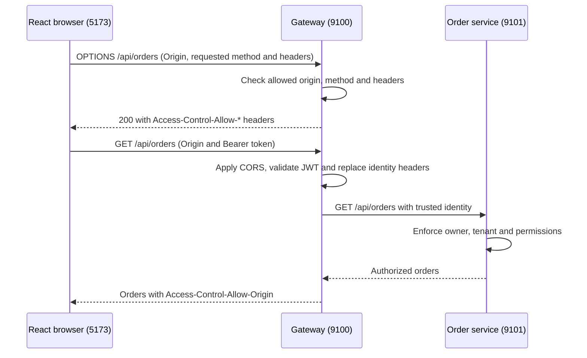

# 09. CORS, Preflight Requests and Browser Security

**Topic name:** Cross-Origin Resource Sharing (CORS).  
**Implemented scenario:** React on `http://localhost:5173` calls API gateway on
`http://localhost:9100` directly. Gateway handles CORS before JWT authentication.
## 1. Purpose: why does the browser need CORS?

An origin consists of **scheme + hostname + port**. Our UI and gateway have
different ports, so they are different origins.

The browser's same-origin policy restricts JavaScript reading response from cross-origin . 
CORS lets gateway declare which frontend origins may access its API.
Postman, curl and service clients does not block cross-origin calls,only browser do this.


## 2. Request flow: preflight, authentication, routing



The browser sends a preflight because `Authorization` is not a CORS-safelisted
request header. JSON POST/PATCH requests also require preflight. It asks whether
the intended method and headers are allowed; **the preflight does not carry the
application's Bearer token**. Gateway answers it without contacting order-service.
The subsequent business request still needs a valid token and permissions.

Preflight results may be cached for up to the configured 600 seconds, subject to
browser limits. Not seeing OPTIONS before every request is normal. Product image
GET requests do not carry the API Bearer token and generally do not need preflight.

## 3. React implementation: one explicit gateway destination(Optional-UI Only)

In [api.js](../../ecom-ui/src/api.js):

```javascript
export const GATEWAY_ORIGIN = new URL(import.meta.env?.VITE_GATEWAY_URL || 'http://localhost:9100')
  .origin;

export function gatewayUrl(path) {
  validateRequest(path, 'GET', '');
  return `${GATEWAY_ORIGIN}${path}`;
}
```

API callers still supply paths such as `/api/orders`. The helper validates them,
rejecting external URLs and traversal paths, before requesting a token. It calls
`fetcher(gatewayUrl(path), ...)` with the Bearer token, `credentials: 'omit'` and
`redirect: 'error'`. Redirects cannot silently forward that request elsewhere.
The configured gateway must be a trusted HTTP(S) origin; `.origin` drops any path.

`credentials: 'omit'` avoids sending browser cookies with these API requests.
It does not remove the explicitly supplied Authorization header. Our API
uses Bearer tokens, so it does not need cookie-based credentialed CORS.
Keycloak's own browser login/token flow has separate client configuration.

[ShopPage.jsx](../../ecom-ui/src/modules/customer/pages/ShopPage.jsx) also resolves
`product.image` through `gatewayUrl(...)`. Otherwise a relative image path would
still go to port 5173 and fail after removing the proxy. Product images remain
public at gateway, while catalog/profile/order APIs require authentication.

[vite.config.js](../../ecom-ui/vite.config.js) now has only frontend server options:

```javascript
server: { host: 'localhost', port: 5173, strictPort: true },
preview: { host: 'localhost', port: 5173, strictPort: true },
```

For environment values, build-time behavior, restart instructions and minikube
access, use [application configuration](../infra-setup/commerce-setup.md#10-frontend-configuration).
The API origin must be browser-reachable, not an internal Kubernetes DNS name.

## 4. Gateway implementation: CORS inside the security chain

[application-local.yml](../../gateway-service/src/main/resources/application-local.yml)
and [application-k8s.yml](../../gateway-service/src/main/resources/application-k8s.yml)
each define their own configurable allowlist:

```yaml
security:
  cors:
    allowed-origins: ${CORS_ALLOWED_ORIGINS:http://localhost:5173}
```

Both profiles currently default to the same origin because the POC frontend runs
locally even when gateway runs in minikube. Allowed origins belong to the active
profile; change `CORS_ALLOWED_ORIGINS` for that environment when its frontend moves.
Use exact comma-separated origins for additional frontends. No wildcard origin is
enabled by default.

[GatewaySecurity.java](../../gateway-service/src/main/java/com/tip/ecommerce/gateway/security/GatewaySecurity.java)
creates a reactive `CorsConfigurationSource`, registers it for `/**`, and installs
it explicitly in the Spring Security chain:

```java
return http.cors(spec -> spec.configurationSource(cors))
    .csrf(ServerHttpSecurity.CsrfSpec::disable)
```

This is a partial excerpt; the existing JWT and authorization rules follow it.
Using Spring Security's CORS integration handles preflight **before authentication**
and adds CORS headers to allowed-origin authentication failures too. We do not
simply permit every OPTIONS request or duplicate CORS policy in each microservice.
[Spring Security reactive CORS reference](https://docs.spring.io/spring-security/reference/reactive/integrations/cors.html).

| Setting           | Implemented value and purpose                                                    |
| ----------------- | -------------------------------------------------------------------------------- |
| Allowed origins   | `http://localhost:5173` by default; configurable through `CORS_ALLOWED_ORIGINS`. |
| Allowed methods   | GET, POST, PATCH, OPTIONS, matching the current UI operations.                   |
| Allowed headers   | Authorization, Content-Type and the five existing X-Auth demo headers.           |
| Allow credentials | false; browser API cookies are not used.                                         |
| Max age           | 600 seconds for preflight caching.                                               |

The allowed X-Auth headers support the existing identity-spoofing learning exercise.
Allowing a header through CORS **does not trust its value**. Gateway's
[IdentityHeadersFilter](../../gateway-service/src/main/java/com/tip/ecommerce/gateway/security/IdentityHeadersFilter.java)
replaces forged identity with validated JWT claims before forwarding. Downstream
services continue enforcing role, owner and tenant rules.

Keycloak's Web Origins setting controls calls to **Keycloak**. Gateway's allowlist
controls calls to **gateway**. Changing one does not configure the other.

## 5. How to test

### Required applications and tools

For the curl checks below, start **gateway-service** with the local profile.
They use preflight or deliberately unauthenticated requests and need no downstream
service or running Keycloak. Use a terminal with curl.

For browser login and My orders, start Keycloak, PostgreSQL, gateway, order-service
and ecom-ui. For shopping, use the catalog and checkout service sets in the
[business flow checklist](../project-docs/business-flows-and-service-dependencies.md).
Use Chrome/Edge DevTools → Network. Accounts and passwords are in
[Keycloak setup](../infra-setup/keycloak-setup.md); startup commands and configuration
are in [commerce setup](../infra-setup/commerce-setup.md).

Restart gateway after changing its CORS configuration. Restart Vite after changing
its environment variables; rebuild for preview/deployed assets.

### Allowed preflight, without a token

```sh
curl -i -X OPTIONS http://localhost:9100/api/orders/checkout \
  -H 'Origin: http://localhost:5173' \
  -H 'Access-Control-Request-Method: POST' \
  -H 'Access-Control-Request-Headers: authorization,content-type'
```

Expect **200**, `Access-Control-Allow-Origin: http://localhost:5173`, an allowed
methods list including POST, and allowed headers including authorization and
content-type. There is no `Access-Control-Allow-Credentials: true`.

### Wrong origin, method or header

Repeat the command with `Origin: http://localhost:5174`. Expect **403** and no
allow-origin header. Also try the original allowed origin with requested method
DELETE, or requested header `x-unapproved`; each should return 403.
Do not add these values to the policy just to make a negative test pass.

### CORS success does not grant authentication

```sh
curl -i http://localhost:9100/api/orders \
  -H 'Origin: http://localhost:5173'
```

Expect **401**, with the allowed-origin header. The browser can read that failure
instead of reporting a misleading CORS error. A request without an Origin header
still needs authentication. An authenticated customer denied a business permission
should receive a readable 403; CORS does not upgrade their role.

### Browser and image verification

1. Open `http://localhost:5173/`, sign in as customer1, and open My orders.
2. Filter Network for `/api/orders`. Confirm the request URL starts with
   `http://localhost:9100`, not 5173. Inspect Origin and Authorization headers.
3. Inspect OPTIONS if present: it requests permission to send Authorization but
   contains no Bearer token itself. The actual GET contains the token.
4. Open Shop with the shopping services running. Confirm product image requests
   also target gateway on 9100 and render successfully.
5. In Postman, repeat an authenticated identity request with `X-Auth-Roles: admin`.
   Identity must remain the signed-in customer; header acceptance does not bypass
   gateway's JWT-based replacement. The API helper also retains a `spoof` option
   for programmatic learning checks; the shopping pages do not expose a checkbox.

curl displays headers/status but does not enforce CORS. The browser check confirms
the complete cross-origin behavior. Do not use `mode: 'no-cors'`: it prevents
JavaScript reading the API response and does not solve authenticated API access.

### Automated verification

```sh
mvn -f gateway-service/pom.xml test
npm --prefix ecom-ui test
npm --prefix ecom-ui run build
```

Use JDK 17. [GatewayCorsTest](../../gateway-service/src/test/java/com/tip/ecommerce/gateway/security/GatewayCorsTest.java)
exercises the real Spring security chain without external services: permitted
preflight, wrong origin/method/header, readable 401 and non-browser authentication.
[API helper tests](../../ecom-ui/src/api.test.js) check direct destinations,
image URLs, token headers and rejection of arbitrary destination paths.

## 6. Troubleshooting

| Symptom                                         | What to check                                                                   |
| ----------------------------------------------- | ------------------------------------------------------------------------------- |
| API request still targets 5173                  | Restart Vite/rebuild; check gatewayUrl and VITE_GATEWAY_URL.                    |
| OPTIONS returns 403                             | Exact origin, requested method and requested headers against gateway policy.    |
| OPTIONS returns 401                             | Confirm the updated gateway is running and security CORS integration is active. |
| GET returns readable 401                        | CORS is working; check token expiry, issuer and audience.                       |
| Allowed customer receives 403                   | Check business permissions/ownership; this is not automatically a CORS failure. |
| Connection refused                              | Start/expose gateway at the configured URL; CORS cannot fix connectivity.       |
| Login callback fails                            | Check Keycloak redirect URI/Web Origins separately.                             |
| UI changes work locally but not in built assets | VITE_GATEWAY_URL is build-time public configuration; rebuild.                   |

## 7. Summary

React calls one gateway origin directly. CORS permits known browser origins and
preflight headers; JWT establishes identity; downstream policies authorize business
operations. Vite serves the UI and does not proxy APIs. These responsibilities
remain separate, and CORS does not stop non-browser clients reaching exposed ports.

## 8. Interview explanation: production e-commerce scenario

Use this example to explain the design in 3–4 minutes. The domains are illustrative;
the project's implementation and verification details are covered above.

> Consider an e-commerce application where customers use `https://shop.example.com`,
> while backend APIs are exposed through `https://api.example.com`. When a customer
> opens My Orders, the browser sends a request from the shopping portal to the API
> gateway. These addresses have different hostnames, so they are different origins.
>
> By default, the browser restricts JavaScript from reading responses from another
> origin. CORS allows the API to explicitly permit a trusted frontend origin. In
> this design, I would manage that policy centrally at the gateway because it is
> the entry point for browser API requests. This also avoids maintaining separate,
> potentially inconsistent CORS settings in every downstream microservice.
>
> For example, the My Orders request carries an Authorization header containing a
> Bearer token. Before sending that request, the browser sends an OPTIONS preflight,
> unless a previous preflight result is still cached. It identifies the portal's
> origin and asks whether the intended method and headers are allowed. The
> preflight itself does not contain the application's access token.
>
> Gateway checks the origin against an explicit allowlist, along with the requested
> method and headers. If they are allowed, it returns the appropriate CORS response
> headers. The browser can then send the actual request. CORS processing must happen
> before JWT authentication so that a legitimate preflight is not rejected for
> having no token. This does not make the business endpoint public.
