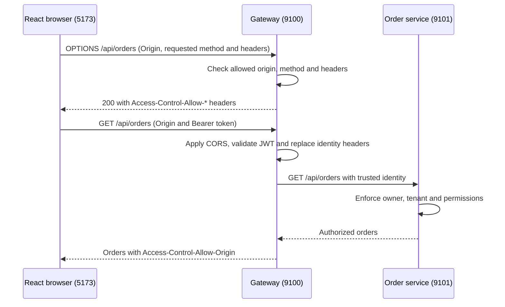

# 09. CORS, Preflight Requests and Browser Security

## 1. Purpose: why do we need CORS?

Our React page runs at `http://localhost:5173`. It asks gateway at
`http://localhost:9100` for data, such as the customer's orders.

These addresses use different ports. The browser treats them as different
**origins**. An origin simply means the `http` or `https` part, the hostname and
the port together.

Before letting React read the response, the browser needs permission from gateway.
**CORS is how gateway gives that permission.** Our settings tell the browser:
“Pages from `http://localhost:5173` are allowed to read my API responses.”

Without that permission, the browser blocks React from reading the response.
Postman and backend services do not apply this browser rule. The API still needs
login and permission checks to protect the data.

## 2. Request flow: preflight, authentication, routing



Before sending the API request, the browser first sends an `OPTIONS` request to
gateway. This is called a **preflight**. It asks: “Can this frontend send this
request with these headers?” Headers carry extra details, such as the login token
or the type of data being sent.

Our React app sends the login token in the `Authorization` header, so the browser
needs this permission first. Sending JSON data in a POST or PATCH request also
needs a preflight.

The OPTIONS request **does not contain the login token**. Gateway checks the CORS
settings and replies directly. It does not call order-service for this check.

If gateway allows the request, the browser sends the actual API request with the
login token. Gateway checks the token, and order-service checks which orders the
user can see. Allowing the preflight does not skip these security checks.

The browser can remember this permission for **20 seconds**, as set in our code.
During that time, it may send another matching API request without asking again.
So it is normal not to see OPTIONS before every request.

Product image requests do not send a login token and normally do not need this
OPTIONS check.

## 3. React implementation: one explicit gateway destination(Optional-UI Only)

In [api.js](../../ecom-ui/src/api.js):

```javascript
export const GATEWAY_ORIGIN = new URL(import.meta.env?.VITE_GATEWAY_URL || 'http://localhost:9100')
  .origin;

export function gatewayUrl(path) {
  validateRequest(path, 'GET', '');
  return `${GATEWAY_ORIGIN}${path}`;
}
```

API callers still supply paths such as `/api/orders`. The helper validates them,
rejecting external URLs and traversal paths, before requesting a token. It calls
`fetcher(gatewayUrl(path), ...)` with the Bearer token, `credentials: 'omit'` and
`redirect: 'error'`. Redirects cannot silently forward that request elsewhere.
The configured gateway must be a trusted HTTP(S) origin; `.origin` drops any path.

`credentials: 'omit'` avoids sending browser cookies with these API requests.
It does not remove the explicitly supplied Authorization header. Our API
uses Bearer tokens, so it does not need cookie-based credentialed CORS.
Keycloak's own browser login/token flow has separate client configuration.


For environment values, build-time behavior, restart instructions and minikube
access, use [application configuration](../infra-setup/commerce-setup.md#10-frontend-configuration).
The API origin must be browser-reachable, not an internal Kubernetes DNS name.

## 4. Gateway implementation: CORS inside the security chain

[application-local.yml](../../gateway-service/src/main/resources/application-local.yml)
and [application-k8s.yml](../../gateway-service/src/main/resources/application-k8s.yml)
each define their own configurable allowlist:

```yaml
security:
  cors:
    allowed-origins: ${CORS_ALLOWED_ORIGINS:http://localhost:5173}
```

Both profiles currently default to the same origin because the POC frontend runs
locally even when gateway runs in minikube. Allowed origins belong to the active
profile; change `CORS_ALLOWED_ORIGINS` for that environment when its frontend moves.
Use exact comma-separated origins for additional frontends. No wildcard origin is
enabled by default.

[GatewaySecurity.java](../../gateway-service/src/main/java/com/tip/ecommerce/gateway/security/GatewaySecurity.java)
defines the CORS settings in `corsConfigurationSource()`. Spring passes this bean
into `security()`, where `.cors(...)` enables it for incoming requests.

Only the CORS-related code is shown below. Other methods and security settings are
omitted to keep this example focused; they remain in the actual Java class.

```java
@Configuration
public class GatewaySecurity {
    // Choose which frontend addresses, HTTP methods and headers are allowed.
    // Use these CORS rules for all gateway paths.
    @Bean
    org.springframework.web.cors.reactive.CorsConfigurationSource corsConfigurationSource(
            @org.springframework.beans.factory.annotation.Value("${security.cors.allowed-origins}")
            java.util.List<String> origins) {

        var config = new org.springframework.web.cors.CorsConfiguration();
        config.setAllowedOrigins(origins);
        config.setAllowedMethods(java.util.List.of("GET", "POST", "PATCH", "OPTIONS"));
        // Allow X-Auth headers so we can test requests with fake user details.
        // Gateway replaces those details with the real user details from the checked token.
        config.setAllowedHeaders(
                java.util.List.of(
                        "Authorization",
                        "Content-Type",
                        "X-Auth-Subject",
                        "X-Auth-Username",
                        "X-Auth-Roles",
                        "X-Auth-Tenant",
                        "X-Auth-Permissions"));
        // Do not allow browser cookies for these API calls.
        // The login token can still be sent in the Authorization header.
        config.setAllowCredentials(false);
        // Let the browser remember permission for 20 seconds before asking with OPTIONS again.
        // This does not save API data or skip login checks for protected APIs.
        config.setMaxAge(20L);
        // Create a place to store which CORS settings apply to each URL path.
        var source = new org.springframework.web.cors.reactive.UrlBasedCorsConfigurationSource();
        // "/**" means all gateway paths. Apply the same CORS settings to all of them.
        source.registerCorsConfiguration("/**", config);
        return source;
    }

    @Bean
    SecurityWebFilterChain security(
            ServerHttpSecurity http,
            org.springframework.web.cors.reactive.CorsConfigurationSource cors) {
        // Spring passes in the CORS settings object created by the method above.
        // Use it to check browser requests before checking the login token.
        return http.cors(spec -> spec.configurationSource(cors))
                // ... other security settings omitted ...
                .build();
    }

    // ... other methods omitted ...
}
```

| Setting           | Implemented value and purpose                                                    |
| ----------------- | -------------------------------------------------------------------------------- |
| Allowed origins   | `http://localhost:5173` by default; configurable through `CORS_ALLOWED_ORIGINS`. |
| Allowed methods   | GET, POST, PATCH, OPTIONS, matching the current UI operations.                   |
| Allowed headers   | Authorization, Content-Type and the five existing X-Auth demo headers.           |
| Allow credentials | false; browser API cookies are not used.                                         |
| Max age           | 20 seconds for preflight caching.                                               |


Keycloak's Web Origins setting controls calls to **Keycloak**. Gateway's allowlist
controls calls to **gateway**. Changing one does not configure the other.

## 5. How to test in the browser

Use the running application for this check.

1. Open `http://localhost:5173/` and sign in as `customer1`.
2. Open browser **Developer Tools → Network**. Select **All** so preflight
   requests are visible, then enter `/api/orders` in the filter box.
3. Open **My orders**. Look for an **OPTIONS** request followed by a **GET** request
   to `http://localhost:9100/api/orders`. Click a request and open **Headers** to
   see its request method.
4. Select **OPTIONS**. Under **Request Headers**, check that `Origin` is
   `http://localhost:5173` and `Access-Control-Request-Method` is `GET`.
   `Access-Control-Request-Headers` should include `authorization`. This request
   asks permission to send the token; it does not contain the token itself.
5. Under **Response Headers**, check that `Access-Control-Allow-Origin` is
   `http://localhost:5173`, the allowed methods include `GET`, and the allowed
   headers include `Authorization`. Expect a successful response (`200`).
6. Select the actual **GET** request. Its request headers should contain
   `Authorization: Bearer ...`. Expect `200`, an orders response (which can be an
   empty list), and the My orders page to load.

If OPTIONS is missing, the browser may remember an earlier preflight. The current
code sets this time to **20 seconds**. Keep Network open, wait more than 20 seconds,
and reload My orders. A new private browser window can also help you see the first
preflight. You do not need to send OPTIONS yourself; the browser sends it.

## 6. Summary: a real e-commerce example

> Customers open the shopping site at `https://shop.example.com`. The site calls
> APIs through `https://api.example.com`. These addresses have different hostnames,
> so the browser treats them as different origins.
>
> When a customer opens My Orders, the frontend needs to call the order API with
> a login token. Before this call, the browser sends an OPTIONS request. This is
> called a preflight. It asks whether the shopping site can send the required
> method and headers. It does not send the login token in this first request.
>
> Gateway checks whether the shopping site is in its allowed origins. It also
> checks the requested method and headers. If they are allowed, it replies with
> CORS headers, and the browser can send the actual request with the token.
>
> Gateway then checks the token and sends the request to order-service with the
> verified user details. Order-service checks which orders that customer can see
> and returns them. Gateway adds the CORS response header so the browser lets the
> frontend read and display the orders.
>
> We keep CORS settings at gateway because all browser API calls go through it.
> This gives us one place to allow each environment's frontend address. CORS
> controls which frontend can read a response in the browser. Token and permission
> checks still decide who can access the data.
>
> The browser can remember a successful preflight for a short time, so OPTIONS
> does not appear before every API call.
