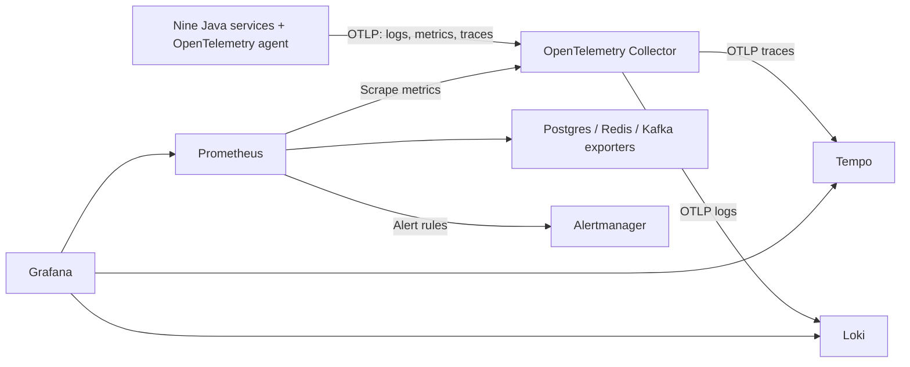

# Observability setup and operations

The repository implements observability for all nine Java services. Backends and
infrastructure exporters belong to the root **shared-infra** Compose project.
Applications still run in IntelliJ or Minikube. See the [concept and interview
guide](../observability/01-logs-metrics-and-tracing.md) for the reasoning.

## Architecture



The Java agent instruments incoming HTTP, Reactor/Netty, Java HttpClient,
WebClient, JDBC, Kafka clients/listeners, scheduled work and Logback. Its
Micrometer bridge also exports Spring/Actuator and custom business measurements.
There is one tracing SDK: the agent. Do not add Micrometer Tracing or another
agent on top of it without deciding how to avoid duplicate instrumentation.

This replaces the earlier proposal to tail local files with Alloy and scrape
application Actuator ports. OTLP works from both IntelliJ and Minikube without
mounting Mac log directories or accessing Pod files. `/actuator/prometheus` is
**not** exposed; existing business authorization and health access stay intact.

## 1. Start shared infrastructure

Docker Desktop, JDK 17, Maven and Python 3 are required. Follow the
[shared infrastructure setup](README.md) first for PostgreSQL/Kafka volumes and
Keycloak initialization. From the repository root:

```sh
docker compose config --quiet
docker compose up -d
docker compose ps
python3 -u docker/observability/smoke-test.py
```

The smoke check emits isolated synthetic data, then queries all three backends.
A running container alone is not a successful ingestion check. First pulls can
take several minutes. Budget extra Docker memory for this stack and nine JVMs.

| Component | Browser / host address | Purpose |
| --- | --- | --- |
| Grafana | http://localhost:3000/d/commerce-overview | Provisioned Commerce dashboard and Explore |
| Prometheus | http://localhost:9090 | PromQL, targets, alert rules |
| Alertmanager | http://localhost:9093 | Grouped alerts and local silences |
| Loki | http://localhost:3100/ready | Log storage readiness; query through Grafana |
| Tempo | http://localhost:3200/ready | Trace storage readiness; query through Grafana |
| Collector | http://localhost:13133/ | Collector readiness |
| OTLP HTTP / gRPC | localhost:4318 / localhost:4317 | Application telemetry ingestion |

Grafana's learning login is `admin` / `WorkoutsGrafana-Local-2026!`. Set
`GRAFANA_ADMIN_PASSWORD` **before first initialization** to use another password;
changing it later does not reset an existing Grafana volume's account.
Grafana provisions Prometheus, Loki and Tempo automatically, including trace/log
navigation and metric exemplar links where an exemplar exists.

Infrastructure exporters are internal-only: PostgreSQL `9187`, Redis `9121`,
Kafka `9308`. Kafka exporter measures broker/topic/group offsets and lag; it is
not a full Kafka JMX performance exporter. PostgreSQL exporter uses the existing
learning credential; production should use a dedicated monitoring role.

Pinned versions are in [Compose](../../docker-compose.yml); the Java agent is
pinned to `2.20.0` in each service POM. These are verified compatible pins, not a
claim to be the newest releases. Upgrade intentionally and repeat validation.

## 2. Run applications with instrumentation

First download the agent and build the independent projects:

```sh
mvn -B test package
```

Maven's `process-resources` step copies the pinned agent to each
`SERVICE/target/otel/opentelemetry-javaagent.jar`. It is a separate runtime
artifact, not a dependency inside the Spring Boot JAR.

**IntelliJ:** reimport the root Maven project and choose the shared
`SERVICE (observable)` run configurations from [.run](../../.run). They attach
the agent and load that service's `src/main/resources/otel.properties`. Run
`mvn process-resources` again after deleting target directories. A pre-existing
run configuration is not automatically instrumented: select the new one or copy
its two VM options. Keep JDK 17 selected.

**Maven:** `mvn -f order-service/pom.xml spring-boot:run` attaches the agent using
the configured Spring Boot plugin. Repeat with other service POMs.

**Packaged JAR:** the agent must be explicit:

```sh
java -javaagent:order-service/target/otel/opentelemetry-javaagent.jar \
  -Dotel.javaagent.configuration-file=order-service/src/main/resources/otel.properties \
  -jar order-service/target/order-service-0.0.1-SNAPSHOT.jar
```

Use the analogous paths for each service. Starting `java -jar` alone provides
structured console logging but does not activate the agent's telemetry pipeline.

## 3. Settings and Minikube

The agent initializes **before Spring**. Its settings live in `otel.properties`,
not `application.yml`; environment variables override them.

| Setting | Local default | When to override |
| --- | --- | --- |
| `OTEL_EXPORTER_OTLP_ENDPOINT` | `http://localhost:4318` | k8s manifests use `http://host.minikube.internal:4318` |
| `OTEL_EXPORTER_OTLP_PROTOCOL` | `http/protobuf` | Only if changing transport deliberately |
| `OTEL_RESOURCE_ATTRIBUTES` | `service.namespace=ecommerce,deployment.environment.name=local` | k8s uses environment `stage` |
| `OTEL_SERVICE_NAME` | The module name | Keep stable across replicas |
| `OTEL_TRACES_SAMPLER_ARG` | `1.0` | Parent-based root sampling; reduce for higher volume |
| `OTEL_METRIC_EXPORT_INTERVAL` | `15000` milliseconds | Collection/export tradeoff |
| `OTEL_SDK_DISABLED` | `false` | Explicitly disable telemetry for troubleshooting |

Rebuilt Docker images include the agent and activate it in their entrypoints.
The application-only [k8s manifests](../../k8s/) point at the same Collector.
Rebuild/load images and roll out deployments; applying YAML alone does not update
an existing image. No observability server is deployed inside Minikube.
Minikube connectivity/manifests are supplied but must be validated in a running
cluster; local acceptance checks do not prove Pod-to-host reachability.

Only OTLP ports bind beyond loopback so Minikube can reach them. They have no
TLS/authentication in this trusted local learning setup. Restrict network access;
production requires authenticated ingestion, TLS and appropriate network policy.
All browser/query ports bind to `127.0.0.1`. Do not expose these Compose defaults
as a production service. Agent-generated instance IDs distinguish replicas;
only service, namespace, environment and instance become metric resource labels.

## 4. Dashboard, queries and alerts

Open **Grafana → Dashboards → Commerce**. Generate requests first and allow two
15-second exports/scrapes before using rate panels. Filter by service/environment.

The dashboard contains HTTP request rate, p95, 5xx ratio, JVM heap, checkout
backlog, outbox backlog, attempt failures, snapshot age, Kafka lag and target
health. Shared infrastructure panels intentionally ignore service/environment
filters because local and stage use the same infrastructure.

```promql
# RED: rate, errors, duration (OpenTelemetry HTTP semantic convention names)
sum by (service_name) (rate(http_server_request_duration_seconds_count[5m]))
histogram_quantile(0.95, sum by (le, service_name) (rate(http_server_request_duration_seconds_bucket[5m])))

# Multiple replicas read the same database: max, not sum.
max by (service_name, outbox) (commerce_outbox_pending)
time() - max by (service_name) (commerce_metrics_last_success_seconds)

# Lag is not an HTTP request metric.
sum by (consumergroup, topic) (kafka_consumergroup_lag)
```

Loki query: `{service_name="order-service"}`. Filter by an order/event ID as text,
then inspect structured `trace_id` and follow its Tempo link. IDs are **not** Loki
index labels. Tempo TraceQL: `{ resource.service.name = "gateway-service" }`.
Logs outside an active span may legitimately have no trace ID.

Prometheus evaluates checked-in [alerts](../../docker/observability/alerts.yml)
for scrape failure, missing local application telemetry, high HTTP error ratio,
high p95, backlog, stale business snapshots, Kafka lag and PostgreSQL/Redis
availability. Thresholds are learning defaults to tune against real traffic/SLOs.
Application absence alerts deliberately fire when expected local apps are stopped;
change the expected environment/service set for a stage-only workflow. Collector
`up=1` means its metrics endpoint is reachable, not that all services are healthy.

Alertmanager groups alerts for viewing locally. **No email/Slack/webhook receiver
is configured**. Add a real receiver separately when you choose a destination.
A rule without notification delivery is not a production paging setup.

## 5. Verification

See the [completed local validation report](../observability/validation.md) for
tested behavior and deployment limits.

```sh
# Infrastructure configuration and synthetic ingestion
python3 -u docker/observability/smoke-test.py

# All ports 9100–9108 must be free. Temporarily runs built JARs, then stops them.
python3 -u docker/observability/verify.py --commerce
```

The acceptance check runs nine instrumented applications, checks health, proves
gateway-to-PGS trace continuity, runs existing checkout/idempotency/inventory/
payment/Kafka checks, verifies each service's JVM metrics and centralized logs,
checks backlog metrics and actual Kafka producer/consumer trace continuity, validates
infrastructure exporters and alert-rule cases, and executes every Grafana dashboard query. `--commerce`
creates learning records; omit it for the read-only HTTP flow. It never stops
pre-existing application processes. Output/logs are under
`/tmp/commerce-observability-validation`. The shared infrastructure stays running.

For a manual interview demo: open My Orders, inspect the gateway trace, place one
order, follow its worker logs by order ID, and inspect Kafka publisher/consumer
spans. The initial checkout `202` trace and later durable worker/outbox traces
are separate. Context is not persisted in business tables; do not present them
as one continuous checkout trace. The agent propagates context across live HTTP
and Kafka headers, not across a database row and a later polling transaction.

## 6. Storage, failure behavior and troubleshooting

Named volumes persist Prometheus, Loki, Tempo, Grafana, Alertmanager and Collector
queues. Prometheus retains seven days or 2 GB, Loki seven days, Tempo 48 hours.
These are local filesystem stores, not HA/object-storage installations or backups.
Loki/Tempo retention is time-based and does not enforce a hard disk-size cap.
Avoid `docker compose down -v`; it deletes Compose-managed history.

Collector uses a memory limiter, batching and disk-backed queues for logs/traces.
Exporter retries are bounded (five minutes); full queues or a prolonged outage
can lose data. Metrics are in memory until scraped and are not durably queued.
The app's exporter is asynchronous and bounded too: Collector persistence cannot
recover data that never reached it. Application functionality should continue
when telemetry backends are unavailable.

| Symptom | Check |
| --- | --- |
| No application data | Agent startup line, chosen IntelliJ configuration, OTLP endpoint, Collector logs |
| `unknown_service:java` | Agent property file path / `OTEL_SERVICE_NAME`; Spring name alone is insufficient here |
| Empty rate/latency panel | Generate traffic, wait two intervals, select correct environment, inspect raw metric names |
| Backlog zero but processing broken | Snapshot age, worker retries, consumer lag; retained snapshots can be stale |
| Missing Kafka spans | Agent attached to producer and consumer, fresh messages, sampling, backend export delay |
| Missing log link | Log must occur in a traced operation; inspect Loki `trace_id` metadata |
| Local works, Pod does not | Rebuilt agent image, Pod env and `host.minikube.internal:4318` connectivity |
| Datasource error | Compose service names in Grafana provisioning; browser `localhost` is not a container address |

SQL bind-value TRACE logging and gateway DEBUG logging are disabled by default.
Agent JDBC statement sanitization is enabled. Do not log access tokens, customer
addresses, payment bodies or other personal information. This is not a general
redaction guarantee: review new log statements and instrumentation changes.

Official references: [Java agent](https://opentelemetry.io/docs/zero-code/java/agent/),
[agent configuration](https://opentelemetry.io/docs/zero-code/java/agent/configuration/),
[Tempo and Collector](https://grafana.com/docs/tempo/latest/set-up-for-tracing/instrument-send/set-up-collector/otel-collector/),
[Loki native OTLP](https://grafana.com/docs/loki/latest/send-data/otel/),
[Prometheus configuration](https://prometheus.io/docs/prometheus/latest/configuration/configuration/).
