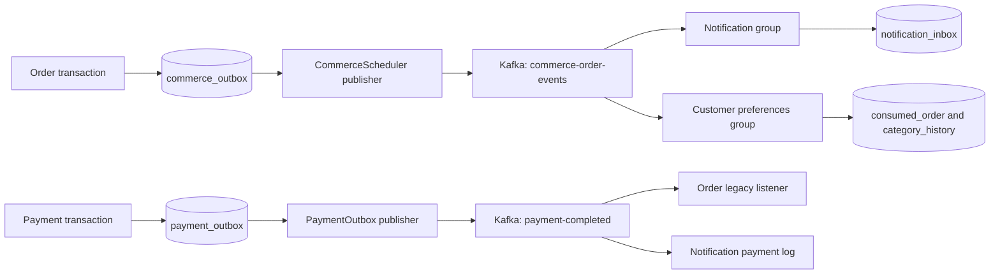

# Kafka in this project: outbox, consumer groups and duplicate delivery

## 1. Problem and business scenario

A confirmed order must create a customer notification and influence future
category recommendations. Neither consumer should hold up checkout. A service
restart must not silently lose the fact that the order was confirmed.

The solution combines three distinct ideas: a database **outbox** retains events,
Kafka **consumer groups** deliver them independently to each business capability,
and consumer **deduplication** makes redelivery safe. None alone provides the
whole guarantee.

Install/configure the broker using [Kafka setup](../infra-setup/kafka-setup.md).
This guide explains application code, not broker installation.

## 2. Two topics with different business jobs

| Topic                   | Producer                  | Consumers and group IDs                                                      | Effect                                                      |
| ----------------------- | ------------------------- | ---------------------------------------------------------------------------- | ----------------------------------------------------------- |
| `commerce-order-events` | Order `CommerceScheduler` | Notification `commerce-notifications-v1`; customer `customer-preferences-v1` | Persist inbox updates; count confirmed purchase categories  |
| `payment-completed`     | Payment `PaymentOutbox`   | Order `order-group`; notification `notification-group`                       | Confirm legacy amount-only orders; log payment notification |



Different groups each receive the topic's records. Replicas in the **same group**
share partitions; they do not each receive every event. Local and k8s instances
use the same groups and databases, so running both can split processing.

## 3. Producer transaction: persist the fact before attempting Kafka

**Failure without an outbox:** a payment commits, the process crashes before
sending, and downstream services never hear about it. Payment-service now writes
its payment and outbox within the same `@Transactional` method:

Excerpt from [PaymentServiceImpl.java](../../payment-service/src/main/java/com/tip/ecommerce/payment/service/impl/PaymentServiceImpl.java) (surrounding code omitted):

```java
payment = paymentRepository.save(payment);

db.update(
    "INSERT INTO payment_outbox(order_id,payment_id) VALUES (?,?) ON CONFLICT DO NOTHING",
    payment.getOrderId(),
    payment.getId());
```

The outbox row is in payment-service's database. A failed local transaction saves
neither payment nor event intent. It does **not** include Kafka in that transaction.
Order-service similarly calls `CheckoutService.event` within checkout/fulfillment
transactions. Its event ID is `orderId:status`, with owner, tenant, item categories
and occurrence time in the payload.

## 4. Publisher: acknowledge first, then mark the database row

Excerpt from [PaymentOutbox.java](../../payment-service/src/main/java/com/tip/ecommerce/payment/service/PaymentOutbox.java) (surrounding code omitted):

```java
kafka
    .send(
        "payment-completed",
        String.valueOf(id),
        new PaymentCompletedEvent(
            id, ((Number) row.get("payment_id")).longValue(), "SUCCESS"))
    .get(10, java.util.concurrent.TimeUnit.SECONDS);
db.update("UPDATE payment_outbox SET published=true WHERE order_id=?", id);
```

If send fails, the row remains pending. If Kafka accepts the event but the process
crashes before setting `published=true`, the next attempt can publish it again.
That is **at-least-once delivery**. Producer idempotence reduces transport retries
within producer operation; it does not deduplicate every future outbox replay.

Order's publisher uses `order_id` as the Kafka key, sends string JSON and waits for
acknowledgment before marking published. Payment uses JSON serialization with Java
type headers disabled; each legacy consumer supplies its own target event class.

`acks=all` means all current in-sync replicas acknowledge. This Compose broker is
single-node: it has no extra replica to survive machine/disk loss. Kafka producer
transactions, XA and Debezium CDC are not configured here.

## 5. Customer consumer: make repeated events harmless

Category counts are increments, so processing a duplicate would distort the
recommendations. Customer-service first records the event ID in the **same database
transaction** as the increments:

Excerpt from [PurchaseListener.java](../../customer-service/src/main/java/com/tip/ecommerce/customer/PurchaseListener.java) (surrounding code omitted):

```java
  @KafkaListener(topics = "commerce-order-events", groupId = "customer-preferences-v1")
  @Transactional(rollbackFor = Exception.class)
  public void receive(String body) throws Exception {
    var event = json.readTree(body);
    if (!event.path("status").asText().equals("CONFIRMED")) return;
    if (db.update(
            "INSERT INTO consumed_order VALUES (?) ON CONFLICT DO NOTHING",
            event.path("eventId").asText())
        == 0) return;
    for (var item : event.path("items"))
      db.update(
          "INSERT INTO category_history VALUES (?,?,?,?) ON CONFLICT(tenant,username,category) DO"
              + " UPDATE SET purchases=category_history.purchases+excluded.purchases",
          event.path("tenant").asText(),
          event.path("customerId").asText(),
          item.path("category").asText(),
          item.path("quantity").asInt());
  }
}
```

A duplicate ID returns before incrementing. A database failure rolls back the ID
and history update together so a retry can still apply the change. Only CONFIRMED
contributes; SHIPPED and DELIVERED do not count the purchase again.

Customer uses a string consumer and container-managed acknowledgment; it does not
use the manual `Acknowledgment` argument found in notification-service. Database
commit and Kafka offset commit remain separate, hence the deduplication requirement.

## 6. Notification consumer: durable inbox before acknowledgment

Excerpt from [CommerceNotifications.java](../../notification-service/src/main/java/com/tip/ecommerce/notification/messaging/CommerceNotifications.java) (surrounding code omitted):

```java
  @KafkaListener(
      topics = "commerce-order-events",
      groupId = "commerce-notifications-v1",
      properties = {"value.deserializer=org.apache.kafka.common.serialization.StringDeserializer"})
  public void receive(String payload, Acknowledgment ack) throws Exception {
    var e = json.readTree(payload);
    db.update(
        "INSERT INTO notification_inbox(event_id,tenant,customer_id,order_id,status,created_at)"
            + " VALUES (?,?,?,?,?,?) ON CONFLICT DO NOTHING",
        e.path("eventId").asText(),
        e.path("tenant").asText(),
        e.path("customerId").asText(),
        e.path("orderId").asLong(),
        e.path("status").asText(),
        java.sql.Timestamp.from(
            e.hasNonNull("occurredAt")
                ? java.time.Instant.parse(e.path("occurredAt").asText())
                : java.time.Instant.now()));
    ack.acknowledge();
  }
}
```

The inbox's unique `event_id` prevents duplicate rows. Acknowledgment happens after
the insert. The saved occurrence time comes from the event so delayed delivery
does not pretend the business transition happened at delivery time.

`GET /notifications/me` reads stored rows filtered by user and tenant. Kafka is
not needed to read an already stored inbox. The older payment listener and manual
`POST /notifications` only log; they do not produce these inbox records.

## 7. Retry, ordering and remaining limitations

Customer and notification provide an error handler with a five-second retry delay
and unlimited attempts. This avoids silently abandoning transient database failures,
but a poison record can block progress. No dead-letter topic/replay workflow exists.
Legacy order payment-consumption uses its own container behavior; do not assume all
three consumers share the same error handler or acknowledgment configuration.

The order publisher orders pending rows by order and lifecycle state, and events
are keyed by order ID. Kafka order is within a partition. Multiple publisher
replicas can select the same pending outbox rows because the publisher does not
claim/lock them. Deduplicating consumers tolerate repeated IDs, but this is **not**
a guarantee of globally ordered, exactly-once business processing across publishers.
A production extension would address publisher coordination, poison records,
retention/cleanup and operational replay explicitly.

`read_committed` in the legacy order consumer filters aborted Kafka transactions
if such producers exist; it does not make PostgreSQL and Kafka one transaction.

## 8. Observe the business outcome

Use [manual event verification](../project-docs/manual-verification.md#6-kafka-and-background-updates).
Stop Kafka, create a shopping order, and observe confirmation plus a pending order
outbox row. Restart Kafka and verify inbox/history catch-up. Use Kafka UI or
[the broker inspection commands](../infra-setup/kafka-setup.md#inspect-topics-and-consumer-groups)
to compare record publication with consumer progress.

A message visible in Kafka proves publication, not successful inbox/history writing.
A green unit test with a mocked publisher does not prove database/broker recovery.
