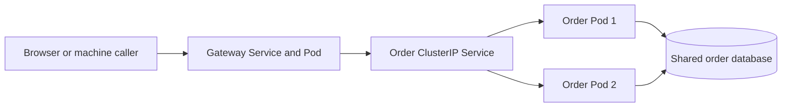

# Scaling and availability: what the current manifests demonstrate

## Problem and scenario

More gateway or order instances can share load, but additional replicas alone do
not make checkout safe. Multiple workers must not advance the same workflow twice,
and all instances must see the same durable state.

## 1. Actual deployment configuration

The current manifests specify **one gateway replica** and **two order replicas**.
Other business-service Deployments specify one replica. There are no HPA,
PodDisruptionBudget, topology-spread, resource request/limit or Ingress manifests.
These files are inputs for a future Jenkins deployment, not evidence of live scaling.

Excerpt from [order-service.yaml](../../k8s/order-service.yaml) (surrounding code omitted):

```yaml
spec:
  replicas: 2
  selector:
    matchLabels:
      app: order-service
```

The order Service routes to matching ready Pods. HTTP keep-alive can reuse a
connection, so repeated requests need not alternate between replicas. Kubernetes
Service routing is not an application-level guarantee of per-request round-robin.



## 2. Readiness and liveness solve different problems

Excerpt from [order-service.yaml](../../k8s/order-service.yaml) (surrounding code omitted):

```yaml
readinessProbe:
  httpGet:
    path: /actuator/health/readiness
    port: 9101
  initialDelaySeconds: 10
  periodSeconds: 5
livenessProbe:
  httpGet:
    path: /actuator/health/liveness
    port: 9101
  initialDelaySeconds: 20
  periodSeconds: 10
```

Readiness controls eligibility for Service traffic; liveness failure can restart a
container. These are Actuator probe endpoints, not a custom end-to-end checkout
health check. Do not assume readiness checks every external dependency; the
repository does not configure custom readiness-group dependency membership.

## 3. Coordination is in the application database

Excerpt from [CheckoutWorker.java](../../order-service/src/main/java/com/tip/ecommerce/order/service/CheckoutWorker.java) (surrounding code omitted):

```java
var rows =
    db.queryForList(
        "SELECT * FROM checkout WHERE state IN ('CREATED','RESERVED','PAID','RELEASING') AND"
            + " next_attempt<=now() ORDER BY order_id LIMIT 1 FOR UPDATE SKIP LOCKED");
```

One worker locks a checkout row; another skips it and may work on a different row.
Checkout submission uses advisory locks and a unique idempotency constraint;
inventory and payment separately handle duplicates. See [checkout](../project-docs/shopping-and-fulfillment.md).

The outbox publisher does not use the same claim/lock mechanism. Multiple publishers
may emit duplicate events, so [consumer deduplication](../kafka/kafka-notes-scenarios.md) remains
necessary. Replicas do not automatically make every background task exclusive.

## 4. Availability limits of this learning environment

The gateway has one replica. Shared PostgreSQL, Kafka, Keycloak and the Minikube
node/host are also single failure points. Multiple order replicas on one machine
do not provide multi-zone availability. Application locks/transactions survive a
process restart only while their underlying durable database remains available.

## 5. Future exercise: HPA and disruption protection

HPA could vary replicas using measured load, but it is not configured here. Before
adding CPU-based utilization scaling, define resource requests and ensure a metrics
source exists. Then measure whether gateway CPU, JDBC capacity or dependency
latency is the actual bottleneck. Scaling callers can overload shared dependencies.

PDBs, topology spread, rolling-release verification and load testing are also
future work. Their YAML should not be presented as already deployed project code.
Use [the deployment contract](../../k8s/README.md) when implementing them through Jenkins.

## Verify current definitions

Inspect the linked files and, only after deployment, read:

```sh
kubectl --context=minikube -n ecommerce get deployments,pods,services
kubectl --context=minikube -n ecommerce get hpa
kubectl --context=minikube -n ecommerce describe deployment order-service
```

No HPA resource is expected from the current repository. A live cluster may have
manual changes; compare it to the intended manifests rather than treating this
document as a live inventory.
