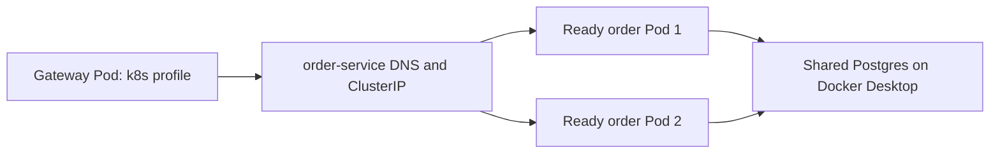

# Kubernetes routing: stable Service names for replaceable Pods

## Problem and scenario

A restarted order Pod can have a new IP. Hardcoding that IP in gateway would
require a configuration change on every replacement. The k8s profile instead
addresses a Kubernetes Service whose name stays stable while Pods change.

The repository contains application manifests; this document does not claim they
are deployed. Jenkins deployment is planned. Setup and future pipeline requirements
are in [Minikube setup](../infra-setup/minikube-setup.md).

## 1. Gateway chooses Service DNS in the k8s profile

Excerpt from [application-k8s.yml](../../gateway-service/src/main/resources/application-k8s.yml) (surrounding code omitted):

```yaml
services:
  order:
    url: http://order-service:9101
```

Both workloads use namespace `ecommerce`, so the short Service name resolves within
that namespace. The fully qualified form is `order-service.ecommerce.svc.cluster.local`
for a cluster using the usual `cluster.local` domain. No Eureka or Spring
DiscoveryClient is configured; these are ordinary HTTP URLs, not `lb://` routes.

## 2. Order Service selects matching Pods

Excerpt from [order-service.yaml](../../k8s/order-service.yaml) (surrounding code omitted):

```yaml
kind: Service
metadata:
  name: order-service
  namespace: ecommerce
spec:
  type: ClusterIP
  selector:
    app: order-service
  ports:
    - name: http
      port: 9101
      targetPort: 9101
```

The Service selects Pod label `app: order-service`. Service port and container
listener happen to both be 9101; they are different concepts. Deployment Pod
labels must match the selector, and `targetPort` must reach the real listener.



The diagram focuses on the gateway-to-order route. When order calls inventory or
payment, it first calls `http://gateway-service:9100`; the gateway resolves the
recipient's Service. All business HTTP still traverses the gateway.

## 3. Infrastructure stays outside Minikube

Application `application-k8s.yml` files use `host.minikube.internal` for shared
PostgreSQL, Kafka and Keycloak. That host alias is different from Kubernetes Service
DNS. Kafka additionally uses 9094 because metadata must advertise a Pod-reachable
address. Redis is shared too but not yet used by application code.

There are no infrastructure server manifests in `k8s/`. PGS also needs the local
image directory mounted into the Minikube node. See the setup guide for the mount.

## Observe after a Jenkins deployment exists

Read-only checks:

```sh
kubectl --context=minikube -n ecommerce get pods,services
kubectl --context=minikube -n ecommerce get endpointslices -l kubernetes.io/service-name=order-service
kubectl --context=minikube -n ecommerce describe service order-service
kubectl --context=minikube -n ecommerce logs deployment/gateway-service --tail=50
```

If DNS resolves but traffic fails, compare selector, endpoint addresses, Pod
readiness, target port and process logs. A ClusterIP is not proof of gateway-only
network isolation; no NetworkPolicy or mTLS is present. See [scaling](load-balancing-and-scaling.md)
for what Service routing does and does not guarantee.
