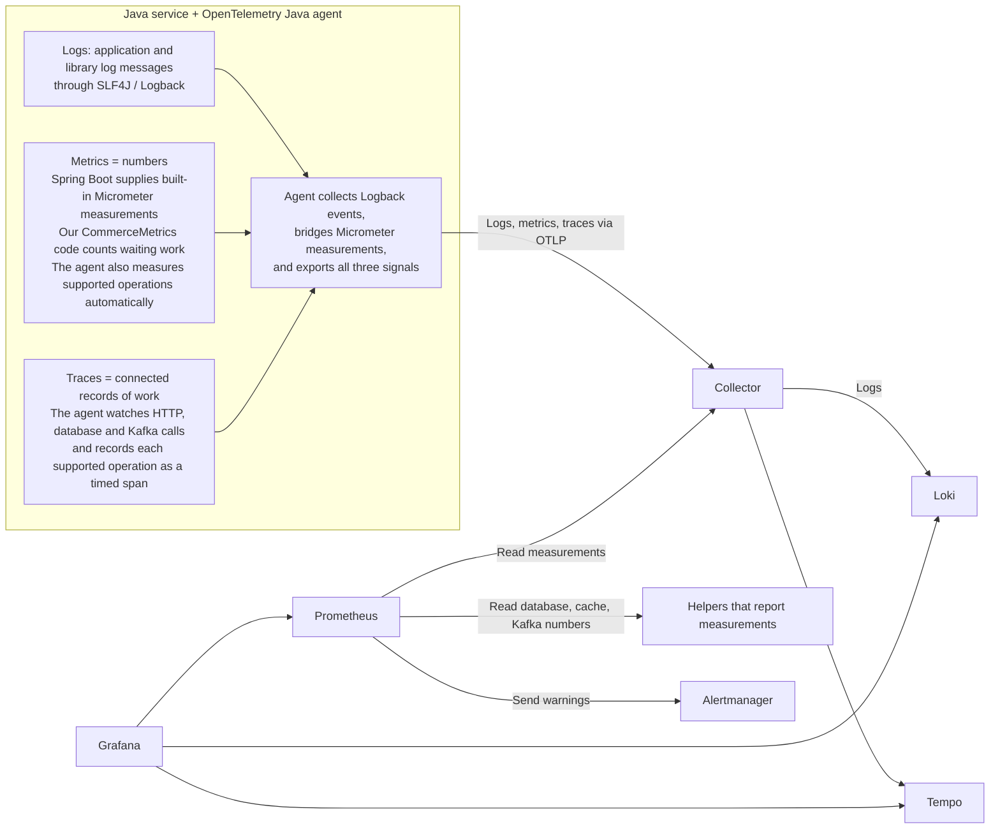

# Logs, metrics and tracing through the commerce project

For interview revision, read **section 2**. Use the remaining sections for concepts,
implementation details and hands-on checks. Installation, startup commands and
credentials are in the [setup guide](../infra-setup/observability-implementation-guide.md).

## 1. Why observability?

One customer action can involve several microservices. If a customer says,
“My order is stuck,” observability helps us find out what happened:

1. **Metrics — how big is the problem?** Check traffic, slow requests, HTTP 500
   errors and waiting orders. This helps us see whether the problem looks isolated
   or failures are increasing across the application.
2. **Traces — where did it go wrong?** Find a trace for the API around the reported
   time. Its **Trace ID** connects the recorded steps; each step, called a **span**,
   has its own Span ID. The timeline shows service calls, database calls and Kafka
   work, helping us spot a slow or failed step—for example, an inventory call.
3. **Logs — what happened there?** Use the Trace ID and service name to find the
   matching logs. Read the error details to understand the failure and decide
   what to fix. Use the order ID to follow later work that has a separate trace.

Remember: **Metrics show the scale → traces locate the step → logs explain the event.**

## 2. Interview recap: diagram, responsibilities and tracing flow



| Pillar | Who creates it? | What does the OpenTelemetry agent do? |
| --- | --- | --- |
| **Logs — what happened?** | Application and library code calls **SLF4J** (the logging API); **Logback** handles the log events. | Collects and exports the events; associates logs with the active trace when available. |
| **Metrics — how much, how often, how long?** | **Spring Boot** supplies built-in measurements through **Micrometer**. Our `CommerceMetrics` code adds business numbers, such as waiting checkouts. The agent also produces automatic measurements. | Exports its own measurements and those collected through its Micrometer bridge. |
| **Traces — where was time spent?** | The agent's **instrumentation** (code that automatically records supported operations) and bundled **OpenTelemetry SDK** (Software Development Kit: libraries inside the agent that create and manage spans, generate IDs, and export telemetry) create spans for supported operations. | Generates Trace IDs and Span IDs, records timing and outcomes, propagates context, and exports spans. |

- **Start the trace:** When Gateway receives a request without valid tracing context, its agent's SDK generates a **Trace ID** and a **Span ID**. A span is one timed operation; instrumentation means adding recording around a supported operation.
- **Connect the steps:** For an outgoing HTTP call, the agent creates a client span and sends context in the **`traceparent`** header. The receiving service creates a server span with the **same Trace ID**, a **new Span ID**, and a parent relationship to the caller. This repeats across supported calls; Kafka carries context in message headers.
- **Record and view:** Each service exports its own spans to the **Collector → Tempo**; Grafana displays the connected trace. Logs go to **Loki**, and **Prometheus** reads metrics from the Collector. The agent does not record every Java method; custom business steps need explicit spans. Our later checkout workers have separate traces because database rows do not preserve trace context—we correlate those stages using order/event IDs.

For deeper reference: [Concept](#3-concept) · [Implementation](#4-implementation) · [Testing](#5-testing).

## 3. Concept

### Components and their roles

| Component | Responsibility in this project |
| --- | --- |
| Java agent | Runs inside each service JVM; records supported operations and exports telemetry using OTLP, OpenTelemetry's transport protocol. |
| Collector | Separate process that receives, batches and routes telemetry. It is not the long-term store. |
| Loki / Tempo / Prometheus | Store logs / traces / metrics respectively. Prometheus scrapes metrics exposed by the Collector. |
| Grafana | Queries those stores and displays logs, charts and trace timelines. |
| Alertmanager | Groups and routes alerts evaluated by Prometheus. Our setup has no email or Slack receiver configured. |

### Metrics: common questions

**Do I need code to measure an API's response time?** Usually no. With the agent
attached and supported HTTP recording enabled, request timing is recorded for us.
Spring Boot also sets up built-in measurements through Micrometer. Micrometer
provides the Java methods and registry (a collection of named measurements).
Custom code is needed for business questions such as “how many checkouts are waiting?”

**What does p95 = 2 seconds mean?** Roughly 95 out of 100 requests finished within
2 seconds; the slowest 5 took longer. It helps reveal slowness that an average can
hide. Our histogram-based p95 is an estimate.

### Metrics: terms that matter

| Term | Meaning / example |
| --- | --- |
| Counter | Running total of events, such as failed checkout attempts; use `rate()` for events per second. A process restart can reset it. |
| Gauge | A current value that can rise or fall, such as pending checkouts. |
| Histogram / p95 | Duration buckets / estimated duration at or below which 95% of observations fall. Combine buckets before calculating p95 across replicas. |
| Cardinality | Number of different label combinations (separate measurement histories). Keep order IDs in logs, not metric labels, to avoid creating a time series per order. |

### Tracing: common questions

**Trace ID versus Span ID?** The Trace ID identifies a connected journey. Each
recorded operation in it has a different Span ID. A database query and an HTTP
call can each be a span; a span is not the same thing as an entire service.

**Does `traceparent` contain only the Trace ID?** No. It includes a format version,
the Trace ID, the calling span's ID and flags, including the sampling flag.
For example, an outgoing client span with Trace `ABC` / Span `100` can lead to a
receiving server span with Trace `ABC` / Span `200` / Parent `100`.
These shortened IDs are illustrative. The parent link tells the trace viewer
which operation led to the next one.

### Tracing and background work

- **Propagation:** HTTP uses `traceparent`; Kafka uses message headers to carry trace context. These IDs connect work; they do not authenticate callers.
- **Sampling:** `parentbased_traceidratio=1.0` records all new traces started here and follows an incoming parent's sampling decision. A log can have a Trace ID even when that trace is not stored.
- **Parallel calls:** Spans can overlap, so adding all span durations can exceed the request's elapsed time. Inspect the timeline.
- **Checkout boundary:** The checkout API saves work and returns `202`. Scheduled workers and outbox publishers run later. Our database does not persist trace context, so these runs have separate traces, correlated by order/event IDs in logs.
- **Two different backlogs:** Outbox backlog is database events waiting to be sent; Kafka consumer lag is published messages waiting to be consumed. Restarting a consumer does not publish outbox rows.

## 4. Implementation

### 4.1. Attach and configure the agent

All nine service POMs copy the agent into `target/otel/` during the build. Building
it does not activate it: select the service's **observable** IntelliJ configuration,
or start Java with these options (order-service example):

```text
-javaagent:order-service/target/otel/opentelemetry-javaagent.jar
-Dotel.javaagent.configuration-file=order-service/src/main/resources/otel.properties
```

Key settings from [order's otel.properties](../../order-service/src/main/resources/otel.properties)
(excerpt):

```properties
otel.service.name=order-service
otel.resource.attributes=service.namespace=ecommerce,deployment.environment.name=local
otel.exporter.otlp.endpoint=http://localhost:4318
otel.exporter.otlp.protocol=http/protobuf
otel.traces.exporter=otlp
otel.metrics.exporter=otlp
otel.logs.exporter=otlp
otel.traces.sampler=parentbased_traceidratio
otel.traces.sampler.arg=1.0
otel.instrumentation.micrometer.enabled=true
otel.metric.export.interval=15000
```

The agent reads configuration before Spring starts. Spring profiles do not select
agent property files. Override local defaults with deployment environment variables:
`OTEL_EXPORTER_OTLP_ENDPOINT`, `OTEL_RESOURCE_ATTRIBUTES`, etc.
Precedence is **JVM `-D` properties → environment variables → property file**.
The [Kubernetes deployment](../../k8s/order-service.yaml) already points to
`http://host.minikube.internal:4318`; `localhost` inside a pod means that pod.

### 4.2. Infrastructure configuration

These files are mounted into containers by [Docker Compose](../../docker-compose.yml).

| Configuration | Key behavior |
| --- | --- |
| [otel-collector.yml](../../docker/observability/otel-collector.yml) | Receives OTLP on 4317 (gRPC) / 4318 (HTTP); sends logs to Loki and traces to Tempo; exposes metrics on 9464. Pipelines use receivers → processors → exporters. |
| [prometheus.yml](../../docker/observability/prometheus.yml) | Scrapes the Collector every 15 seconds, plus infrastructure exporters for PostgreSQL, Redis and Kafka. |
| [Grafana data sources](../../docker/observability/grafana/provisioning/datasources/datasources.yml) | Provisions Prometheus, Loki and Tempo, including log TraceID links to Tempo. |
| [alerts.yml](../../docker/observability/alerts.yml) | Includes a checkout backlog alert: more than 10 pending checkouts for 5 minutes. One test order will not trigger it. |

Prometheus does **not** scrape each service's `/actuator/prometheus` in this setup.
`up{job="otel-applications"}=1` means the Collector's metrics endpoint answered,
not that every service is healthy. The Collector has bounded disk queues for logs
and traces; a prolonged outage can still lose data.

### 4.3. Application logs and business metrics

**Logs:** Our services use Logback and structured JSON console output
(`logging.structured.format.console: logstash`). The agent collects log events;
it does not tail the console file. Logstash is the format here, not a separate
Logstash server. Logs include order/event IDs for investigation; avoid tokens,
addresses and full sensitive payloads. Trace IDs are available when logging within
an active tracing context, not necessarily in startup logs.

**What our logs now contain:**

| Level | Events |
| --- | --- |
| INFO | Checkout accepted/state changes, completed payment, HTTP writes with safe request/response summaries, and Kafka publication/handling. |
| DEBUG | Routine HTTP reads, outgoing request starts and detailed safe responses. Enable with `APP_LOG_LEVEL=DEBUG` in the service's IntelliJ environment variables, then restart it. |
| WARN | Rejected requests and retryable dependency failures, including the order amount, current checkout state and retry delay. |
| ERROR | HTTP 5xx responses, unexpected worker errors and failed Kafka handlers. |

Events use labels such as `event`, `orderId`, `amount`, `state`, `path`, `status`,
`durationMs` and `failure`. Payload summaries keep selected business fields such
as amount, SKU and quantity. They omit addresses, customer identities, credentials,
headers and arbitrary error-body text; lists and strings are capped. The gateway
logs routing/status metadata; the services log the safe business payloads.
Database state-change success events are written after the transaction commits.

After restarting with the new code, a stopped inventory service produces an order
log like this (illustrative):

```text
event=checkout.dependency.failed data={"orderId":42,"amount":22.50,"state":"CREATED","dependency":"inventory-service","status":503,"attempt":3,"retryInSeconds":10,"nextAction":"RETRY",...}
```

In **Grafana → Explore → Loki**, find these failures with:

```logql
{service_name="order-service"} |= "checkout.dependency.failed"
```

Add `|= "\"orderId\":42,"` for a specific order, or `|= "\"amount\":22.50,"`
for an amount as displayed in that log. Order ID is the better identifier because
several orders can have the same amount. Logs from before this change do not gain
these fields. Trace IDs still come from the agent's active trace; no separate
request ID or manually invented Trace ID is added.

**Business metrics:** The agent cannot know what our business calls a waiting checkout.
Our [order CommerceMetrics](../../order-service/src/main/java/com/tip/ecommerce/order/observability/CommerceMetrics.java)
uses `JdbcTemplate` to count unfinished database rows and registers the saved
count with Micrometer. Micrometer does not run this business query for us.
If the count is 7, the gauge reports 7:

`Database → CommerceMetrics → Micrometer gauge → agent → Collector → Prometheus → Grafana`

Prometheus reads the gauge from the Collector; the arrows show where the value travels.

```java
// Excerpt: register a gauge that reads the cached count.
Gauge.builder("commerce.checkout.pending", this, m -> m.checkout)
    .register(registry);
```

The class refreshes checkout/outbox counts with a default 15-second delay.
[Payment CommerceMetrics](../../payment-service/src/main/java/com/tip/ecommerce/payment/observability/CommerceMetrics.java)
uses the same approach for its outbox. A failed read retains the previous count
and last-success timestamp; always check data age alongside the count.
Replicas may count the same database rows, so use `max`, not `sum`, for this backlog.
A failure counter counts attempts, not unique failed orders, and does not fall after success.

**How would I count checkouts waiting more than 3 seconds?** This is a possible
extension, not what our current gauge measures. Save when waiting began, then
count unfinished rows whose start time is more than 3 seconds ago. A checkout
that started at 10:00:00 has waited 5 seconds at 10:00:05.

**What if there is no start time?** A status alone tells us that work is waiting,
not how long it has waited. We need a saved start time or reliable event history.
Our current checkout table has a retry time (`next_attempt`), which is not the
waiting start time. Also, a gauge refreshed every 15 seconds would not provide
an immediate alert when a checkout crosses a 3-second threshold.

### 4.4. Useful PromQL queries

Use **Grafana → Explore → Prometheus**, with environment `local`.

**Pending checkouts by service:**

```promql
max by (service_name) (commerce_checkout_pending{deployment_environment_name="local"})
```

**Age of the last successful business-metric refresh, in seconds:**

```promql
time() - max by (service_name) (commerce_metrics_last_success_seconds{deployment_environment_name="local"})
```

**Requests per second over five minutes:**

```promql
sum by (service_name) (rate(http_server_request_duration_seconds_count{deployment_environment_name="local"}[5m]))
```

**p95 HTTP duration, in seconds:**

```promql
histogram_quantile(0.95,
  sum by (le, service_name) (
    rate(http_server_request_duration_seconds_bucket{deployment_environment_name="local"}[5m])
  )
)
```

Missing data is not zero. Low traffic can make rate and p95 charts empty or unstable.

## 5. Testing

### 5.1. Check all three signals in Grafana

Use the existing Commerce dashboard to answer these questions:

| Look at | Question |
| --- | --- |
| HTTP request rate | How much traffic is arriving? |
| HTTP p95 latency | Are requests taking too long? |
| HTTP 5xx ratio | What share of HTTP responses are server errors? |
| JVM heap used | How much Java object memory is being used? |
| Pending checkouts / outbox rows | How much business work is waiting? |
| Business metric refresh age | Is the waiting-work count still being updated? |

CPU, threads, garbage collection and database connection-pool usage are also useful
measurements to explore when exposed. They are not all panels in our current dashboard.


Start infrastructure, all nine services with their **observable** configurations,
and the UI using the [setup guide](../infra-setup/observability-implementation-guide.md).

1. Sign in at `http://localhost:5173/` and reload the Shop page several times to
   generate catalog requests. Allow 30–60 seconds for metrics to arrive.
2. Open the [Commerce dashboard](http://localhost:3000/d/commerce-overview), select
   **local** and **Last 15 minutes**. Check request rate and p95.
3. In **Explore → Tempo**, run `{ resource.service.name = "gateway-service" }`.
   Open a recent `GET /api/products` trace and inspect the connected service spans.
4. Place an order, note its order ID, and inspect pending checkouts and refresh age
   using section 4.4. A finished checkout can already show zero pending.
5. In **Explore → Loki**, run `{service_name="order-service"} |= "kafka.publish.recorded"`.
   Match an event near your order's time and follow its **TraceID** link to Tempo.
   For a failure log, search `|= "\"orderId\":42,"`, replacing 42 with your ID.
   Not every successful request produces an application log.

If results are empty, check the time range, environment, service filter, agent
attachment and Collector endpoint. A startup log without a TraceID is normal.

### 5.2. Optional local failure exercise

In an isolated learning run, add an available item to the cart, then stop the local
inventory service and submit checkout. For an accepted order, inspect retry logs,
pending work and failed spans. Restart inventory with its observable configuration
and watch the order resume. Allow the worker's 10-second retry delay and metric
refresh/export time. Local and stage share databases and consumer groups, so avoid
this exercise while another environment is using them.

### 5.3. Repeatable verification

From the repository root, after setup:

```sh
# Synthetic telemetry: verifies Collector-to-storage paths.
python3 -u docker/observability/smoke-test.py

# Real services and commerce flows: creates learning orders.
python3 -u docker/observability/verify.py --commerce
```

Stop your Java applications before the second command; it needs ports 9100–9108
free and stops only the applications it starts. Omit `--commerce` for its read-only
HTTP flow. Results go to `/tmp/commerce-observability-validation`.

The synthetic check does not prove services have agents attached. The real-service
check validates application telemetry and connected HTTP/Kafka flows. See the
[validation report](validation.md) for the earlier run's results and limits;
these commands were not rerun for this documentation edit.
