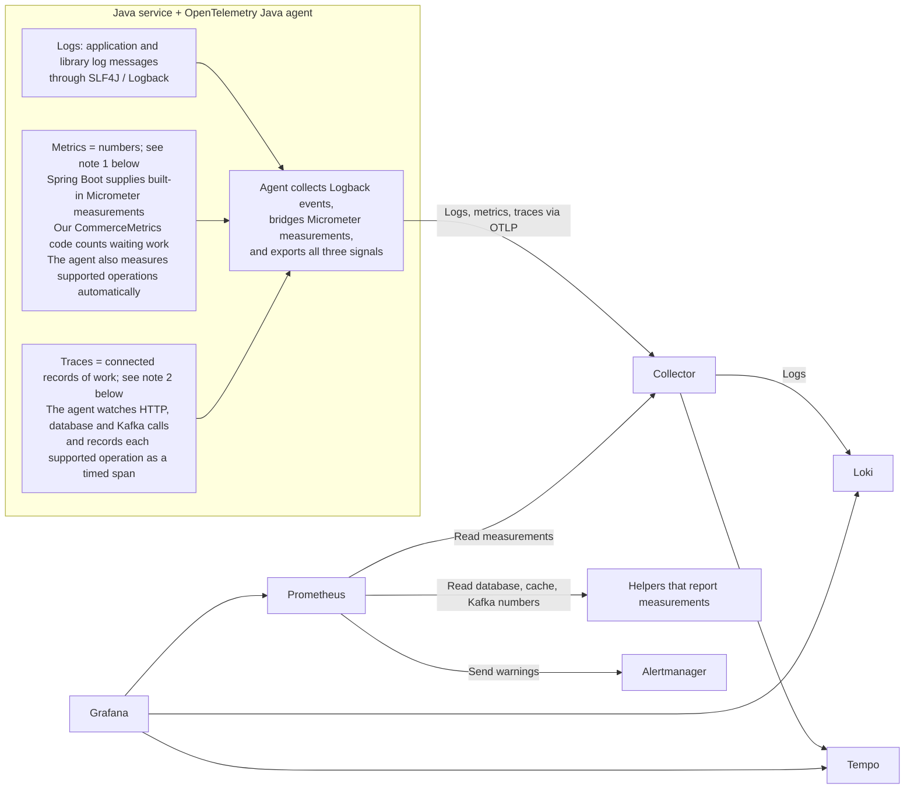
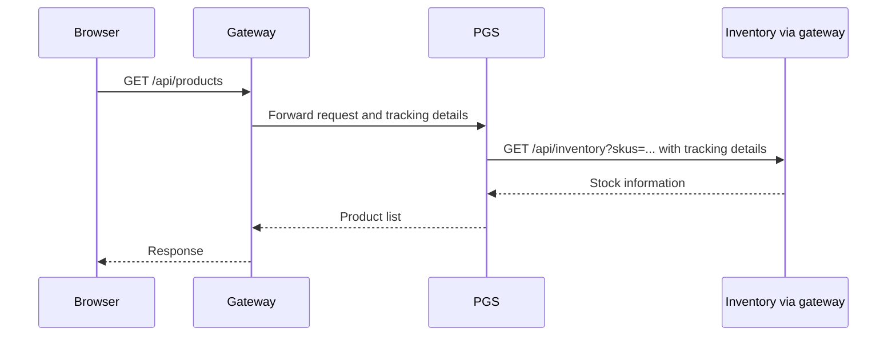
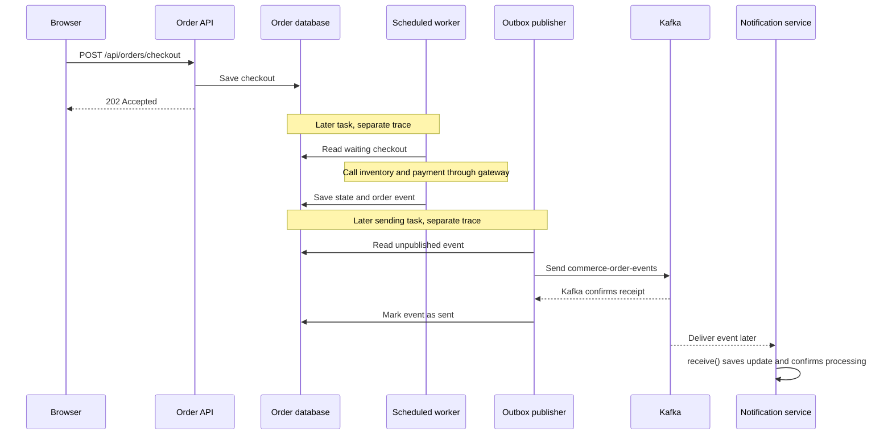

# Logs, metrics and tracing through the commerce project

This guide follows a customer through our shopping application. We will learn
how to find out what happened when an order is slow or stuck. Then we will read
the actual settings and code, and try the same checks ourselves.

The examples use the tools already configured for our nine Java services.
Keep [setup and operations](../infra-setup/observability-implementation-guide.md)
open for installation, startup commands and login details. Code marked **excerpt**
shows only the relevant part of a file; it is not a complete replacement file.

## 1. What problem does observability solve?

Imagine Priya opens our shopping app, adds a book to her cart and clicks **Pay now**.
She later says, “My order is still processing.” The browser received
`202 Accepted`, meaning “we accepted your request”. Each service's health check
may also say UP, meaning it answered that check. But has the application kept a
book aside for her? Has payment finished? Has her order update reached the
notification service? Those checks do not answer these questions.

We need a way to see what the application is doing inside. This is the purpose
of **observability**. We use three kinds of information to investigate.

First, we check how many orders are waiting. That number is a **metric**.
If the number changes from 2 to 20 to 50, we know the waiting work is growing.
Other metrics tell us how many requests failed or how long requests took.

Next, we inspect a **trace**. Think of it as a record of a request's journey:
gateway received it, order-service handled it, and another service was called.
It shows the time spent on the recorded steps. We can see which call was slow.

Finally, we read a **log**. This is a written message about something that happened,
such as “payment returned an error for order 42”. It gives details about one event.
A number on a chart alone would not tell us that story.

| Information | Question it helps answer | Example |
| --- | --- | --- |
| Metric | How much work is waiting? | 20 checkouts are waiting |
| Trace | Which recorded step took time? | The call to inventory took two seconds |
| Log | What happened to this order? | A payment attempt for order 42 failed |

**Monitoring** means watching checks we chose earlier, such as “warn me when more
than ten checkouts are waiting”. Observability also helps us investigate a new
problem we did not prepare a check for. Grafana gives us a screen to inspect the
information, but our applications must first collect and send it.

## 2. Follow the information from the application to the screen



**1. Metrics:** Spring Boot supplies built-in Micrometer measurements; our
`CommerceMetrics` code adds business numbers, such as waiting checkouts. The agent
exports these alongside its automatic measurements.
[See the business-metrics code walkthrough](#42-how-order-and-payment-publish-business-measurements).

**2. Traces:** The agent automatically records timing and outcomes around supported
calls—this is *instrumentation*. Each recorded operation is a **span**; connected
spans form a **trace** across services.

Let us follow Priya's order again. We want to know how long a service call takes,
what the application writes in its logs, and how much work is waiting.

**OpenTelemetry provides tools and common rules for collecting and sending this
information.** For example, the service name needs a consistent field name so
other tools can recognise it. OpenTelemetry calls these naming rules *semantic
conventions*. You do not need to memorise that phrase to follow this guide.
It also defines OTLP, the agreed way these tools send the information to each
other. OpenTelemetry itself is not the database where we look up yesterday's logs.

To collect information from Java, we start a small helper called the
**OpenTelemetry Java agent** along with each service. It starts before our Java
`main` method. When the application uses a library the agent understands, the
agent can record work such as “this HTTP call took 200 milliseconds”. Adding this
recording is called **instrumentation**. We do not need to write a stopwatch into
every controller. In this project, it also works with the Java HttpClient and
WebClient code used to call other services, and with code that sends Kafka messages.

However, the agent cannot guess what “waiting checkout” means in our database.
We write that count ourselves and register it using **Micrometer**, a Java library
for application measurements. Spring Boot also uses Micrometer for built-in
measurements. The agent has a connection to Micrometer, called a *bridge*, so
it can send these numbers along with the measurements it collects automatically.
Section 4 shows the actual counting code.

The information next reaches the **Collector**, a separate running program.
Think of it as a collection desk. Our services give their information to this
one desk. The desk groups records before sending them onward and has settings
to control memory use. Each service therefore needs the Collector's address,
instead of a separate address for every storage tool.

The Collector sends logs to **Loki** and traces to **Tempo**. **Prometheus** regularly
reads the measurements made available by the Collector and stores them. These
three tools keep the information so we can inspect it later. For example,
Prometheus can show how the waiting-order count changed during the last hour.

Now we open **Grafana** in the browser. Grafana asks these tools for their stored
information and displays charts, log messages and trace timelines. It is the
screen we use to investigate Priya's order.

We can also tell Prometheus, “If more than ten checkouts keep waiting for five
minutes, raise a warning.” Prometheus checks that rule and sends the warning to
**Alertmanager**. Alertmanager brings related warnings together. It can also pause
notifications for a chosen warning while someone works on the problem. Our
setup lets us view alerts in a browser; it does **not** send emails, Slack messages
or phone notifications. Those destinations have not been configured.

What if a storage tool is temporarily unavailable? Our Collector can save waiting
logs and traces on disk and try sending them again. But its waiting space and
retry time have limits. Some information can still be lost during a long outage.
It is a useful buffer, not a promise that every record will arrive.

One detail matters when reading other tutorials: this project sends application
measurements through the agent and Collector. Prometheus does not read them from
`/actuator/prometheus`, and no tool follows a log file to collect these Java logs.
Spring Boot's **Actuator** still provides health checks and built-in measurements.

### 2.1. Step one: attach the agent to each service

**Telemetry** is a short name for the logs, measurements and traces described above.
The agent comes in a JAR, a file containing Java code, loaded when Java starts. It watches supported operations, such
as an HTTP call, without requiring a timer in every controller.

The [order-service POM](../../order-service/pom.xml) uses a Maven plugin, a build helper,
during the build step called `process-resources` to copy agent version `2.20.0` into
`target/otel/opentelemetry-javaagent.jar`. All nine service POMs follow this pattern.
Building the project downloads the agent; starting Java with `-javaagent` activates it.
These are two different steps.

The [order-service IntelliJ configuration](../../.run/order-service.run.xml) uses
these two Java startup options (excerpt):

```text
-javaagent:$PROJECT_DIR$/order-service/target/otel/opentelemetry-javaagent.jar
-Dotel.javaagent.configuration-file=$PROJECT_DIR$/order-service/src/main/resources/otel.properties
```

The first option loads the agent. The second tells it where to read its settings.
Select **order-service (observable)** in IntelliJ. The other services have their
own observable configurations. A normal `java -jar` command does not attach it.
Build/start commands and prerequisites are in
[setup step 2](../infra-setup/observability-implementation-guide.md#2-run-applications-with-instrumentation).

### 2.2. Step two: give each service a name and a destination

From [order-service/otel.properties](../../order-service/src/main/resources/otel.properties)
(excerpt):

```properties
otel.service.name=order-service
otel.resource.attributes=service.namespace=ecommerce,deployment.environment.name=local
otel.exporter.otlp.endpoint=http://localhost:4318
otel.exporter.otlp.protocol=http/protobuf
otel.traces.exporter=otlp
otel.metrics.exporter=otlp
otel.logs.exporter=otlp
otel.traces.sampler=parentbased_traceidratio
otel.traces.sampler.arg=1.0
otel.propagators=tracecontext,baggage
otel.metric.export.interval=15000
otel.instrumentation.micrometer.enabled=true
```

Read this as a small instruction to the agent: “I am order-service in our local
ecommerce environment. Send logs, measurements and traces to the Collector on port 4318.
Send measurements every 15 seconds. Also collect the measurements registered
through Micrometer.” **OTLP** is the agreed way to send this information.
`http/protobuf` chooses HTTP for sending it, with Protobuf as its data format.
The application and Collector already understand that format; we do not write it by hand.

A **resource attribute** describes where the data came from. The service name
lets Grafana separate order-service from payment-service. The environment name
separates local data from stage data. These settings are read before Spring
starts, so adding them only to `application.yml` will not configure this agent.
Section 5 explains how we choose which traces to keep and how related calls stay connected.

Each module has its own `src/main/resources/otel.properties`:

| Services | What we can inspect |
| --- | --- |
| gateway-service | Incoming API requests and calls forwarded to services |
| product-aggregator-service | Building the product list and asking for product details |
| customer-service | Customer profile and preference requests |
| product-discount-service, rating-service, inventory-service | Discount, rating and stock requests |
| order-service | Checkout API, worker calls and sending saved order events |
| payment-service | Payment processing and sending saved payment events |
| notification-service | Receiving Kafka messages and creating notifications |

Their common agent configuration works the same way; the service name changes.
Order and payment also define custom business metrics, shown in section 4.

If you run the service in Docker, the [order Dockerfile](../../order-service/Dockerfile) copies the
agent and settings into the image used to run the service. Its `ENTRYPOINT`
starts Java with that agent. The
[order Kubernetes settings file](../../k8s/order-service.yaml) overrides the destination
with `OTEL_EXPORTER_OTLP_ENDPOINT=http://host.minikube.internal:4318` and uses
`deployment.environment.name=stage` in `OTEL_RESOURCE_ATTRIBUTES`. A **Pod** is the unit Kubernetes uses to run the application container. Inside a
Pod, `localhost` means that Pod. It would not reach the Collector on your computer. Follow the
[Minikube setup notes](../infra-setup/observability-implementation-guide.md#3-settings-and-minikube)
when running in Kubernetes. Checks made with local Java processes do not prove
that a Pod can reach the Collector.

### 2.3. Step three: send each kind of information to the right tool

From [otel-collector.yml](../../docker/observability/otel-collector.yml)
(excerpt; other processors and queue settings omitted):

```yaml
receivers:
  otlp:
    protocols:
      grpc:
        endpoint: 0.0.0.0:4317
      http:
        endpoint: 0.0.0.0:4318
exporters:
  otlp/tempo:
    endpoint: tempo:4317
    tls:
      insecure: true
  otlphttp/loki:
    endpoint: http://loki:3100/otlp
  prometheus:
    endpoint: 0.0.0.0:9464
service:
  pipelines:
    traces:
      receivers: [otlp]
      processors: [memory_limiter, batch]
      exporters: [otlp/tempo]
    metrics:
      receivers: [otlp]
      processors: [memory_limiter, transform/metric_resources, batch]
      exporters: [prometheus]
    logs:
      receivers: [otlp]
      processors: [memory_limiter, batch]
      exporters: [otlphttp/loki]
```

Read each `pipeline` as a route through the Collector. For example, the `logs`
route receives log records, prepares them, then sends them to Loki.

A **receiver** accepts incoming information. A **processor** prepares it. An
**exporter** sends it onward or makes it available for another tool to read.
These names match the three parts shown in each route above.

`memory_limiter` helps control how much memory the Collector uses. `batch` groups
records together before sending them. `transform/metric_resources` keeps selected
details about where measurements came from: the service name, application group,
running copy of the service, and environment such as local or stage.

The application pushes data to the Collector. Logs and traces are then pushed
to their stores. Metrics take a different final step: Prometheus asks the
Collector for its current measurements. This is called a **scrape**.

From [prometheus.yml](../../docker/observability/prometheus.yml) (excerpt):

```yaml
global:
  scrape_interval: 15s
  evaluation_interval: 15s
scrape_configs:
  - job_name: otel-applications
    honor_labels: true
    static_configs:
      - targets: [otel-collector:9464]
```

Prometheus reads port 9464 every 15 seconds. It is not calling nine separate
Actuator endpoints. Therefore, `up{job="otel-applications"}=1` proves that the
Collector's metric endpoint answered; it does not prove all services are alive.
The configuration also scrapes PostgreSQL, Redis and Kafka **exporters**: small
programs that turn infrastructure measurements into Prometheus metrics.

### 2.4. Step four: connect Grafana and alert rules

Grafana needs a **data source**, meaning a configured connection to a data store.
The [data-source file](../../docker/observability/grafana/provisioning/datasources/datasources.yml)
registers Prometheus, Loki and Tempo automatically. For example (excerpt):

```yaml
- name: Loki
  uid: loki
  type: loki
  access: proxy
  url: http://loki:3100
  jsonData:
    derivedFields:
      - name: TraceID
        matcherType: label
        matcherRegex: trace_id
        datasourceUid: tempo
        url: '${__value.raw}'
```

Grafana uses the log's `trace_id` as a link to Tempo. The `loki` hostname works
inside the Compose network; you open Grafana through `localhost:3000` in your
browser. These are addresses used by different callers.

Prometheus also checks the rules in [alerts.yml](../../docker/observability/alerts.yml).
This rule is a useful example (excerpt):

```yaml
- alert: CheckoutBacklog
  expr: commerce_checkout_pending > 10
  for: 5m
  labels:
    severity: warning
```

Eleven pending checkouts for a few seconds do not immediately fire this alert.
The condition must remain true for five minutes. Prometheus sends the warning
to Alertmanager, where we can view related warnings together in the browser. There is no email or Slack
receiver in this setup. One test order should not trigger this backlog rule.

## 3. Logs: record decisions, keep secrets out

Priya gives us her order number. We now need messages about that particular order,
not just a chart showing that some orders failed.

Every service writes log messages in JSON, a format with named fields. The agent
collects the messages through **Logback**, the logging library used by the services,
and sends them through the Collector to Loki. If a message was written during a
traced operation, the record can also include the trace ID and step ID.

Loki groups logs using labels such as the service name and environment. A label
is a name/value pair, such as `service_name="order-service"`. We first choose the
service's logs, then search inside them for Priya's order number. We do not create
a separate label used for grouping and lookup for every order number or trace ID. Those details stay
inside the record, where we can still inspect them.

The [checkout worker](../../order-service/src/main/java/com/tip/ecommerce/order/service/CheckoutWorker.java)
is the code that continues processing saved checkouts. When a call returns an
error response, it logs the order ID, checkout step and response status.
The [order publisher](../../order-service/src/main/java/com/tip/ecommerce/order/messaging/CommerceScheduler.java)
and [payment publisher](../../payment-service/src/main/java/com/tip/ecommerce/payment/service/PaymentOutbox.java)
send saved events to Kafka. They log whether sending was recorded as complete or
will be tried again. An **event** is a message about something that happened, such
as an order being confirmed. Kafka carries these messages between services.

A failed attempt does not always mean the order has failed permanently. The
worker may try again. Also, Kafka might receive an event just before the
application fails to mark it as sent in the database. The application may then
send it again. Code receiving an event must handle repeats where needed; one
successful sending log does not prove that the message was delivered only once.

We log enough to explain the decision. We do not need login tokens, customer
addresses or the full message contents in these logs.

### 3.1. The configuration and the log line work together

In [order application.yml](../../order-service/src/main/resources/application.yml)
(excerpt; the other services use the same console format):

```yaml
logging:
  structured:
    format:
      console: logstash
```

This makes console output structured JSON: fields can be read separately instead
of guessing where a sentence starts. The name `logstash` is a format choice; it
does not mean that we installed a Logstash server. The agent collects Logback
logging events and sends them through OTLP. The Collector does not read the console output itself.

In `CheckoutWorker.step()` (excerpt; surrounding state changes omitted):

```java
// Class: CheckoutWorker. This runs when a service call returns an error response.
metrics.counter("commerce.checkout.attempt.failures", "state", state).increment();
org.slf4j.LoggerFactory.getLogger(getClass()).warn(
    "Checkout attempt failed: orderId={} state={} status={}",
    id, state, e.getStatusCode().value());
```

Suppose order 42 has already reserved stock and payment returns HTTP 503. The
message contains `orderId=42 state=RESERVED status=503`. These numbers are an
illustration, not a captured result. `RESERVED` tells us which checkout step was
running; 503 means the called service was unavailable. The worker schedules a
retry for this response. It does not immediately declare the order failed.

Other exceptions are logged by `CommerceScheduler.work()` as `Checkout step will
retry`. They do not all increase this particular counter. Always read what the
counter actually counts before interpreting its name.

In Grafana Explore, select Loki and query `{service_name="order-service"}`.
Filter by an order ID as text. Expand a record's `trace_id` and open it in Tempo.
A startup message may have no trace ID because it was not written as part of
a recorded request or task.

## 4. Metrics: understand the numbers and how they change (Optional)

### 4.1. Understand the numbers before opening a chart

A **counter** remembers how many times something happened. If the worker receives
two error responses from services it calls, its failure counter goes from 0 to 1 to 2.
A later success leaves it at 2. Success does not erase earlier failures. A process
restart can reset it, so Prometheus `rate(...[5m])` handles changes over a time
window rather than treating the raw total as a current failure rate.

A **gauge** shows a current value. If there are three waiting checkouts and one
finishes, the next database count can change the gauge from 3 to 2. Unlike a
counter, it is allowed to decrease. If two running copies of order-service both read the same three rows,
summing their gauges would incorrectly report six. We use `max` for that shared
count. We also check when that count was last updated.
A saved reading from one point in time is called a **snapshot**.

A **histogram** groups measurements into ranges called buckets. Imagine 100
requests: most finish quickly, but a few take several seconds. The average may
hide those slow requests. **p95** is the estimated duration at or below which 95%
of requests fall. It describes the slower end of normal traffic. Histogram
estimates depend on bucket boundaries; they are not the exact list of durations.

For incoming requests, we usually ask three questions: How many are arriving?
How many are failing? How long are they taking? These are called **rate**, **errors**
and **duration**, shortened to RED. Our dashboard shows requests per second,
the share of responses with server errors (HTTP 500–599), and p95 duration.

We also watch Java memory use and waiting work. **JVM** means Java Virtual Machine,
the program that runs our Java code. Its **heap** is the memory area where Java
stores objects. High memory use may help explain a slow service. But a fast HTTP
response cannot tell us whether background work has finished.

The table below connects those questions to the exact measurement names you will
see in Prometheus. An **outbox** is a database table of events waiting to be sent.
**Backlog** means waiting work. **Kafka consumer lag** measures how far a receiving
group's saved reading position is behind the messages available in Kafka.

| Measurement name | What it tells us | How to read it carefully |
| --- | --- | --- |
| `http_server_request_duration_seconds` | How long HTTP requests took | A fast `202` means quick acceptance, not completed checkout |
| `jvm_memory_used_bytes` | Memory used by Java | The heap chart selects and adds the heap measurements |
| `commerce_checkout_pending` | Saved checkouts that still need work | Two service copies may count the same database rows |
| `commerce_outbox_pending` | Saved events not yet marked as sent | A repeated sending attempt is not a new business event |
| `commerce_checkout_attempt_failures_total` | Checkout attempts that received error responses | One order can have several failed attempts |
| `commerce_metrics_last_success_seconds` | Time of the last successful database count | Subtract it from the current time to find the reading's age |
| `kafka_consumergroup_lag` | How far Kafka receivers are behind | This concerns messages already in Kafka, not waiting outbox rows |

The [order](../../order-service/src/main/java/com/tip/ecommerce/order/observability/CommerceMetrics.java)
and [payment](../../payment-service/src/main/java/com/tip/ecommerce/payment/observability/CommerceMetrics.java)
classes read database counts regularly in the background. If a read fails, they
keep the previous number. A separate chart shows how old that number is. For
example, a count of zero from ten minutes ago is not proof that nothing is waiting now.

There is another important choice: which labels to put on measurements. Suppose
we attach an order ID to a counter. Orders 41, 42 and 43 would create three
separate sets of readings. A million orders could create a million sets.
Each combination of labels has its own history, called a **time series**.
The number of these series is called **cardinality**. More series need more storage
and processing. This is why we use labels with a small set of values, such as
checkout state, and keep individual order numbers in logs.

When several service copies report request durations, we combine their histogram
buckets before calculating p95. Averaging their separate p95 values would not
give the overall p95. Section 4.3 shows the query that combines them correctly.

### 4.2. How order and payment publish business measurements

The agent can record HTTP calls and Java measurements, but it does not know that a database row
means “checkout is waiting”. We teach that meaning with Micrometer gauges.
**Micrometer** is the Java library through which our code registers these
measurements. Registering gives a measurement a name and tells the library
where to read its value.

From order's `CommerceMetrics` (excerpt; constructor and refresh parts shown):

```java
// Class: order.observability.CommerceMetrics
private volatile double checkout = Double.NaN;
private volatile double lastSuccess = 0;

// In the constructor: register a gauge that reads the cached value.
Gauge.builder("commerce.checkout.pending", this, m -> m.checkout)
    .description("Pending checkout rows; use max across replicas sharing the database")
    .register(registry);

// In refresh(): count unfinished checkouts, then update the cached value.
long nextCheckout = db.queryForObject(
    "SELECT count(*) FROM checkout WHERE state IN ('CREATED','RESERVED','PAID','RELEASING')",
    Long.class);
checkout = nextCheckout;
lastSuccess = System.currentTimeMillis() / 1000.0;
```

`Double.NaN` means no valid number is available yet. The full method also reads
the order outbox count before assigning values. `@Scheduled` runs the refresh
with a default 15-second delay. Exporting a gauge only reads the cached number;
it does not run a new database query for every scrape.

Payment uses the same idea for its own outbox (excerpt):

```java
// Class: payment.observability.CommerceMetrics
// In the constructor:
Gauge.builder("commerce.outbox.pending", this, m -> m.outbox)
    .tag("outbox", "payment_outbox")
    .description("Unpublished DB rows; use max across replicas sharing the database")
    .register(registry);

// In refresh():
long nextOutbox = db.queryForObject(
    "SELECT count(*) FROM payment_outbox WHERE NOT published", Long.class);
outbox = nextOutbox;
lastSuccess = System.currentTimeMillis() / 1000.0;
```

A **tag**, also called a label in Prometheus, distinguishes related measurements.
Order uses `outbox=commerce_outbox`; payment uses `outbox=payment_outbox`.
As measurements travel from Micrometer to Prometheus, names with dots become
names with underscores, such as
`commerce_outbox_pending`. The failure counter also gets `_total` at the end of its name.

If the database read fails, the old value is kept. Suppose the last count was 2:
a failed read does not turn it into 0. The last-success time also stays unchanged.
That is why we need both the waiting count and the age of the last reading.

### 4.3. Queries you can read and explain

Enter these in Grafana Explore with the **Prometheus** data source, or in
`http://localhost:9090`. PromQL is Prometheus's query language.

```promql
max by (service_name) (commerce_checkout_pending{deployment_environment_name="local"})
```

This shows the last recorded waiting-checkout count for each local service. A completed order
may finish between two database readings; zero
is a normal result after completion.

```promql
time() - max by (service_name) (commerce_metrics_last_success_seconds{deployment_environment_name="local"})
```

This subtracts the last successful refresh time from the current time. The result
is age in seconds. A small age that regularly drops back down means the database count is being updated.
Missing data is different from zero; it may mean the agent has not sent the measurement yet.

```promql
sum by (service_name) (rate(http_server_request_duration_seconds_count{deployment_environment_name="local"}[5m]))
```

This shows average requests per second over five minutes. For example, 60 requests
over five minutes is about 0.2 requests per second, not 60 requests per second.

```promql
histogram_quantile(0.95,
  sum by (le, service_name) (
    rate(http_server_request_duration_seconds_bucket{deployment_environment_name="local"}[5m])
  )
)
```

`le` identifies a bucket's upper limit. We combine matching buckets first, then
calculate p95. The answer is in seconds. With very little traffic, this chart may
be empty or jump around; it becomes more useful with repeated requests.

## 5. Traces: follow a request from one service to another

Imagine the catalog takes two seconds to load. Gateway's total time tells us the
customer waited, but not why. A trace might show a short discount call and a long
inventory call. That gives us a specific dependency to inspect.

A **span** is one recorded step with a start time and duration. Receiving an HTTP
request or querying a database can each have a span. A **trace** brings related
spans together. The trace has an ID, and each span has its own ID.

How does inventory know that its work belongs to the same request as gateway's
work? The agent adds tracking details to the outgoing HTTP request in a header
called `traceparent`. A header is extra information sent with a request. The next
service reads it and can connect its own span to the calling span.

These tracking details are called **trace context**. Passing them between services
is called **context propagation**. With Kafka, the details travel in message
headers. They help us connect work; they do not log in a user or grant permission.



PGS means **product-aggregator-service**. The diagram shows only its inventory
branch. The [CatalogController](../../product-aggregator-service/src/main/java/com/tip/ecommerce/product/CatalogController.java)
also asks for customer preferences, discounts and ratings. Its `catalog()` method
includes the following (excerpt):

```java
// Class: CatalogController. Calls go through the service's gateway client.
var discounts = gateway.get("/api/discounts?skus=" + skus);
var ratings = gateway.get("/api/ratings?skus=" + skus)
    .onErrorReturn(JsonNodeFactory.instance.arrayNode());
var availability = gateway.get("/api/inventory?skus=" + skus)
    .onErrorReturn(JsonNodeFactory.instance.arrayNode());
// Mono.zip(profile, discounts, ratings, availability) joins the results.
```

`Mono.zip` waits for these results and combines them. The calls can run without
waiting for each earlier call to finish. These calls can overlap, so adding every
span's duration can exceed the customer's total wait. Look at when each bar starts and ends, and which call started another call.
Do not simply add all the durations. Optional rating
or stock failures can also be replaced with empty results by the code above:
the product list may load even when one of these optional calls failed.

Our code uses Java HttpClient and WebClient to make calls. The agent records calls
through these supported libraries, including where the application builds its
own client object. We did not need to rewrite those clients to add tracing.
It also records supported scheduled tasks and follows supported Reactor work.
Reactor is the library used here for work that may continue later or on another
thread. We still check actual traces to confirm related work stayed connected.

**Sampling** means choosing which traces to record. Our settings use
`parentbased_traceidratio` with `1.0`. For a new trace started here, `1.0` means
record every trace. If a request already belongs to a trace, the agent follows
that trace's existing decision. Recording everything makes this learning example
easier to inspect, but delivery can still fail if tools are unavailable.

A busy application may record only a portion of traces to reduce stored data.
If we decide at the start, we cannot yet know which requests will fail later.
This choice concerns traces; measurements such as request counts are still
collected. A log can also contain a trace ID even if that trace was not stored.

## 6. Checkout: why background work needs special care

Priya clicks Pay now. Order-service saves the checkout in the database and returns
`202`. Later, a scheduled worker reads the saved checkout and continues its work.
It asks inventory to keep the items aside, calls payment, tells inventory to
complete the reservation, and updates the order. Another scheduled task reads
saved events from the outbox and sends them to Kafka.

The browser request and these later tasks happen at different times. Our checkout
and outbox tables do not save the original request's trace context. So the later
worker and sending tasks have separate traces. The agent can connect the calls
made during each task, but it cannot recover tracking details that were never
saved in the database.

We therefore use order IDs and event IDs in logs to follow the order across these
stages. For example, we can search for order 42 even when its acceptance and
payment attempt appear in different traces. Connecting every stage into one
trace would need extra implementation. This project does not do that.

### 6.1. Follow the background work in order



An **outbox** holds events waiting to be sent. The **publisher** sends them. A
**consumer** receives Kafka messages. A **topic** is a named stream of messages,
such as `commerce-order-events`. A **consumer group** is a named set of receivers
that share the work of reading that stream.
The HTTP caller waits for acceptance. It does not wait for the later worker or
Kafka consumer. The publisher waits for Kafka to confirm receipt. That confirmation, called an
**acknowledgment**, does not mean notification-service has finished its work.

In order's `CommerceScheduler` (excerpts):

```java
@Scheduled(fixedDelay = 500)
public void work() {
  try {
    worker.step();
  } catch (Exception e) {
    org.slf4j.LoggerFactory.getLogger(getClass())
        .warn("Checkout step will retry: {}", e.getClass().getSimpleName());
  }
}

// Inside publish(), scheduled with fixedDelay = 1500:
kafka.send("commerce-order-events", row.get("order_id").toString(),
    (String) row.get("payload")).get(12, java.util.concurrent.TimeUnit.SECONDS);
db.update("UPDATE commerce_outbox SET published=true WHERE event_id=?", row.get("event_id"));
```

The delays mean 500 ms or 1500 ms after the previous run finishes; they
are not a guarantee that each order finishes within that time.

[CommerceNotifications](../../notification-service/src/main/java/com/tip/ecommerce/notification/messaging/CommerceNotifications.java)
receives this topic (excerpt):

```java
@KafkaListener(
    topics = "commerce-order-events",
    groupId = "commerce-notifications-v1",
    properties = {"value.deserializer=org.apache.kafka.common.serialization.StringDeserializer"})
public void receive(String payload, Acknowledgment ack) throws Exception {
  // Read the message and save it in notification_inbox. Skip it if already saved.
  // The full source supplies the event fields to that insert.
  ack.acknowledge();
}
```

The insert avoids repeating the same stored event. Acknowledgment tells the
consumer that processing completed. The agent passes the tracking details in Kafka message headers, connecting
the sending step to the receiving work.

Payment has its own path. In `PaymentOutbox.publish()` (excerpt):

```java
kafka.send("payment-completed", String.valueOf(id),
    new PaymentCompletedEvent(id, ((Number) row.get("payment_id")).longValue(), "SUCCESS"))
    .get(10, java.util.concurrent.TimeUnit.SECONDS);
db.update("UPDATE payment_outbox SET published=true WHERE order_id=?", id);
```

[PaymentCompletedListener.handlePaymentCompleted()](../../notification-service/src/main/java/com/tip/ecommerce/notification/messaging/PaymentCompletedListener.java)
uses `@KafkaListener(topics = "payment-completed", groupId = "notification-group")`.
It calls `notificationService.send(...)`, then acknowledges. This demo payment
notification path does not prevent repeated processing in the same way as
`CommerceNotifications`, which avoids storing the same event twice.

Now we can distinguish two delays. A high outbox count means events are waiting
**before they are sent to Kafka**. Kafka consumer lag means messages already sent to Kafka are waiting
**for a consumer group to catch up**. Restarting a consumer cannot publish rows
still sitting in the outbox.

### 6.2. Practical walkthrough: follow one customer using all three views

Use the local learning environment. Run shared infrastructure, all nine Java
services with their **observable** configurations, and the React UI. Follow
[observability setup](../infra-setup/observability-implementation-guide.md) and
[application setup](../infra-setup/commerce-setup.md) for startup commands.
Use the customer login from [Keycloak setup](../infra-setup/keycloak-setup.md).
Installation and passwords stay in those guides.

1. Open `http://localhost:5173/`, sign in as `customer1`, and open the Shop page
   (`/#/customer/dashboard`). Complete the customer profile if required, following
   [manual verification](../project-docs/manual-verification.md).
2. Open **Developer Tools → Network**, filter by `/api/products`, then reload
   the Shop page. Select the GET request. Expect a successful catalog response
   (`200`). Note the request time. You may also see OPTIONS, a separate browser request asking permission to
   make the call. Choose the GET request for this check.
3. Reload a few times to create traffic. Allow roughly 30–60 seconds for the agent to send measurements
   and Prometheus to read them. Open
   `http://localhost:3000/d/commerce-overview`, sign in using the setup guide,
   choose environment **local**, and use a recent time range such as **Last 15 minutes**.
   Inspect request rate and p95 for gateway and product-aggregator-service.
4. In **Grafana → Explore**, select **Tempo**, choose the TraceQL query editor
   (TraceQL is the language used to search traces),
   and enter `{ resource.service.name = "gateway-service" }`. Run the query.
   Open a trace near the catalog request time containing `GET /api/products`.
   Expect gateway and product-aggregator-service spans in the same trace. Expand
   the calls to other services. Compare their time bars to see where the request waited.
   A trace for an image or OPTIONS request will not show the same business flow.
5. Back in Shop, add an available product, open Cart, select the required address
   and click **Pay now**. In Network, select `POST /api/orders/checkout`. For a
   newly accepted checkout, expect `202`. Record its order ID from the response
   or the order details page. Payment is simulated in this project.
6. Open **My orders** and wait for the checkout to progress. In Prometheus, run
   the pending-checkout and reading-age queries from section 4.3. A completed
   checkout may already show zero pending. A small reading age tells you this is a
   recent database count, rather than an old value left behind by a failed read.
7. In Grafana Explore, select **Loki**, use the query editor, and run
   `{service_name="order-service"} |= "eventId="`. Here `|=` means “keep messages
   containing this text”. Find the message about sending an event near your
   order's time and match the order/event ID. For a failure investigation, use
   `{service_name="order-service"} |= "orderId=42 "`, replacing 42 with your ID.
   A successful checkout need not produce a failure log.
8. Expand that sending log and follow its **TraceID** link to Tempo. Inspect
   the recorded Kafka sending and receiving steps when present. The notification
   service uses group `commerce-notifications-v1` for this order event. Its
   consumer belongs to the trace of the task that sent the event, not necessarily the original
   checkout HTTP trace. Open the customer's Notifications page to inspect the
   saved order update.

The evidence you are collecting is specific: a browser response, changing HTTP
measurements, a trace joining service calls, and a log tied to one business event.
Do not expect every HTTP request to produce an application log; our code logs
selected events, not a complete HTTP access log.

If a view is empty, first check its time range, environment and service filter.
Then check that the selected run configuration attached the agent. For a log
without a TraceID, choose a log made while handling a request or task;
startup logs may not belong to any recorded step. If there are no spans at all, check the Collector endpoint and the
agent property-file path using the setup guide's troubleshooting table.

### 6.3. Optional failure exercise: watch what changes when inventory stops

Use this only in an isolated local learning run; local and stage share databases
and consumer groups. Keep inventory running while adding an available item to
Cart. Stop only the local inventory-service application in IntelliJ, then submit
the checkout. Order acceptance and background reservation are different steps;
inspect the actual HTTP response before assuming the order was accepted.

For an accepted order, the worker cannot finish reserving stock. Look for its
retry log, a pending checkout after the next database count, and recorded calls with
failed responses. The attempt counter may increase repeatedly for this one order:
it counts attempts that received an error response, not the number of orders. The age of the database reading should
remain small while the order database is reachable.

Restart inventory-service with its observable configuration. Allow the worker's
10-second retry delay and time for measurements to reach the tools, then inspect the same order ID.
It should resume processing; the waiting count falls after a later database reading. The
counter does not fall. A single pending order does not meet the `> 10` backlog
alert threshold. This drill is a procedure to try, not a claim that it was rerun
while editing this guide.

### 6.4. Repeatable checks and what they prove

From the repository root, after following setup:

```sh
# Sends made-up test data and checks that all three storage tools receive it.
python3 -u docker/observability/smoke-test.py

# Starts built applications temporarily; needs all ports 9100–9108 free.
# --commerce creates learning orders and exercises business flows.
python3 -u docker/observability/verify.py --commerce
```

Stop your own Java applications before running the second command. The verifier
does not take over occupied ports. It stops the applications it started and
leaves shared infrastructure running. Omit `--commerce` for its read-only HTTP
flow. Results/logs go under `/tmp/commerce-observability-validation`.

The first check sends made-up test data. A pass means the collection and storage
path works. It does not prove that real Java services started with their agents.
The second script checks information from the real applications and checks that
related HTTP calls appear in the same trace. Its commerce mode also checks
shopping behaviour and tracing across Kafka messages. The
[dated validation report](validation.md) records the earlier completed run and
what it did not test. The commands above are instructions to repeat the checks,
not a claim that they were run again for this document edit.

## 7. Tools to learn for Spring Boot microservices

Learn the path used in this project first: the agent collects information,
the Collector passes it on, Prometheus/Loki/Tempo store it, and Grafana displays
it. Alertmanager handles the warnings raised by Prometheus. These tools work
together; they are not different names for the same job.

You may hear other tool names in tutorials or interviews. You do not need to
install them for this guide. Here is how they relate to our choices:

| Our choice | Other tools you may hear about |
| --- | --- |
| Java agent | Micrometer Tracing is another way to add tracing in application code; client setup must carry the tracking details correctly |
| Prometheus | Mimir and Thanos can extend a Prometheus setup to store and query more measurement data |
| Loki | Elasticsearch and OpenSearch can be used to store and search logs instead |
| Tempo | Jaeger and Zipkin are other tools for stored traces |
| Grafana and separate storage tools | Services such as Datadog and New Relic offer collection, storage and viewing together |
| Sending logs through the agent | Grafana Alloy can collect logs from files, useful for applications that write files instead |

Our learning setup keeps data on local disks. A real shared deployment would
also need protected access, encrypted connections, backups, enough storage,
and a way to keep working if a machine fails. Someone must receive and act on
warnings. A working local dashboard alone does not provide those things.

## 8. Interview walkthrough

Use this connected explanation for a three-to-four-minute interview answer:

> In our e-commerce project, a customer can place an order and receive 202 Accepted.
> That means we saved the request, but the order is not necessarily complete.
> Inventory reservation, payment and notifications involve later work. So a green
> health check alone cannot explain why a customer is still waiting.
>
> We use three kinds of information. Metrics show numbers over time, such as the
> number of waiting checkouts and the rate of failed requests. Traces show the
> service calls in one execution and how long each call took. Logs describe
> specific events, such as a failed checkout attempt for an order. I use them
> together: notice a problem in the measurements, inspect the slow or failed
> operation in a trace, and read the relevant log for details.
>
> We attach the OpenTelemetry Java agent when starting each of our nine Spring
> Boot services. Each service has a name and a Collector destination. The agent
> records supported HTTP calls, database work, Kafka operations and log messages.
> Our services send telemetry to the Collector. It sends logs to Loki and traces
> to Tempo. Prometheus regularly reads the measurements from the Collector. Grafana
> connects to these stores so we can inspect the information in one place.
>
> For example, when a customer opens the catalog, gateway calls the product
> aggregator. The aggregator asks other services for details such as discounts,
> ratings and inventory. Tracking details travel with these requests so their recorded steps stay connected. We can
> open one trace and compare the recorded service calls to understand where time was
> spent. Some calls run at the same time, so I inspect their timeline rather
> than simply adding every duration.
>
> Automatic HTTP measurements do not tell us how many orders are waiting in the
> database. We added Micrometer gauges in order-service and payment-service for
> pending checkout and outbox rows. These refresh in the background. If a database
> read fails, we keep the previous value and expose the last successful refresh
> time. Otherwise, a failed read could incorrectly look like an empty backlog.
>
> We also count checkout attempts that receive error responses. One order can fail twice and
> later succeed, so two failures do not mean two failed orders. The counter stays
> at two after success. We keep order IDs in logs instead of creating a separate
> metric label for every order, which would create too many separate measurement histories.
>
> The checkout HTTP request and the later scheduled worker run separately.
> Our database rows do not save trace context, so I do not describe the whole order
> lifecycle as one continuous trace. We connect those stages using order and event
> IDs. When a task sends an outbox event, the agent passes tracking details through
> Kafka headers to the receiving service. Outbox backlog means saved events are waiting to be
> sent; consumer lag means a receiving group has not caught up with messages in Kafka.
>
> Finally, Prometheus checks warning rules, and Alertmanager groups related warnings.
> We view them in the browser; emails and phone notifications are not configured.
> We test with made-up data first and then with real application requests. These
> checks show what works locally. They do not prove that the system would keep
> running through a machine failure in a production deployment.

Questions to practice:

1. Why can all health checks be UP while checkout is stuck?
2. How does p95 differ from the average, and why not average the p95 values of separate service copies?
3. Why does `up{job="otel-applications"}=1` not prove all nine services are alive?
4. What happens if the Collector or Kafka is unavailable for ten minutes?
5. Why would using every order ID as a metric label need more storage?
6. How is a delay in reading Kafka messages different from events waiting in the outbox?
7. Why is retry count not a count of unique failed orders?
8. How would you check that sending and receiving work stayed connected in a trace?

The [verification script](../../docker/observability/verify.py) lets you repeat these
checks. It starts applications with their agents temporarily and checks their
logs, measurements and traces, while the [operations guide](../infra-setup/observability-implementation-guide.md)
explains setup and what is still needed beyond local learning.
