# Business flows, service calls and event consumers

Use this as the main reference for **what happens after a user action**: which
services must run, which APIs are called, what is saved, what happens later, and
which Kafka topic/group receives each event. It describes the implemented POC,
including its limitations; it does not assume unimplemented e-commerce features.

- [Common rules and services](#1-common-rules-and-running-services)
- [Registration, login, session refresh and logout](#2-registration-login-session-refresh-and-logout)
- [Customer scenarios](#3-customer-scenarios)
- [Admin scenarios](#4-admin-scenarios)
- [Checkout backend: acceptance to confirmation](#5-checkout-backend-acceptance-to-confirmation)
- [Service-to-service and API-only scenarios](#6-service-to-service-and-api-only-scenarios)
- [Kafka topics, publishers, consumers and payloads](#7-kafka-topics-publishers-consumers-and-payloads)
- [Failures, retries and duplicate requests](#8-failures-retries-and-duplicate-requests)
- [Quick runtime dependency matrix](#9-quick-runtime-dependency-matrix)
- [Code map and manual tracing](#10-code-map-and-manual-tracing)

Installation, ports, credentials and commands belong in
[commerce setup](../infra-setup/commerce-setup.md),
[Keycloak setup](../infra-setup/keycloak-setup.md) and
[Kafka setup](../infra-setup/kafka-setup.md). The sections below focus on business behavior.

## 1. Common rules and running services

**Portal base** means React (`ecom-ui`), gateway, order-service, Keycloak and shared
PostgreSQL. After login, React reads `/api/orders/security/me`. Each permitted
module also mounts `OrdersProvider`, which reads `/api/orders`. Therefore even a
customer visiting Profile depends on order-service for the portal shell.

| Component                        | Business responsibility                                                                   |
| -------------------------------- | ----------------------------------------------------------------------------------------- |
| gateway-service                  | JWT validation, CORS, routing, trusted identity-header replacement. No business database. |
| order-service                    | Orders, item snapshots, checkout state machine, fulfillment and commerce outbox.          |
| payment-service                  | Simulated payment records and payment outbox; checks orders through gateway.              |
| inventory-service                | Stock and tenant/order reservations; reserve, commit and release.                         |
| product-aggregator-service (PGS) | Product database, images, personalized catalog and authoritative quotes.                  |
| customer-service                 | Contact profile, DOB, preferences and purchase-category history.                          |
| product-discount-service         | Stored discount percentages.                                                              |
| rating-service                   | Stored rating averages and counts.                                                        |
| notification-service             | Commerce inbox plus payment-notification logging.                                         |
| Keycloak                         | Account registration, browser login/tokens and machine client-credentials tokens.         |
| PostgreSQL                       | One shared server with separate databases for the business services and Keycloak.         |
| Kafka                            | Asynchronous payment and commerce events.                                                 |
| Redis / Kafka UI                 | Redis is unused by current business code; Kafka UI is an optional inspection tool.        |

**HTTP convention:** every business call from React or one microservice to another
passes through gateway. `Order → Inventory` in a logical diagram means
`Order → Gateway → Inventory`. Keycloak token calls go directly to Keycloak.
Kafka producers/consumers contact the broker directly, not gateway.
In flowcharts, solid arrows describe synchronous calls or local work; dashed arrows
marked async describe scheduled/event delivery. Dashed optional HTTP arrows are
explicitly labeled optional sync. Sequence diagrams label asynchronous handoffs
separately; returning HTTP responses are not Kafka messages. Diagram path segments
`id`, `username`, `customerId` and `sku` represent the corresponding path variables.

The browser calls gateway directly; Vite serves frontend assets and has no API
proxy. Gateway validates the token, removes forged identity headers, and passes
trusted username, tenant, roles and permissions. Services apply their own access
rules to those headers. Direct service ports remain a deliberate learning bypass,
not a production network boundary.

**Synchronous** means the caller waits for the response. **Asynchronous** means
work happens after acceptance through a worker or event consumer. An HTTP 202,
a successful payment, a confirmed order and a delivered order are different milestones.

For the whole demonstration, start shared-infra, all nine Java services and React.
Minimums below refer to functional dependencies; keeping infrastructure running is fine.

## 2. Registration, login, session refresh and logout

### Register an account

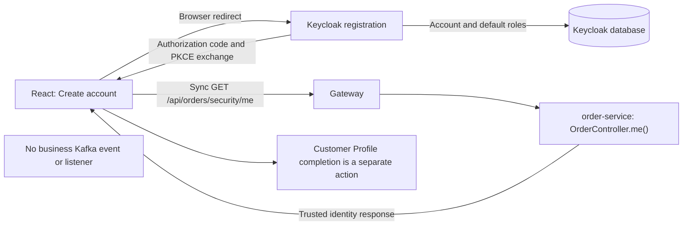
```mermaid
flowchart LR
    UI["React: Create account"] -->|Browser redirect| KC["Keycloak registration"]
    KC -->|Account and default roles| KDB[("Keycloak database")]
    KC -->|Authorization code and PKCE exchange| UI
    UI -->|Sync GET /api/orders/security/me| GW["Gateway"]
    GW --> O["order-service: OrderController.me()"]
    O -->|Trusted identity response| UI
    UI --> NEXT["Customer Profile completion is a separate action"]
    NOTE["No business Kafka event or listener"]
```

**Trigger:** Sign-in page → Create account. **Run:** React + Keycloak/PostgreSQL;
add Portal base and catalog dependencies to open the customer landing page afterward.

1. `SessionProvider.register()` redirects to Keycloak's registration screen.
2. Keycloak creates the login account and applies its configured default roles.
3. Keycloak redirects to the React callback; the browser exchanges the code using PKCE.
4. React loads trusted identity through gateway and chooses the permitted module.
5. Account registration does **not** create a customer-service profile. Email may
   initially populate the Profile form from the token; phone, DOB and category
   choices are saved separately by the customer in section 3.1.

No order, stock reservation, payment or business Kafka event is created by registration.

### Sign in and select the correct module

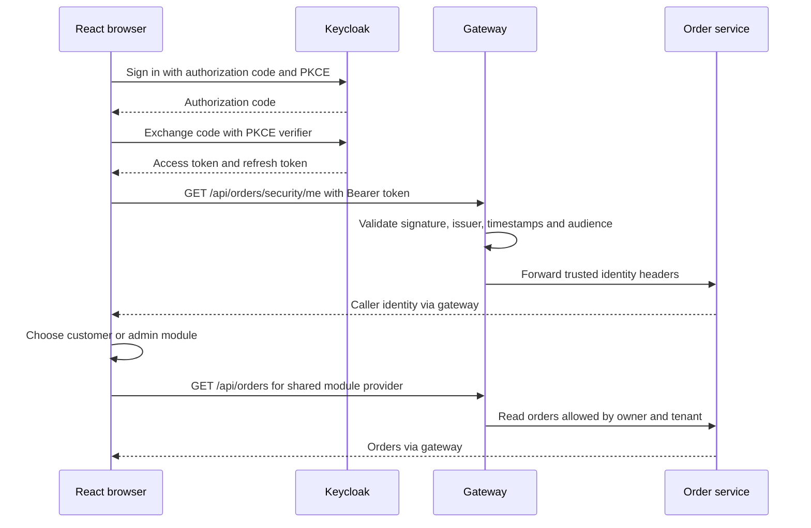
```mermaid
sequenceDiagram
    participant UI as React browser
    participant KC as Keycloak
    participant GW as Gateway
    participant O as Order service
    UI->>KC: Sign in with authorization code and PKCE
    KC-->>UI: Authorization code
    UI->>KC: Exchange code with PKCE verifier
    KC-->>UI: Access token and refresh token
    UI->>GW: GET /api/orders/security/me with Bearer token
    GW->>GW: Validate signature, issuer, timestamps and audience
    GW->>O: Forward trusted identity headers
    O-->>UI: Caller identity via gateway
    UI->>UI: Choose customer or admin module
    UI->>GW: GET /api/orders for shared module provider
    GW->>O: Read orders allowed by owner and tenant
    O-->>UI: Orders via gateway
```

1. React's Keycloak adapter initializes with `check-sso` and PKCE S256.
2. Before an API call, the helper refreshes a token approaching expiry, then sends
   its Bearer token to gateway. Browser preflight may precede the actual request.
3. `/api/orders/security/me` returns the identity parsed from gateway headers.
4. Role `admin` chooses the admin dashboard; otherwise `customer` chooses Shop.
   A user with neither role cannot enter a portal module. Explicit module URLs
   are checked before mounting that module or its orders provider.
5. `OrdersProvider` fetches `/api/orders`; customer filtering and tenant checks
   happen on the server. The UI guard is not the backend authorization boundary.

**Landing pages:** `/#/customer/dashboard` runs the catalog/profile reads in 3.2.
`/#/admin/dashboard` computes summaries from the order list in 4.1.
Login does not publish business Kafka events.

### Refresh a session, retry bootstrap, or sign out

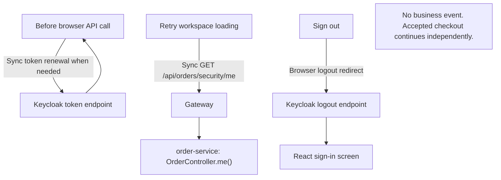
```mermaid
flowchart TD
    API["Before browser API call"] -->|Sync token renewal when needed| KC["Keycloak token endpoint"]
    KC --> API
    RETRY["Retry workspace loading"] -->|Sync GET /api/orders/security/me| GW["Gateway"]
    GW --> O["order-service: OrderController.me()"]
    LOGOUT["Sign out"] -->|Browser logout redirect| KOUT["Keycloak logout endpoint"]
    KOUT --> SIGNIN["React sign-in screen"]
    NOTE["No business event. Accepted checkout continues independently."]
```

- Token renewal calls Keycloak, not a business microservice. Tokens stay in adapter
  memory. If refresh fails, React clears the token and asks the user to sign in.
- “Try again” after identity loading fails repeats `/api/orders/security/me`.
- Sign out calls Keycloak logout and redirects back. It does not cancel accepted
  orders, release reservations, or stop backend workers. The browser cart is stored
  separately by tenant/subject; logout does not itself submit or delete an order.

Implementation: [SessionProvider](../../ecom-ui/src/shared/auth/SessionProvider.jsx),
[auth.js](../../ecom-ui/src/auth.js), [module routing](../../ecom-ui/src/app/routing.js),
[OrdersProvider](../../ecom-ui/src/shared/orders/OrdersProvider.jsx),
[gateway security guide](../api-gateway/03-gateway-security-oauth2-oidc-jwt.md).

## 3. Customer scenarios

### 3.1 Complete or update profile and interests

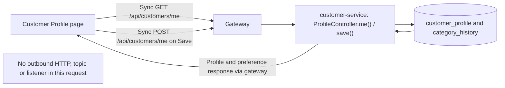
```mermaid
flowchart LR
    UI["Customer Profile page"] -->|Sync GET /api/customers/me| GW["Gateway"]
    UI -->|Sync POST /api/customers/me on Save| GW
    GW --> C["customer-service: ProfileController.me() / save()"]
    C --> DB[("customer_profile and category_history")]
    DB --> C
    C -->|Profile and preference response via gateway| UI
    NOTE["No outbound HTTP, topic or listener in this request"]
```

**Screen:** `/#/customer/profile`. **Run:** Portal base + customer-service.

1. On opening, React calls `GET /api/customers/me` through gateway.
2. Customer-service uses the trusted tenant and username to read `customer_profile`,
   `category_history` and the recommendation rules. An absent profile returns
   `complete=false`; it is not automatically created by a GET.
3. Customer enters email, phone, DOB and selected categories: Electronics,
   Groceries, Home, Books and Fitness.
4. Save sends `POST /api/customers/me`. `customers:write` is required. The service
   validates contact formats, DOB range and category choices, then upserts the
   signed-in customer's profile. The response contains the updated profile.
5. No outbound HTTP or Kafka publication occurs. This changes the commerce profile,
   not the Keycloak account's password or login email.

Recommendations put explicit choices first, then purchase-history categories.
Age-based starter categories apply only when neither explicit choices nor history
exist. With no usable profile/history, popular categories are used. Reopening Shop
fetches the new ordering; there is no push update to an already rendered catalog.

### 3.2 Open Shop and browse personalized categories

**Screen:** `/#/customer/dashboard`. **Run:** Portal base + PGS + customer-service +
product-discount-service. **Optional enrichment:** rating-service and inventory-service.

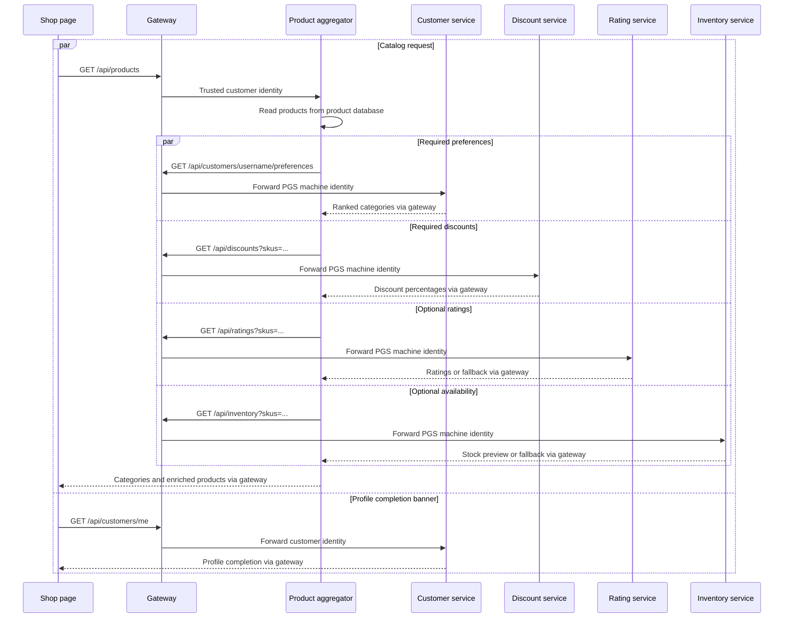
```mermaid
sequenceDiagram
    participant UI as Shop page
    participant GW as Gateway
    participant P as Product aggregator
    participant C as Customer service
    participant D as Discount service
    participant R as Rating service
    participant I as Inventory service
    par Catalog request
        UI->>GW: GET /api/products
        GW->>P: Trusted customer identity
        P->>P: Read products from product database
        par Required preferences
            P->>GW: GET /api/customers/username/preferences
            GW->>C: Forward PGS machine identity
            C-->>P: Ranked categories via gateway
        and Required discounts
            P->>GW: GET /api/discounts?skus=...
            GW->>D: Forward PGS machine identity
            D-->>P: Discount percentages via gateway
        and Optional ratings
            P->>GW: GET /api/ratings?skus=...
            GW->>R: Forward PGS machine identity
            R-->>P: Ratings or fallback via gateway
        and Optional availability
            P->>GW: GET /api/inventory?skus=...
            GW->>I: Forward PGS machine identity
            I-->>P: Stock preview or fallback via gateway
        end
        P-->>UI: Categories and enriched products via gateway
    and Profile completion banner
        UI->>GW: GET /api/customers/me
        GW->>C: Forward customer identity
        C-->>UI: Profile completion via gateway
    end
```

1. `ShopPage` starts **two browser requests in parallel**: catalog and own profile.
   The second supplies the “complete your profile” banner; it is distinct from
   PGS's internal preferences lookup.
2. PGS requires `products:read` and the POC's demo tenant. It derives the customer
   username from trusted headers, not a customer ID supplied by the browser.
3. PGS reads its product database using JDBC scheduled on boundedElastic, then
   combines four nonblocking WebClient calls with `Mono.zip` through gateway.
4. PGS obtains/caches its client-credentials token. Customer/discount responses
   are required; rating failures produce an empty enrichment and stock failures
   produce unknown availability. This is fallback behavior, not a circuit breaker.
5. PGS calculates discounted prices, attaches original prices, ratings and stock,
   sorts categories by preferences, and returns the catalog.
6. UI shows cards, quantities and totals. The browser separately requests product
   SVGs via gateway at `GET /api/products/images/{filename}`. PGS reads local files;
   image requests are public, not part of `Mono.zip`, and publish no events.

No stock is reserved and no order is created by browsing. A stock preview can become
stale before checkout. Repeated catalog refreshes repeat these reads; they do not
change purchase history. See [aggregation and preferences](catalog-aggregation-and-preferences.md).

### 3.3 Change quantities, add/remove cart items, reopen the cart

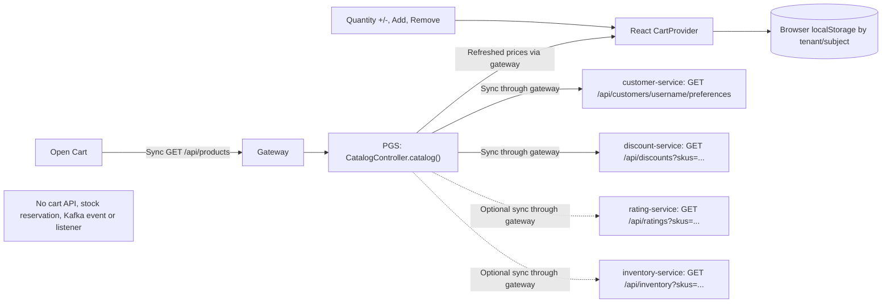
```mermaid
flowchart LR
    EDIT["Quantity +/-, Add, Remove"] --> CART["React CartProvider"]
    CART --> LS[("Browser localStorage by tenant/subject")]
    OPEN["Open Cart"] -->|Sync GET /api/products| GW["Gateway"]
    GW --> P["PGS: CatalogController.catalog()"]
    P -->|Sync through gateway| C["customer-service: GET /api/customers/username/preferences"]
    P -->|Sync through gateway| D["discount-service: GET /api/discounts?skus=..."]
    P -.->|Optional sync through gateway| R["rating-service: GET /api/ratings?skus=..."]
    P -.->|Optional sync through gateway| I["inventory-service: GET /api/inventory?skus=..."]
    P -->|Refreshed prices via gateway| CART
    NOTE["No cart API, stock reservation, Kafka event or listener"]
```

**Screen:** Shop or `/#/customer/cart`. **Run for edits:** React browser state;
opening the signed-in portal still needs Portal base. **For price refresh:** catalog dependencies.

1. Plus/minus and Add to cart update `CartProvider`; there is no cart microservice.
2. Cart items are stored in `localStorage`, keyed by tenant and subject. Quantities
   and displayed totals are computed in the browser. Removing an item does not
   release stock because adding it never reserved stock.
3. On opening Cart, React calls `GET /api/products` to refresh prices and product
   information. This repeats PGS's catalog dependency calls from 3.2. Local cart
   contents are not trusted as authoritative price data by the backend.
4. Address editing and quantity changes do not call payment/order APIs. No Kafka event occurs.

### 3.4 Click Pay now for a shopping cart

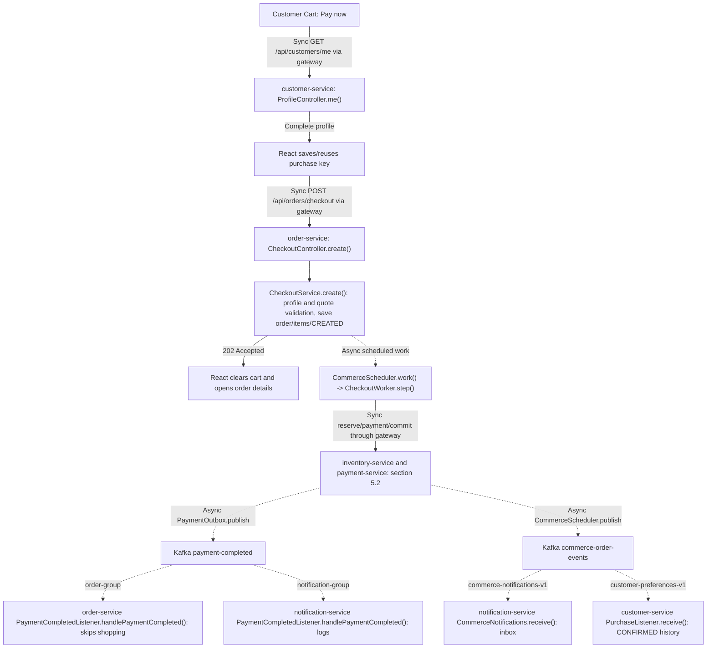
```mermaid
flowchart TD
    UI["Customer Cart: Pay now"] -->|Sync GET /api/customers/me via gateway| C["customer-service: ProfileController.me()"]
    C -->|Complete profile| KEY["React saves/reuses purchase key"]
    KEY -->|Sync POST /api/orders/checkout via gateway| O["order-service: CheckoutController.create()"]
    O --> ACCEPT["CheckoutService.create(): profile and quote validation, save order/items/CREATED"]
    ACCEPT -->|202 Accepted| UI2["React clears cart and opens order details"]
    ACCEPT -.->|Async scheduled work| W["CommerceScheduler.work() -> CheckoutWorker.step()"]
    W -->|Sync reserve/payment/commit through gateway| DEPS["inventory-service and payment-service: section 5.2"]
    DEPS -.->|Async PaymentOutbox.publish| KP["Kafka payment-completed"]
    DEPS -.->|Async CommerceScheduler.publish| KC["Kafka commerce-order-events"]
    KP -.->|order-group| OL["order-service PaymentCompletedListener.handlePaymentCompleted(): skips shopping"]
    KP -.->|notification-group| NL["notification-service PaymentCompletedListener.handlePaymentCompleted(): logs"]
    KC -.->|commerce-notifications-v1| IN["notification-service CommerceNotifications.receive(): inbox"]
    KC -.->|customer-preferences-v1| HIST["customer-service PurchaseListener.receive(): CONFIRMED history"]
```

**Screen:** `/#/customer/cart`. **Run:** Portal base + customer + PGS + discount +
inventory + payment. Ratings are optional. Kafka/notification are needed for new
event-driven updates, not for the immediate order acceptance.

1. React calls `GET /api/customers/me`; an incomplete profile stops submission.
2. It prepares `{items: [{sku, quantity}], address, expectedAmount, idempotencyKey}`.
   `customerId` is omitted for a normal customer: order-service derives the owner
   from trusted identity.
3. A key is saved in session storage and reused when the same cart/address is retried.
   It identifies the intended purchase; it is not an authorization credential.
4. React sends `POST /api/orders/checkout` through gateway. Order-service performs
   its own profile and price checks, saves order/items/workflow and returns **202**.
   The detailed backend sequence is in section 5.
5. After acceptance, UI clears the cart and saved checkout key and navigates to
   `/#/customer/orders/{orderId}`. The browser does not call `/payments` for this flow.
6. The detail page reads saved order and fulfillment; the worker reserves inventory,
   pays and commits stock independently of the browser.

A failed HTTP response before acceptance keeps the cart for correction/retry.
A 202 followed by a FAILED checkout is a saved failed order, not a request to submit
another payment. Closing the browser after 202 does not stop backend processing.

### 3.5 My orders, order details and fulfillment polling

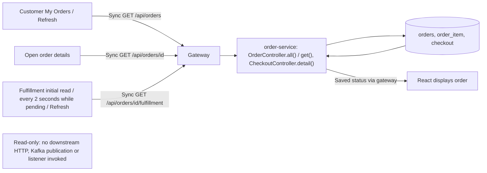
```mermaid
flowchart LR
    LIST["Customer My Orders / Refresh"] -->|Sync GET /api/orders| GW["Gateway"]
    DETAILS["Open order details"] -->|Sync GET /api/orders/id| GW
    POLL["Fulfillment initial read / every 2 seconds while pending / Refresh"] -->|Sync GET /api/orders/id/fulfillment| GW
    GW --> O["order-service: OrderController.all() / get(), CheckoutController.detail()"]
    O --> DB[("orders, order_item, checkout")]
    DB --> O
    O -->|Saved status via gateway| VIEW["React displays order"]
    NOTE["Read-only: no downstream HTTP, Kafka publication or listener invoked"]
```

**Screens:** `/#/customer/orders` and `/#/customer/orders/{id}`.
**Run to read:** Portal base. **To advance pending work:** dependencies in section 5.

1. `OrdersProvider` loads `GET /api/orders`; the backend filters by owner/tenant.
   Searching/filtering the displayed list is browser-side; Refresh reloads the API.
2. Details call `GET /api/orders/{id}` and then `GET /api/orders/{id}/fulfillment`.
3. Order-service reads its own `orders`, `order_item` and `checkout` data. It does
   **not** call PGS, customer, inventory or payment to display saved items and prices.
4. UI repeats fulfillment GETs every **two seconds** while state is CREATED,
   RESERVED, PAID or RELEASING. Requests are sequential, not simultaneous. This is
   intentional status polling; it does not reserve stock or retry payment itself.
5. It stops automatic polling on CONFIRMED, FAILED, SHIPPED or DELIVERED, on a
   request error, or when the component is unmounted. Pending states have no
   fixed polling time limit. “Refresh fulfillment” checks again manually.
6. After confirmation, later shipping/delivery updates require manual refresh or
   reopening the page. There is no websocket or server-sent event subscription.

Customer attempts to read another customer's order are rejected by owner/tenant
checks. A manually edited URL does not bypass authorization. No Kafka event is
published by these reads. If `items` is empty, the screen uses the legacy controls
explained in section 6.2 rather than shopping fulfillment.

### 3.6 View notifications and recommendations after purchasing

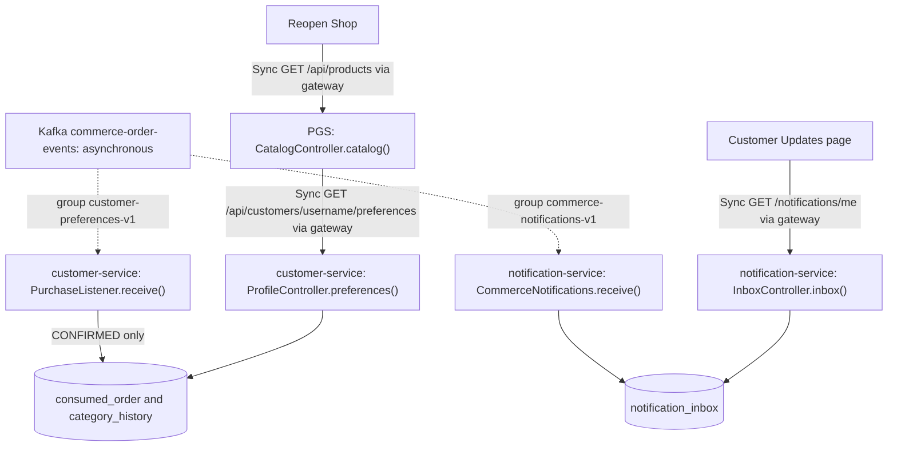
```mermaid
flowchart TD
    K["Kafka commerce-order-events: asynchronous"] -.->|group commerce-notifications-v1| N["notification-service: CommerceNotifications.receive()"]
    K -.->|group customer-preferences-v1| C["customer-service: PurchaseListener.receive()"]
    N --> IN[("notification_inbox")]
    C -->|CONFIRMED only| HIST[("consumed_order and category_history")]
    UI["Customer Updates page"] -->|Sync GET /notifications/me via gateway| API["notification-service: InboxController.inbox()"]
    API --> IN
    SHOP["Reopen Shop"] -->|Sync GET /api/products via gateway| P["PGS: CatalogController.catalog()"]
    P -->|Sync GET /api/customers/username/preferences via gateway| PREF["customer-service: ProfileController.preferences()"]
    PREF --> HIST
```

**Screen:** `/#/customer/notifications`. **Run to read:** Portal base + notification-service.
**For new entries:** Kafka + order publisher + notification consumer.

1. React calls `GET /notifications/me` once on page mount.
2. Notification-service returns the latest 50 inbox rows for the trusted tenant/customer.
3. The endpoint does not call order-service or Kafka to construct the response;
   Kafka consumers populated the stored inbox earlier.
4. Navigate away/back or reload to fetch new entries. It is not a live subscription.
5. Separately, customer-service consumes CONFIRMED events into category history.
   The next catalog request uses that history, alongside explicit preferences.

Payment logging and commerce inbox messages are different paths. A `payment-completed`
event only causes the notification service's payment listener to log a message;
the UI inbox is populated by `commerce-order-events` (section 7).

## 4. Admin scenarios

### 4.1 Open dashboard, view all orders, filter and inspect customers

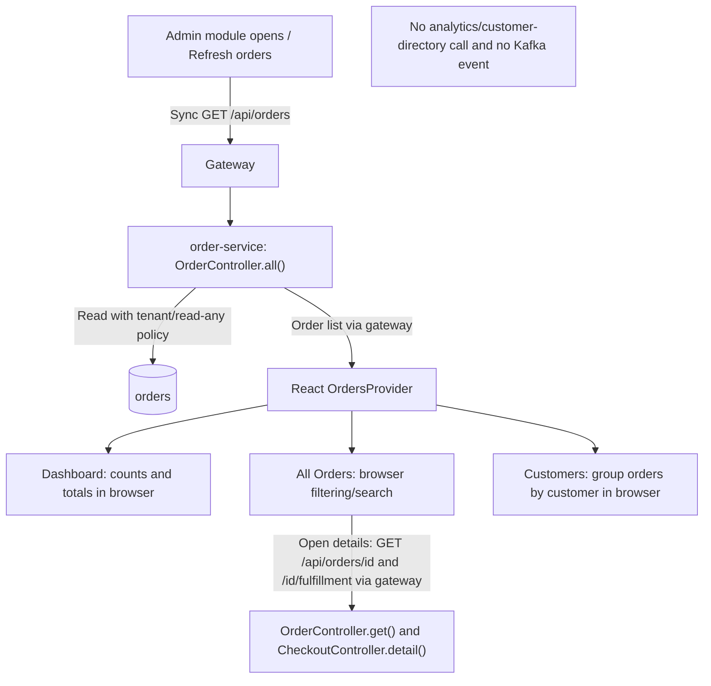
```mermaid
flowchart TD
    UI["Admin module opens / Refresh orders"] -->|Sync GET /api/orders| GW["Gateway"]
    GW --> O["order-service: OrderController.all()"]
    O -->|Read with tenant/read-any policy| DB[("orders")]
    O -->|Order list via gateway| CACHE["React OrdersProvider"]
    CACHE --> DASH["Dashboard: counts and totals in browser"]
    CACHE --> LIST["All Orders: browser filtering/search"]
    CACHE --> C["Customers: group orders by customer in browser"]
    LIST -->|Open details: GET /api/orders/id and /id/fulfillment via gateway| D["OrderController.get() and CheckoutController.detail()"]
    NOTE["No analytics/customer-directory call and no Kafka event"]
```

**Screens:** `/#/admin/dashboard`, `/#/admin/orders`, `/#/admin/customers`.
**Run:** Portal base.

1. Admin login follows section 2 and loads `GET /api/orders` through the shared provider.
2. With `orders:read:any`, order-service returns all orders in the admin's tenant,
   not orders from every tenant.
3. Dashboard counts, status totals and order-value summaries are calculated in React
   from that list; there is no dedicated dashboard or analytics microservice call.
4. All Orders applies UI filters/search to the loaded records; Refresh repeats the list call.
5. Admin Customers groups these order records by customer. Customers appear after
   their first order. This screen is not a Keycloak user directory and does not
   fetch a customer-service user list.
6. “View orders” opens the same admin orders screen with a customer filter. Opening
   details calls the order and fulfillment endpoints just as in customer details.

No outbound business HTTP or Kafka publication occurs for these reads.

### 4.2 Create an order on behalf of a customer

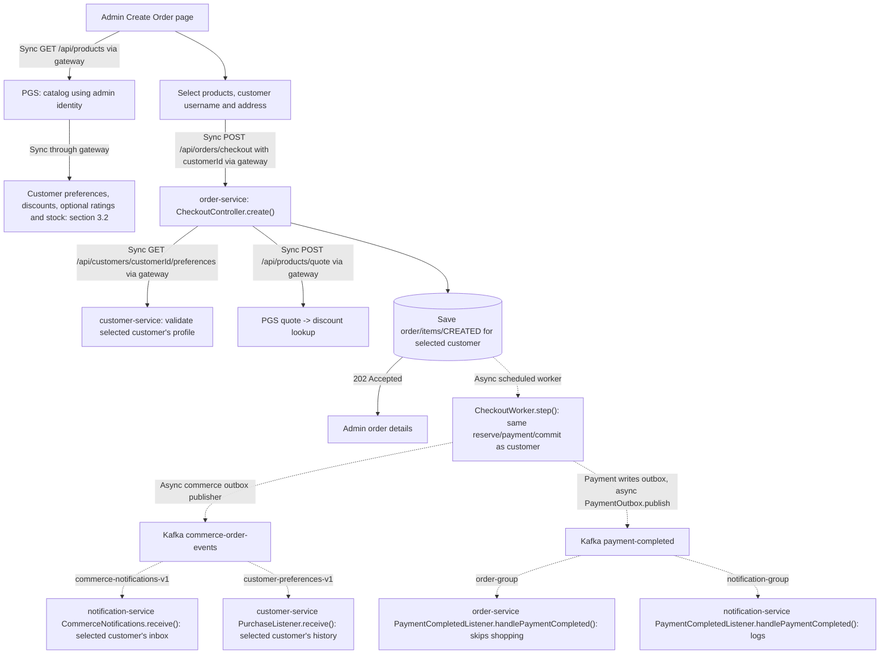
```mermaid
flowchart TD
    UI["Admin Create Order page"] -->|Sync GET /api/products via gateway| P["PGS: catalog using admin identity"]
    P -->|Sync through gateway| LOOKUP["Customer preferences, discounts, optional ratings and stock: section 3.2"]
    UI --> INPUT["Select products, customer username and address"]
    INPUT -->|Sync POST /api/orders/checkout with customerId via gateway| O["order-service: CheckoutController.create()"]
    O -->|Sync GET /api/customers/customerId/preferences via gateway| C["customer-service: validate selected customer's profile"]
    O -->|Sync POST /api/products/quote via gateway| Q["PGS quote -> discount lookup"]
    O --> SAVE[("Save order/items/CREATED for selected customer")]
    SAVE -->|202 Accepted| DETAIL["Admin order details"]
    SAVE -.->|Async scheduled worker| W["CheckoutWorker.step(): same reserve/payment/commit as customer"]
    W -.->|Async commerce outbox publisher| CE["Kafka commerce-order-events"]
    W -.->|Payment writes outbox, async PaymentOutbox.publish| PE["Kafka payment-completed"]
    CE -.->|commerce-notifications-v1| N["notification-service CommerceNotifications.receive(): selected customer's inbox"]
    CE -.->|customer-preferences-v1| H["customer-service PurchaseListener.receive(): selected customer's history"]
    PE -.->|order-group| OL["order-service PaymentCompletedListener.handlePaymentCompleted(): skips shopping"]
    PE -.->|notification-group| NL["notification-service PaymentCompletedListener.handlePaymentCompleted(): logs"]
```

**Screen:** `/#/admin/orders/new`. **Run:** same checkout service set as 3.4.

1. The page loads `GET /api/products`. PGS sees the **admin's** identity while
   browsing; this catalog is not repersonalized when the admin types a customer name.
   All five categories remain available to choose products.
2. Admin enters a customer username, delivery address and quantities. Totals are
   calculated locally; the customer must already have a complete commerce profile.
3. Submit sends `POST /api/orders/checkout` with `customerId` in addition to cart,
   amount and idempotency key. Admin UI stores a retry key for the same
   customer/items/address signature.
4. Order-service requires `orders:create`, checks the admin role before allowing a
   different owner, and uses the admin's tenant. It looks up the **selected customer's**
   preferences/completion endpoint and obtains a fresh PGS quote.
5. The order and item snapshots belong to the selected customer. After 202, the
   worker runs the same reserve → payment → commit sequence as customer checkout.
6. React opens `/#/admin/orders/{id}`. The selected customer can see the order and
   receives its eventual inbox/history updates; they are not attributed to the admin.

There is no UI operation here to create a Keycloak account or fill another
customer's profile. An unknown/incomplete customer must complete registration/profile first.

### 4.3 Ship a confirmed order and mark it delivered

**Screen:** admin order details. **Run for transition:** Portal base.
**For new inbox entries:** Kafka + notification-service. PGS/inventory/payment are not called.

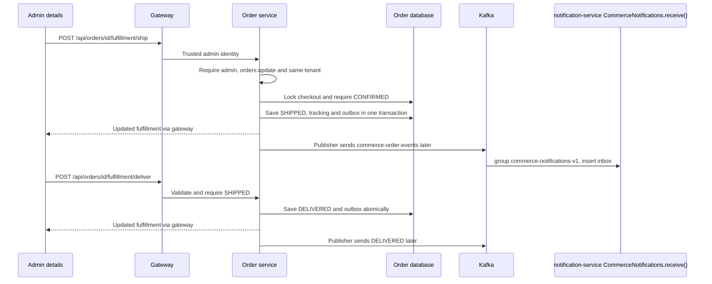
```mermaid
sequenceDiagram
    participant UI as Admin details
    participant GW as Gateway
    participant O as Order service
    participant DB as Order database
    participant K as Kafka
    participant N as notification-service CommerceNotifications.receive()
    UI->>GW: POST /api/orders/id/fulfillment/ship
    GW->>O: Trusted admin identity
    O->>O: Require admin, orders:update and same tenant
    O->>DB: Lock checkout and require CONFIRMED
    O->>DB: Save SHIPPED, tracking and outbox in one transaction
    O-->>UI: Updated fulfillment via gateway
    O->>K: Publisher sends commerce-order-events later
    K->>N: group commerce-notifications-v1, insert inbox
    UI->>GW: POST /api/orders/id/fulfillment/deliver
    GW->>O: Validate and require SHIPPED
    O->>DB: Save DELIVERED and outbox atomically
    O-->>UI: Updated fulfillment via gateway
    O->>K: Publisher sends DELIVERED later
```

1. Buttons are visible only for the expected state and admin permission; backend
   independently checks `admin`, `orders:update` and tenant access.
2. `/ship` permits CONFIRMED → SHIPPED. `/deliver` permits SHIPPED → DELIVERED.
3. Repeating the action when already at that target returns current detail.
   Invalid action gives 400; out-of-order transition gives 409.
4. Tracking is simulated as `ECOM-{orderId}`. No shipping/carrier service is called.
5. Order status, checkout state and commerce outbox entry commit together. Kafka
   publication occurs later, so broker unavailability need not prevent the HTTP transition.
6. Notification consumer inserts SHIPPED/DELIVERED inbox entries. Customer history
   consumer receives these events but ignores them because it counts CONFIRMED only.
7. React refreshes fulfillment after an action and updates the shared order status.

Legacy amount-only orders have no checkout state and cannot use these actions.
Their separate status editor is described in 6.2.

## 5. Checkout backend: acceptance to confirmation

### 5.1 Synchronous acceptance: what must finish before HTTP 202

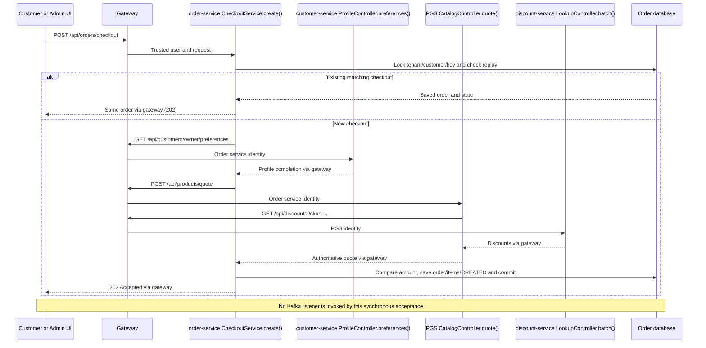
```mermaid
sequenceDiagram
    participant UI as Customer or Admin UI
    participant GW as Gateway
    participant O as order-service CheckoutService.create()
    participant C as customer-service ProfileController.preferences()
    participant P as PGS CatalogController.quote()
    participant D as discount-service LookupController.batch()
    participant DB as Order database
    UI->>GW: POST /api/orders/checkout
    GW->>O: Trusted user and request
    O->>DB: Lock tenant/customer/key and check replay
    alt Existing matching checkout
        DB-->>O: Saved order and state
        O-->>UI: Same order via gateway (202)
    else New checkout
        O->>GW: GET /api/customers/owner/preferences
        GW->>C: Order service identity
        C-->>O: Profile completion via gateway
        O->>GW: POST /api/products/quote
        GW->>P: Order service identity
        P->>GW: GET /api/discounts?skus=...
        GW->>D: PGS identity
        D-->>P: Discounts via gateway
        P-->>O: Authoritative quote via gateway
        O->>DB: Compare amount, save order/items/CREATED and commit
        O-->>UI: 202 Accepted via gateway
    end
    Note over UI,DB: No Kafka listener is invoked by this synchronous acceptance
```

**Entry:** customer or admin `POST /api/orders/checkout`. **Owner:** order-service.

1. Gateway validates the user token, replaces headers and routes the request.
2. Order-service requires `orders:create`; validates customer selection, demo tenant,
   idempotency-key format, address and unique SKU/quantity input.
3. A PostgreSQL advisory transaction lock serializes the same tenant/customer/key.
   Existing same-key, same-items/address requests return the saved order; a changed
   fingerprint gives 409. This can return a later fulfillment state on replay.
4. Order-service obtains/caches its own machine token from Keycloak. The original
   user's ownership was checked before switching to service credentials.
5. Through gateway, it calls `GET /api/customers/{owner}/preferences` and requires
   `complete=true`. Missing profile produces 400 before a new order is accepted.
6. Through gateway, it calls PGS `POST /api/products/quote` with SKU/quantity only.
7. PGS reads product data and calls discount-service `GET /api/discounts?skus=...`
   through gateway with its own token. It calculates current line prices and total.
   Quote does not call ratings, inventory or customer-service.
8. Order-service compares the quote with `expectedAmount`; stale/tampered totals
   produce 409. Browser prices are never used as the authoritative persisted price.
9. It saves an `orders` row with PENDING, `order_item` price/category/name snapshots,
   and a `checkout` row with CREATED in one transaction, then returns 202.

Inventory reservation and payment happen **after** this acceptance. There is no
Kafka event for merely saving CREATED in the current implementation. The worker
reads PostgreSQL; Kafka does not dispatch its steps.

### 5.2 Asynchronous worker: reserve, pay, commit

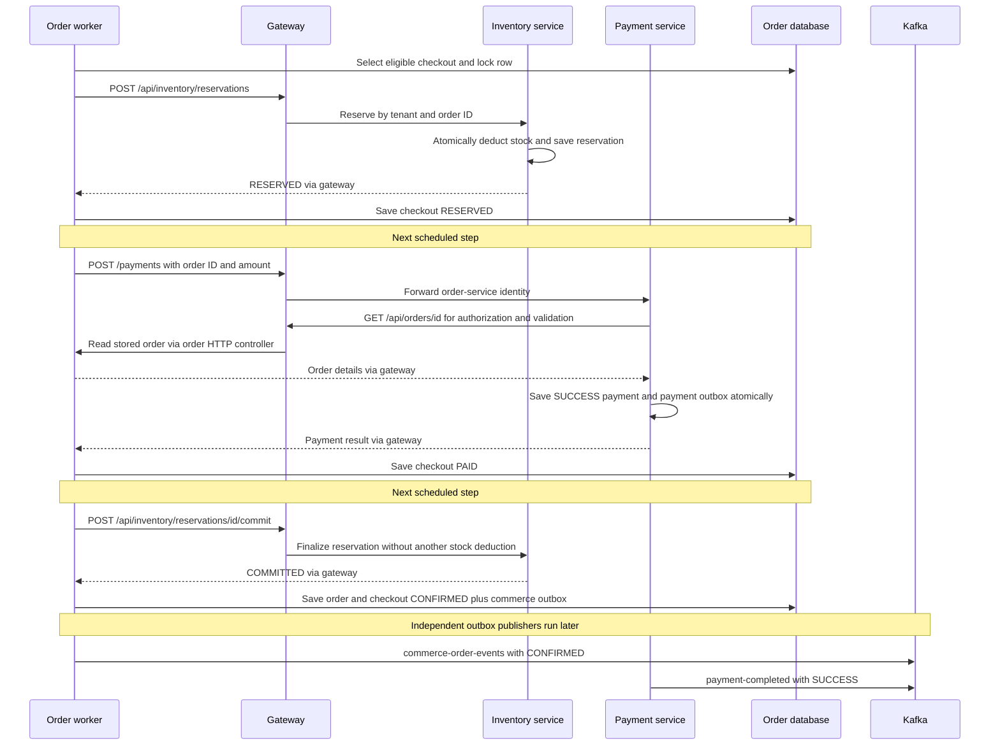
```mermaid
sequenceDiagram
    participant O as Order worker
    participant GW as Gateway
    participant I as Inventory service
    participant P as Payment service
    participant DB as Order database
    participant K as Kafka
    O->>DB: Select eligible checkout and lock row
    O->>GW: POST /api/inventory/reservations
    GW->>I: Reserve by tenant and order ID
    I->>I: Atomically deduct stock and save reservation
    I-->>O: RESERVED via gateway
    O->>DB: Save checkout RESERVED
    Note over O,DB: Next scheduled step
    O->>GW: POST /payments with order ID and amount
    GW->>P: Forward order-service identity
    P->>GW: GET /api/orders/id for authorization and validation
    GW->>O: Read stored order via order HTTP controller
    O-->>P: Order details via gateway
    P->>P: Save SUCCESS payment and payment outbox atomically
    P-->>O: Payment result via gateway
    O->>DB: Save checkout PAID
    Note over O,DB: Next scheduled step
    O->>GW: POST /api/inventory/reservations/id/commit
    GW->>I: Finalize reservation without another stock deduction
    I-->>O: COMMITTED via gateway
    O->>DB: Save order and checkout CONFIRMED plus commerce outbox
    Note over O,K: Independent outbox publishers run later
    O->>K: commerce-order-events with CONFIRMED
    P->>K: payment-completed with SUCCESS
```

- `CommerceScheduler.work()` uses fixed delay 500 ms. Each worker transaction selects
  one eligible pending checkout with `FOR UPDATE SKIP LOCKED` and advances one step.
  It is not a single browser request spanning all transitions.
- CREATED → RESERVED: inventory saves a tenant/order reservation and conditionally
  deducts each SKU. All lines succeed or the transaction rolls back. Insufficient
  stock gives 409; order becomes FAILED and records a commerce outbox event.
- RESERVED → PAID: payment controller reads the order for owner/tenant authorization.
  Payment processing locks by order ID. If no previous success exists, it reads the
  order again and requires PENDING plus matching amount. It saves SUCCESS and
  `payment_outbox` together. Same-order/same-amount replay returns the saved payment.
- PAID → CONFIRMED: inventory commit finalizes the reservation; it does not deduct
  stock again. Order-service marks order and checkout CONFIRMED and saves
  `commerce_outbox` in the same transaction.
- Payment rejection (the worker treats HTTP 409 in RESERVED as rejection) moves to
  RELEASING. A later step calls inventory `/release`, then marks FAILED and emits
  its commerce event. There is no refund operation in this POC.

Once accepted, retries use saved order/items, so PGS, customer and discount are no
longer needed for reserve/pay/commit recovery. Order/gateway/Keycloak/PostgreSQL and
the service required for the current step must remain available. A cached token
can temporarily hide a Keycloak outage; token renewal still needs Keycloak.

### 5.3 Two separate asynchronous mechanisms

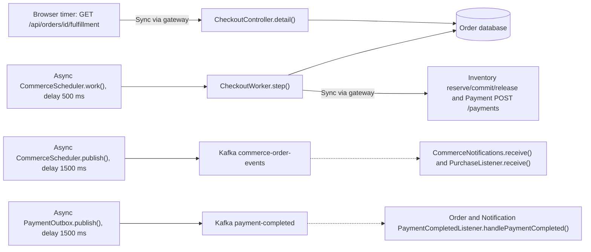
```mermaid
flowchart LR
    B["Browser timer: GET /api/orders/id/fulfillment"] -->|Sync via gateway| READ["CheckoutController.detail()"]
    READ --> DB[("Order database")]
    TIMER["Async CommerceScheduler.work(), delay 500 ms"] --> W["CheckoutWorker.step()"]
    W --> DB
    W -->|Sync via gateway| API["Inventory reserve/commit/release and Payment POST /payments"]
    CP["Async CommerceScheduler.publish(), delay 1500 ms"] --> C["Kafka commerce-order-events"]
    PP["Async PaymentOutbox.publish(), delay 1500 ms"] --> P["Kafka payment-completed"]
    C -.-> CL["CommerceNotifications.receive() and PurchaseListener.receive()"]
    P -.-> PL["Order and Notification PaymentCompletedListener.handlePaymentCompleted()"]
```

| Mechanism                   | Reads                              | Work                             | Trigger/transport                                   |
| --------------------------- | ---------------------------------- | -------------------------------- | --------------------------------------------------- |
| Checkout worker             | Eligible `checkout` rows           | Reserve, payment, commit/release | Scheduled database polling; HTTP through gateway    |
| Payment outbox publisher    | Unpublished `payment_outbox` rows  | Publish payment success          | Scheduled publisher → Kafka `payment-completed`     |
| Commerce outbox publisher   | Unpublished `commerce_outbox` rows | Publish order milestones         | Scheduled publisher → Kafka `commerce-order-events` |
| Browser fulfillment polling | Saved checkout detail              | Display current progress         | HTTP GET every two seconds while pending            |

These mechanisms are independent. Multiple browser reads do not mean multiple
payments. Kafka publication can lag behind order confirmation. Different topics
have no guaranteed cross-topic arrival order: an inbox event may be observed before
or after payment logging. Consumer behavior is detailed next in section 7.

## 6. Service-to-service and API-only scenarios

These complement the portal screens; they are not all buttons in the shopping UI.

### 6.1 Order-to-inventory identity demonstration

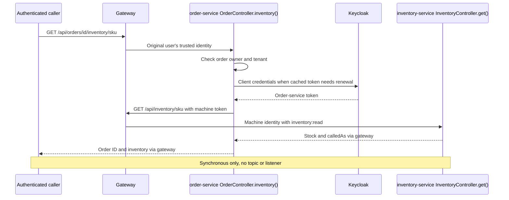
```mermaid
sequenceDiagram
    participant U as Authenticated caller
    participant G as Gateway
    participant O as order-service OrderController.inventory()
    participant KC as Keycloak
    participant I as inventory-service InventoryController.get()
    U->>G: GET /api/orders/id/inventory/sku
    G->>O: Original user's trusted identity
    O->>O: Check order owner and tenant
    O->>KC: Client credentials when cached token needs renewal
    KC-->>O: Order-service token
    O->>G: GET /api/inventory/sku with machine token
    G->>I: Machine identity with inventory:read
    I-->>O: Stock and calledAs via gateway
    O-->>U: Order ID and inventory via gateway
    Note over U,I: Synchronous only, no topic or listener
```

**Entry:** `GET /api/orders/{id}/inventory/{sku}`. **Run:** gateway + order + inventory

- Keycloak + PostgreSQL; React is optional.

1. Gateway authenticates the user. Order checks read permission, tenant and ownership
   of the selected order before making any machine call.
2. `InventoryGatewayClient` obtains/caches an order-service client-credentials token.
3. It calls gateway `GET /api/inventory/{sku}`; gateway validates this new token and
   supplies order-service's machine identity/permissions to inventory.
4. Inventory requires `inventory:read`, reads stock and returns `calledAs`, tenant
   and availability. Order returns it with the order ID.
5. No stock changes or Kafka events occur. A customer's direct inventory request
   may be denied even though this authorized order-mediated demonstration succeeds.

### 6.2 Legacy amount-only order, manual payment and status update

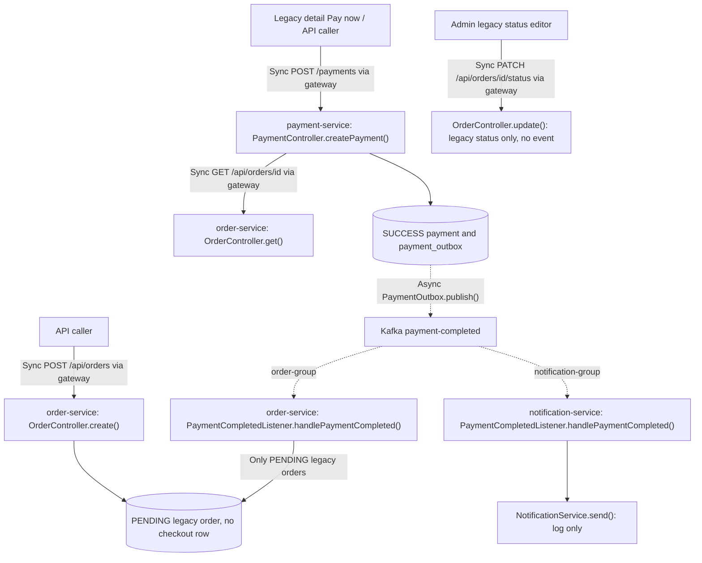
```mermaid
flowchart TD
    USER["API caller"] -->|Sync POST /api/orders via gateway| O["order-service: OrderController.create()"]
    O --> DB[("PENDING legacy order, no checkout row")]
    UI["Legacy detail Pay now / API caller"] -->|Sync POST /payments via gateway| P["payment-service: PaymentController.createPayment()"]
    P -->|Sync GET /api/orders/id via gateway| READ["order-service: OrderController.get()"]
    P --> PDB[("SUCCESS payment and payment_outbox")]
    PDB -.->|"Async PaymentOutbox.publish()"| K["Kafka payment-completed"]
    K -.->|order-group| L["order-service: PaymentCompletedListener.handlePaymentCompleted()"]
    L -->|Only PENDING legacy orders| DB
    K -.->|notification-group| N["notification-service: PaymentCompletedListener.handlePaymentCompleted()"]
    N --> LOG["NotificationService.send(): log only"]
    ADMIN["Admin legacy status editor"] -->|Sync PATCH /api/orders/id/status via gateway| PATCH["OrderController.update(): legacy status only, no event"]
```

**Entry:** API `POST /api/orders` with `{customerId, amount}`. **Run:** gateway + order

- PostgreSQL + Keycloak; add payment for payment and Kafka for automatic confirmation.

1. Order validates amount/customer and creates PENDING with no items/checkout/reservation.
   It does not call customer-service, PGS or inventory.
2. Opening this order in UI details finds no shopping items and displays legacy
   controls. Customer payment control sends `POST /payments` with order ID/amount;
   admin may also use the legacy status editor when permitted.
3. Payment performs the same order access/amount checks as in 5.2 and saves payment/outbox.
4. Payment publisher sends `payment-completed`. `order-group` confirms a PENDING
   legacy order on SUCCESS (or marks FAILED for a non-success event).
5. The listener skips orders that have a `checkout` row and skips non-PENDING legacy
   orders. Therefore it cannot bypass shopping inventory commit or overwrite a
   later status on replay.
6. `notification-group` independently logs the payment event; it does not add a
   commerce inbox row. The legacy order path does not publish `commerce-order-events`.
7. Admin `PATCH /api/orders/{id}/status` requires admin + `orders:update` and tenant
   access. It updates only legacy status; shopping orders return 409. It does not
   implement the shopping transition state machine, reserve stock or emit an event.

Normal cart checkout does not use `POST /api/orders` or the legacy payment button.
Kafka is necessary for the legacy listener's confirmation, unlike shopping confirmation.

### 6.3 Read a payment or repeat payment safely

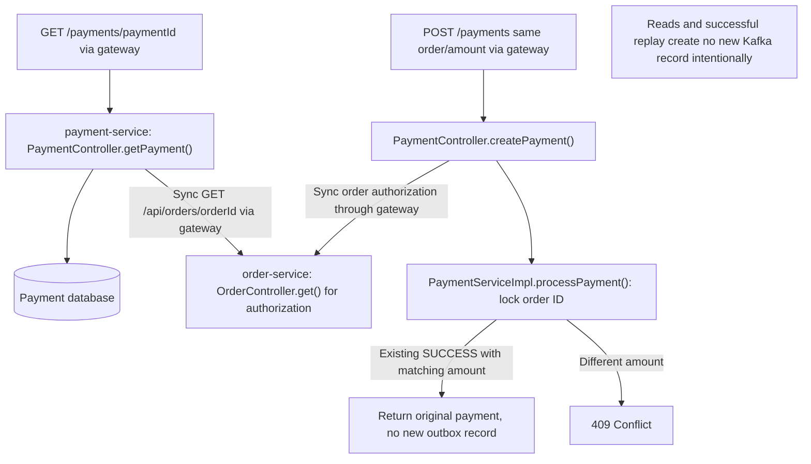
```mermaid
flowchart TD
    READ["GET /payments/paymentId via gateway"] --> PC["payment-service: PaymentController.getPayment()"]
    PC --> PDB[("Payment database")]
    PC -->|Sync GET /api/orders/orderId via gateway| O["order-service: OrderController.get() for authorization"]
    RETRY["POST /payments same order/amount via gateway"] --> CREATE["PaymentController.createPayment()"]
    CREATE -->|Sync order authorization through gateway| O
    CREATE --> S["PaymentServiceImpl.processPayment(): lock order ID"]
    S -->|Existing SUCCESS with matching amount| SAME["Return original payment, no new outbox record"]
    S -->|Different amount| CONFLICT["409 Conflict"]
    NOTE["Reads and successful replay create no new Kafka record intentionally"]
```

**Entry:** `GET /payments/{paymentId}` or `POST /payments`.

Payment read needs `payments:read` or `payments:read:any`. It loads payment from its
DB, then calls order `GET /api/orders/{id}` through gateway to enforce owner/tenant
access. It does not publish anything. A repeated same-amount POST returns the
existing successful payment; changed amount returns 409. The controller still
performs the order authorization call on a replay. New payments create one local
outbox record; retries do not intentionally create another payment event record.

### 6.4 Catalog and inventory machine APIs

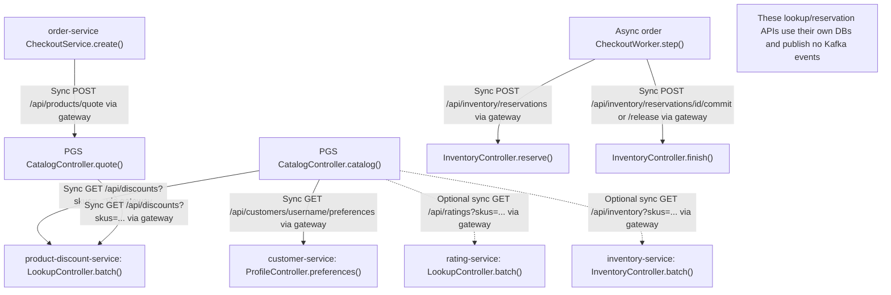
```mermaid
flowchart TD
    P["PGS CatalogController.catalog()"] -->|Sync GET /api/customers/username/preferences via gateway| C["customer-service: ProfileController.preferences()"]
    P -->|Sync GET /api/discounts?skus=... via gateway| D["product-discount-service: LookupController.batch()"]
    P -.->|Optional sync GET /api/ratings?skus=... via gateway| R["rating-service: LookupController.batch()"]
    P -.->|Optional sync GET /api/inventory?skus=... via gateway| I["inventory-service: InventoryController.batch()"]
    O["order-service CheckoutService.create()"] -->|Sync POST /api/products/quote via gateway| Q["PGS CatalogController.quote()"]
    Q -->|Sync GET /api/discounts?skus=... via gateway| D
    W["Async order CheckoutWorker.step()"] -->|Sync POST /api/inventory/reservations via gateway| RES["InventoryController.reserve()"]
    W -->|Sync POST /api/inventory/reservations/id/commit or /release via gateway| FIN["InventoryController.finish()"]
    NOTE["These lookup/reservation APIs use their own DBs and publish no Kafka events"]
```

| API                                             | Normal caller and purpose                             | Outbound HTTP / side effect                                              |
| ----------------------------------------------- | ----------------------------------------------------- | ------------------------------------------------------------------------ |
| `GET /api/customers/{username}/preferences`     | PGS personalization; order profile-completeness check | Customer DB only; requires `customers:read:any`.                         |
| `GET /api/discounts?skus=...`                   | PGS catalog/quote prices                              | Discount DB only; `discounts:read`; 1–50 SKUs.                           |
| `GET /api/ratings?skus=...`                     | PGS optional ratings                                  | Rating DB only; `ratings:read`; 1–50 SKUs.                               |
| `GET /api/inventory?skus=...`                   | PGS optional availability                             | Inventory DB only; `inventory:read`; no reservation.                     |
| `GET /api/inventory/{sku}`                      | Order-mediated identity demonstration                 | Inventory DB only; `inventory:read`.                                     |
| `POST /api/products/quote`                      | Order's authoritative checkout price                  | PGS DB + gateway → discount; `catalog:quote`.                            |
| `POST /api/inventory/reservations`              | Order worker reserve step                             | Inventory DB transaction; `inventory:reserve`; tenant/order idempotency. |
| `POST /api/inventory/reservations/{id}/commit`  | Order worker after payment                            | Finalize reservation; `inventory:commit`; no additional deduction.       |
| `POST /api/inventory/reservations/{id}/release` | Order worker compensation                             | Restore stock once; also uses `inventory:commit`.                        |

In reservation paths `{id}` is the order ID. Inventory, discount, rating and
customer REST handlers do not call other services. These APIs publish no Kafka
events themselves. Their successful HTTP results drive the order worker's decisions.

### 6.5 Security checks and manual notification

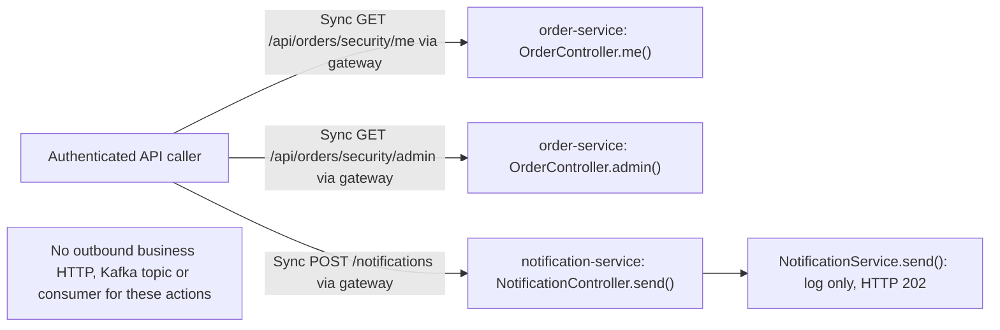
```mermaid
flowchart LR
    U["Authenticated API caller"] -->|Sync GET /api/orders/security/me via gateway| ME["order-service: OrderController.me()"]
    U -->|Sync GET /api/orders/security/admin via gateway| ADMIN["order-service: OrderController.admin()"]
    U -->|Sync POST /notifications via gateway| N["notification-service: NotificationController.send()"]
    N --> LOG["NotificationService.send(): log only, HTTP 202"]
    NOTE["No outbound business HTTP, Kafka topic or consumer for these actions"]
```

- `GET /api/orders/security/me`: authenticated caller identity; used by portal bootstrap.
- `GET /api/orders/security/admin`: admin-only RBAC demonstration; no downstream call.
- Header-spoofing checks: supply forged `X-Auth-*` headers with a valid customer token;
  gateway replaces them. The caller does not become admin. These are API exercises,
  not a promise of a spoof checkbox in current shopping screens.
- `POST /notifications`: requires `notifications:send`; logs `{orderId, status}` and
  returns 202. It sends no real email/SMS, creates no inbox row, calls no service
  and publishes no event. The normal checkout does not call this HTTP endpoint.

## 7. Kafka topics, publishers, consumers and payloads

### 7.1 Complete topic and consumer-group map

| Topic                   | Producer and trigger                                                                     | Message key        | Consumer / group                                                           | Consumer work                                                                     |
| ----------------------- | ---------------------------------------------------------------------------------------- | ------------------ | -------------------------------------------------------------------------- | --------------------------------------------------------------------------------- |
| `payment-completed`     | PaymentOutbox after successful payment transaction                                       | Order ID as string | order-service `PaymentCompletedListener` / `order-group`                   | Skip shopping and non-PENDING orders; update PENDING legacy order; acknowledge.   |
| `payment-completed`     | Same publication                                                                         | Order ID as string | notification-service `PaymentCompletedListener` / `notification-group`     | Log a notification via NotificationService; acknowledge. Does not populate inbox. |
| `commerce-order-events` | CommerceScheduler after order outbox entries for CONFIRMED, SHIPPED, DELIVERED or FAILED | Order ID as string | notification-service `CommerceNotifications` / `commerce-notifications-v1` | Insert event into customer inbox with deduplication; acknowledge.                 |
| `commerce-order-events` | Same publication                                                                         | Order ID as string | customer-service `PurchaseListener` / `customer-preferences-v1`            | Process CONFIRMED only; deduplicate and increase category purchase quantities.    |

Different groups receive their own copy. Instances within the same group share
partitions. There are no current business consumers in PGS, inventory, discount,
rating or gateway. No shipping-topic, cart-topic, refund-topic or configured business
DLT is part of this implementation. Framework default handling must not be mistaken
for an explicitly implemented dead-letter/replay workflow.

### 7.2 Payment event path

```mermaid
flowchart LR
    P[Payment transaction] --> DB[(Payment plus payment_outbox)]
    DB --> R["payment-service: PaymentOutbox.publish()"]
    R -. Async publish .-> K[Kafka payment-completed]
    K -. order-group .-> O["order-service: PaymentCompletedListener.handlePaymentCompleted()"]
    K -. notification-group .-> N["notification-service: PaymentCompletedListener.handlePaymentCompleted()"]
    O --> L[Confirm or fail PENDING legacy order]
    O --> S[Skip shopping checkout order]
    N --> LOG["NotificationService.send(): log payment notification"]
```

Payload shape (illustrative IDs):

```json
{"orderId": 41, "paymentId": 12, "status": "SUCCESS"}
```

1. Payment saves SUCCESS and `payment_outbox(order_id, payment_id, published=false)`
   atomically. The normal publisher currently emits SUCCESS only; the order listener
   contains a non-success branch for received events, not a real bank-decline producer.
2. `PaymentOutbox.publish()` runs with fixed delay 1.5 seconds, reads up to 20
   unpublished rows, sends JSON to `payment-completed` and waits for acknowledgment.
3. It marks the row published after broker acknowledgment. Failure leaves it for
   retry. A crash after Kafka accepts but before marking can cause duplicate delivery.
4. Order listener acknowledges shopping events without changing checkout. Legacy
   updates occur before acknowledgment. Notification listener logs before acknowledgment.
   Its log can repeat on redelivery; it has no payment-event inbox dedup table.

### 7.3 Commerce event path and personalization

```mermaid
flowchart LR
    O[Order milestone transaction] --> DB[(State plus commerce_outbox)]
    DB --> P["order-service: CommerceScheduler.publish()"]
    P -. Async publish .-> K[Kafka commerce-order-events]
    K -. commerce-notifications-v1 .-> N["notification-service: CommerceNotifications.receive()"]
    K -. customer-preferences-v1 .-> CL["customer-service: PurchaseListener.receive()"]
    N --> I[(notification_inbox)]
    CL --> CHECK{Status CONFIRMED?}
    CHECK -->|Yes| H[(consumed_order plus category_history)]
    CHECK -->|No| IGNORE[Ignore for history]
    I --> UI["Customer Updates: GET /notifications/me via gateway"]
    H --> PGS[Next catalog preferences lookup]
```

Payload is assembled from saved order/item snapshots, not the latest catalog:

```json
{
  "eventId": "41:CONFIRMED",
  "orderId": 41,
  "status": "CONFIRMED",
  "occurredAt": "2026-10-02T00:00:00Z",
  "tenant": "demo",
  "customerId": "customer1",
  "items": [{"sku": "BOOK-1", "category": "Books", "quantity": 2}]
}
```

1. `CheckoutService.event()` uses deterministic `eventId = orderId + ':' + status`
   and inserts `commerce_outbox` with conflict protection inside the state transaction.
2. `CommerceScheduler.publish()` runs with fixed delay 1.5 seconds, selects up to
   20 unpublished rows and orders a given order's milestones before sending.
   It sends JSON strings keyed by order ID, waits for acknowledgment, then marks published.
3. Notification consumer inserts `notification_inbox` with `ON CONFLICT DO NOTHING`
   on event identity, preserving event time where supplied, then acknowledges.
   Repeated events do not create duplicate inbox rows.
4. Customer consumer ignores non-CONFIRMED events. For confirmation, one database
   transaction inserts `consumed_order(event_id)` and updates `category_history`.
   A duplicate event exits without counting quantities again. It adds item quantities
   per category, not just one count per order.
5. Its listener returns after the transactional work; container acknowledgment is
   used rather than an explicit `Acknowledgment` parameter. Notification and order
   listeners explicitly acknowledge under their configured manual ack modes.
6. Customer and notification services configure retry every five seconds with
   unlimited attempts for listener errors. Persistent bad data can block progress;
   there is no custom DLT/replay UI here. Order-service does not declare that same
   custom error handler, so do not assume the same policy for `order-group`.

Publication and consumption are eventually consistent. With Kafka down, persisted
outbox entries wait. With a consumer down, the broker retains events according to
its retention policy and the group resumes from committed offsets. Inbox/history
is not guaranteed to be visible immediately after Pay now or Ship returns.

## 8. Failures, retries and duplicate requests

```mermaid
flowchart TD
    W["Async order CheckoutWorker.step()"] -->|Sync API call via gateway| DEP["Inventory or payment"]
    DEP -->|Connection failure or uncertain response| WAIT["Persist same pending state and next_attempt"]
    WAIT -.->|Later scheduled retry| W
    DEP -->|Reserve 409: insufficient stock| FAILED["Save FAILED and commerce outbox"]
    DEP -->|Payment 409 in RESERVED| REL["Save RELEASING"]
    REL -->|Next step: sync POST /api/inventory/reservations/id/release via gateway| I["InventoryController.finish()"]
    I -->|Released| FAILED
    FAILED -.->|"Async CommerceScheduler.publish()"| K["Kafka commerce-order-events, FAILED"]
    K -.->|commerce-notifications-v1| N["notification-service CommerceNotifications.receive(): inbox"]
    K -.->|customer-preferences-v1| C["customer-service PurchaseListener.receive(): ignores FAILED"]
    UI["Browser fulfillment GET via gateway"] --> READ["CheckoutController.detail(): observes saved state only"]
```

| Observation / trigger                                         | Implemented response and next step                                                                                                                                                   |
| ------------------------------------------------------------- | ------------------------------------------------------------------------------------------------------------------------------------------------------------------------------------ |
| Customer/discount unavailable during catalog                  | Catalog fails; no order/stock/payment side effect. Rating/stock-preview failures instead use fallbacks.                                                                              |
| Profile incomplete before checkout                            | UI check stops submission; server independently rejects with 400. Complete profile first.                                                                                            |
| Price changed or browser amount altered                       | Server quote comparison returns 409 before new acceptance; reload prices.                                                                                                            |
| Same checkout key sent concurrently                           | DB advisory lock and uniqueness serialize creation; same fingerprint returns same order. Different items/address with that key gives 409.                                            |
| Inventory unavailable at CREATED                              | Worker records dependency error and retries; fulfillment remains pending. Browser continues two-second status polling.                                                               |
| Inventory reports insufficient stock                          | Reservation transaction rolls back all line deductions; order/checkout FAILED and a commerce FAILED event is queued. Payment has not run.                                            |
| Payment unavailable at RESERVED                               | Reservation stays held; worker retries. Start payment-service; do not create another order.                                                                                          |
| Payment commits but response is lost                          | Worker may still show RESERVED. Same-order/same-amount retry returns the saved payment; timeout does not prove failure.                                                              |
| Payment returns 409 at RESERVED                               | Worker moves to RELEASING, releases stock through inventory, then marks FAILED and queues FAILED event. Current classification is status-based, not typed provider-decline handling. |
| Inventory commit unavailable at PAID                          | Payment remains successful; worker retries commit. Do not manually release paid stock.                                                                                               |
| Release unavailable at RELEASING                              | Worker retries release; failure completion waits until compensation succeeds.                                                                                                        |
| Order-service restarts after acceptance                       | Saved checkout/items let the worker resume. Browser need not be connected.                                                                                                           |
| Kafka unavailable                                             | Successful local business state can remain committed; publishers retain unpublished outbox rows for retry. Legacy confirmation and new event-driven updates wait.                    |
| Duplicate Kafka publication                                   | Inbox/history deduplicate by event ID; legacy listener skips non-PENDING or shopping orders; payment logging may repeat.                                                             |
| Consumer database unavailable                                 | Listener processing fails; customer/notification retry. Their ack/dedup transaction boundaries protect replayed side effects.                                                        |
| Invalid token / insufficient permission / other owner's order | Gateway 401 or service 403 as applicable; the user must not gain privilege by forging headers.                                                                                       |
| Browser signed out or page closed                             | Stops that UI's observation, not accepted backend checkout or Kafka processing.                                                                                                      |

The worker schedules most dependency errors using `next_attempt = now() + interval
'10 seconds'`. PostgreSQL `now()` is the transaction-start time, so this is **not
necessarily ten seconds after the failed HTTP call ends**. There is no configured
maximum attempt count, exponential backoff or business deadline. A permanent outage
can therefore leave checkout pending indefinitely. See [timeouts and retry safety](../api-gateway/06-timeouts-safe-retries-and-idempotency.md).

No cancellation, refund, return, real payment gateway, carrier tracking, inventory
replenishment UI or customer product-review submission is implemented. Ratings and
discounts are stored lookup data. Those should not be inferred from the existing
read APIs or shipping labels.

## 9. Quick runtime dependency matrix

Every UI row includes Portal base. PostgreSQL is required for persisted service data.
Keycloak is included for reliable token acquisition/renewal even when cached tokens
might let some existing requests temporarily succeed without it.

| Scenario                                      | Additional business services                       | Kafka requirement                                                 |
| --------------------------------------------- | -------------------------------------------------- | ----------------------------------------------------------------- |
| Customer profile                              | Customer                                           | None for read/save.                                               |
| Customer Shop                                 | PGS, customer, discount; rating/inventory optional | None for existing recommendations.                                |
| Cart opening / price refresh                  | Same as catalog                                    | None.                                                             |
| Cart quantity/local removal                   | No additional call after page data is loaded       | None.                                                             |
| Checkout before 202                           | Customer, PGS, discount                            | None.                                                             |
| Accepted CREATED → RESERVED                   | Inventory                                          | None.                                                             |
| RESERVED → PAID                               | Payment, which calls order                         | None for payment HTTP result.                                     |
| PAID → CONFIRMED / RELEASING → FAILED         | Inventory                                          | None for state transaction.                                       |
| Read order/items/fulfillment                  | None beyond Portal base                            | None.                                                             |
| Admin dashboard/all orders/customer summary   | None beyond Portal base                            | None.                                                             |
| Admin-assisted new order                      | Same catalog/checkout services as customer         | Events follow the same checkout rules.                            |
| Ship/deliver an already confirmed order       | None beyond Portal base                            | Needed later for inbox event delivery.                            |
| Read stored customer Updates                  | Notification                                       | None to read already stored rows.                                 |
| Create new inbox/history from commerce events | Order publisher + notification/customer consumers  | Required; React/gateway are not required for background delivery. |
| Legacy amount-only payment confirmation       | Payment + order consumer                           | Required for automatic legacy confirmation.                       |
| Order-to-inventory demo                       | Inventory                                          | None.                                                             |
| Direct payment read                           | Payment + order                                    | None.                                                             |
| Manual notification log API                   | Notification                                       | None.                                                             |

## 10. Code map and manual tracing

### Where to inspect each implementation

| Scenario                                  | Main implementation                                                                                                                                                                                                                                                                                                                                       |
| ----------------------------------------- | --------------------------------------------------------------------------------------------------------------------------------------------------------------------------------------------------------------------------------------------------------------------------------------------------------------------------------------------------------- |
| Session and role routing                  | [SessionProvider](../../ecom-ui/src/shared/auth/SessionProvider.jsx), [AppRouter](../../ecom-ui/src/app/AppRouter.jsx)                                                                                                                                                                                                                                    |
| Shop and browser cart                     | [ShopPage](../../ecom-ui/src/modules/customer/pages/ShopPage.jsx), [CartProvider](../../ecom-ui/src/modules/customer/shopping/CartProvider.jsx), [CartPage](../../ecom-ui/src/modules/customer/pages/CartPage.jsx)                                                                                                                                        |
| Customer profile and recommendation rules | [ProfileController](../../customer-service/src/main/java/com/tip/ecommerce/customer/ProfileController.java)                                                                                                                                                                                                                                               |
| Catalog/quote/images                      | [CatalogController](../../product-aggregator-service/src/main/java/com/tip/ecommerce/product/CatalogController.java), [GatewayClient](../../product-aggregator-service/src/main/java/com/tip/ecommerce/product/GatewayClient.java)                                                                                                                        |
| Order access and machine inventory demo   | [OrderController](../../order-service/src/main/java/com/tip/ecommerce/order/controller/OrderController.java), [InventoryGatewayClient](../../order-service/src/main/java/com/tip/ecommerce/order/client/InventoryGatewayClient.java)                                                                                                                      |
| Checkout acceptance and shipping          | [CheckoutController](../../order-service/src/main/java/com/tip/ecommerce/order/controller/CheckoutController.java), [CheckoutService](../../order-service/src/main/java/com/tip/ecommerce/order/service/CheckoutService.java)                                                                                                                             |
| Worker and commerce publication           | [CheckoutWorker](../../order-service/src/main/java/com/tip/ecommerce/order/service/CheckoutWorker.java), [CommerceScheduler](../../order-service/src/main/java/com/tip/ecommerce/order/messaging/CommerceScheduler.java)                                                                                                                                  |
| Inventory reservation                     | [InventoryController](../../inventory-service/src/main/java/com/tip/ecommerce/inventory/controller/InventoryController.java)                                                                                                                                                                                                                              |
| Payment and publication                   | [PaymentController](../../payment-service/src/main/java/com/tip/ecommerce/payment/controller/PaymentController.java), [PaymentServiceImpl](../../payment-service/src/main/java/com/tip/ecommerce/payment/service/impl/PaymentServiceImpl.java), [PaymentOutbox](../../payment-service/src/main/java/com/tip/ecommerce/payment/service/PaymentOutbox.java) |
| Legacy confirmation consumer              | [PaymentCompletedListener](../../order-service/src/main/java/com/tip/ecommerce/order/messaging/PaymentCompletedListener.java)                                                                                                                                                                                                                             |
| Inbox and payment-log consumers           | [CommerceNotifications](../../notification-service/src/main/java/com/tip/ecommerce/notification/messaging/CommerceNotifications.java), [PaymentCompletedListener](../../notification-service/src/main/java/com/tip/ecommerce/notification/messaging/PaymentCompletedListener.java)                                                                        |
| Purchase-history consumer                 | [PurchaseListener](../../customer-service/src/main/java/com/tip/ecommerce/customer/PurchaseListener.java)                                                                                                                                                                                                                                                 |
| UI fulfillment observation                | [FulfillmentPanel](../../ecom-ui/src/shared/orders/FulfillmentPanel.jsx)                                                                                                                                                                                                                                                                                  |
| Admin assisted purchase                   | [CreateOrderPage](../../ecom-ui/src/modules/admin/pages/CreateOrderPage.jsx)                                                                                                                                                                                                                                                                              |

### Trace one purchase end to end

1. In browser Network, capture the checkout response's `orderId`. Expect 202,
   then fulfillment GETs. Internal HTTP calls do not appear as browser requests;
   inspect the service code/logs for those hops.
2. Follow that ID in `checkout.state`, `orders.status`, `order_item`, inventory
   `reservation`, `payment` and the two outboxes. Database names and connection
   instructions are in the setup guide; do not modify state manually to force progress.
3. In Kafka UI, inspect `payment-completed` and `commerce-order-events` using the
   order ID key. Check all four consumer groups from section 7, rather than assuming
   one group's progress means every consumer has processed the event.
4. Verify `notification_inbox` and `category_history`/`consumed_order`, then reopen
   Updates and Shop. A refresh reads the persisted consumer results.
5. Ship and deliver as admin; confirm the new commerce event IDs and inbox entries.
   Purchase history should not increase again for shipping or delivery.
6. For failures and duplicate requests, use [manual verification](manual-verification.md)
   and [retry/idempotency exercises](../api-gateway/06-timeouts-safe-retries-and-idempotency.md).

### Optional order-service Swagger only

Swagger is retained **only in order-service**, at
`http://localhost:9101/swagger-ui.html`, with JSON at `/v3/api-docs`. It documents
its ten order/security/checkout operations. Its UI is read-only; use the portal or
Postman through gateway to execute business requests. This document is the main
cross-service business reference. See [order Swagger setup](../api/order-service-swagger.md).
