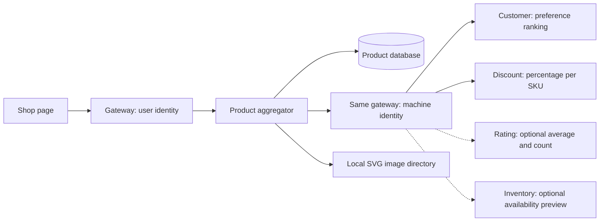

# Personalized catalog: WebFlux aggregation and graceful degradation

## Problem and scenario

Shop needs product names/images/prices, customer preferences, discounts, ratings
and stock. These facts have different owners. Asking the browser to call each
service complicates the UI and exposes internal permissions. PGS builds one
response while preserving service-owned data.

## 1. Start with the trusted customer and PGS product data

The UI calls `GET /api/products` with its access token. Gateway replaces identity
headers. PGS uses the resulting username, not a browser-selected customer ID.
The integrated catalog is restricted to tenant `demo`.

PGS owns the `product` table, reads local SVG images, and delegates preferences,
discounts, ratings and stock to their owning services. All outbound HTTP goes
through gateway with the PGS machine token.



## 2. Keep blocking JDBC off the reactive event loop

Excerpt from [CatalogController.java](../../product-aggregator-service/src/main/java/com/tip/ecommerce/product/CatalogController.java) (surrounding code omitted):

```java
private Mono<List<Map<String, Object>>> products() {
  return Mono.fromCallable(() -> db.queryForList("SELECT * FROM product ORDER BY category,sku"))
      .subscribeOn(Schedulers.boundedElastic());
}
```

JDBC is blocking even when the controller returns a `Mono`. `fromCallable` defers
execution; `subscribeOn(boundedElastic())` runs that work on a scheduler suited to
blocking tasks. This is not R2DBC. The constructor also sets a three-second JDBC
query timeout. Reading product rows still happens before the HTTP fan-out.

## 3. Call independent services concurrently

Excerpt from [CatalogController.java](../../product-aggregator-service/src/main/java/com/tip/ecommerce/product/CatalogController.java) (surrounding code omitted):

```java
var discounts = gateway.get("/api/discounts?skus=" + skus);
// Ratings are optional enrichment; prices and customer identity fail closed.
var ratings =
    gateway
        .get("/api/ratings?skus=" + skus)
        .onErrorReturn(JsonNodeFactory.instance.arrayNode());
var availability =
    gateway
        .get("/api/inventory?skus=" + skus)
        .onErrorReturn(JsonNodeFactory.instance.arrayNode());
return Mono.zip(profile, discounts, ratings, availability)
```

`Mono.zip` subscribes to the independent lookups and combines their results. Batch
SKU APIs avoid one request per product. HTTP latency is approximately the slowest
lookup plus aggregation overhead, rather than the sum of every lookup; token
acquisition and product-query time are additional costs.

Profile and discount failures fail the catalog request. Ratings and availability
have explicit empty-result fallbacks. A stock preview is not a reservation; actual
checkout must still call inventory. Failure fallback must never invent a valid
price or say a reservation succeeded.

## 4. Read the recipient implementations

Customer-service builds a stable ordered set: explicit choices first, then
purchase categories. When both are absent it uses age, then popular defaults.

Excerpt from [ProfileController.java](../../customer-service/src/main/java/com/tip/ecommerce/customer/ProfileController.java) (surrounding code omitted):

```java
ranked.addAll(history);
if (!history.isEmpty()) reason += " and purchases";
if (ranked.isEmpty() && !rows.isEmpty()) {
  int age =
      Period.between(((java.sql.Date) rows.get(0).get("dob")).toLocalDate(), LocalDate.now())
          .getYears();
  ranked.addAll(age < 25 ? List.of("Electronics", "Books") : List.of("Home", "Groceries"));
  reason = "Age-based starter suggestions";
}
if (ranked.isEmpty()) ranked.addAll(List.of("Electronics", "Groceries"));
```

The profile stores email/phone/DOB in the customer database. Internal preferences
return completion/ranking, not the full contact record. Keycloak registration and
customer profile completion are separate actions, not an atomic cross-system signup.

Discount-service owns the percentage lookup:

Excerpt from [LookupController.java](../../product-discount-service/src/main/java/com/tip/ecommerce/discount/LookupController.java) (surrounding code omitted):

```java
  @GetMapping
  @RequireAccess(permissions = "discounts:read")
  public List<Map<String, Object>> batch(@RequestParam List<String> skus) {
    if (skus.isEmpty() || skus.size() > 50)
      throw new org.springframework.web.server.ResponseStatusException(
          org.springframework.http.HttpStatus.BAD_REQUEST, "1–50 SKUs required");
    return db.queryForList(
        "SELECT * FROM product_discount WHERE sku IN ("
            + String.join(",", Collections.nCopies(skus.size(), "?"))
            + ")",
        skus.toArray());
  }
}
```

Rating-service has the same batch shape, requiring `ratings:read` and selecting
from `product_rating`. PGS reads `average` and `reviews`; no user review-write
endpoint exists. These services currently expose seeded read models.

## 5. Protect downstream capacity

Excerpt from [GatewayClient.java](../../product-aggregator-service/src/main/java/com/tip/ecommerce/product/GatewayClient.java) (surrounding code omitted):

```java
private final reactor.netty.resources.ConnectionProvider pool =
    reactor.netty.resources.ConnectionProvider.builder("pgs-http")
        .maxConnections(32)
        .pendingAcquireMaxCount(64)
        .pendingAcquireTimeout(Duration.ofSeconds(2))
        .build();
```

The client also bounds connection/response deadlines, each overall lookup to four
seconds, and buffered response size. These are finite resource limits, not a
configured Resilience4j circuit breaker. Optional failures become missing enrichment;
required failures remain visible.

## 6. Reuse prices safely at checkout

Catalog prices are display estimates. Order-service calls `POST /api/products/quote`
with SKUs and quantities. PGS re-reads products/discounts, applies `BigDecimal`
rounding to two decimal places, and computes line subtotals and total. Quote does
not require customer, rating or stock lookup. Order-service separately checks
profile completeness and rejects a changed expected amount before persisting.

Read [checkout snapshots and idempotency](shopping-and-fulfillment.md) next.
[Purchase events](../kafka/kafka-notes-scenarios.md) explain how confirmed orders update rankings.

## Verify the concept

Follow [catalog verification](manual-verification.md#2-preferences-and-catalog).
Run Portal base, PGS, customer and discount; add rating and inventory for complete
cards. Stop rating alone: products should still load without ratings. Stop discount:
Shop should report an error. Restart stopped services after the exercise.

The product set is deliberately small: five categories and ten products. There is
no pagination, search index, Redis cache or cloud image bucket in the implementation.
