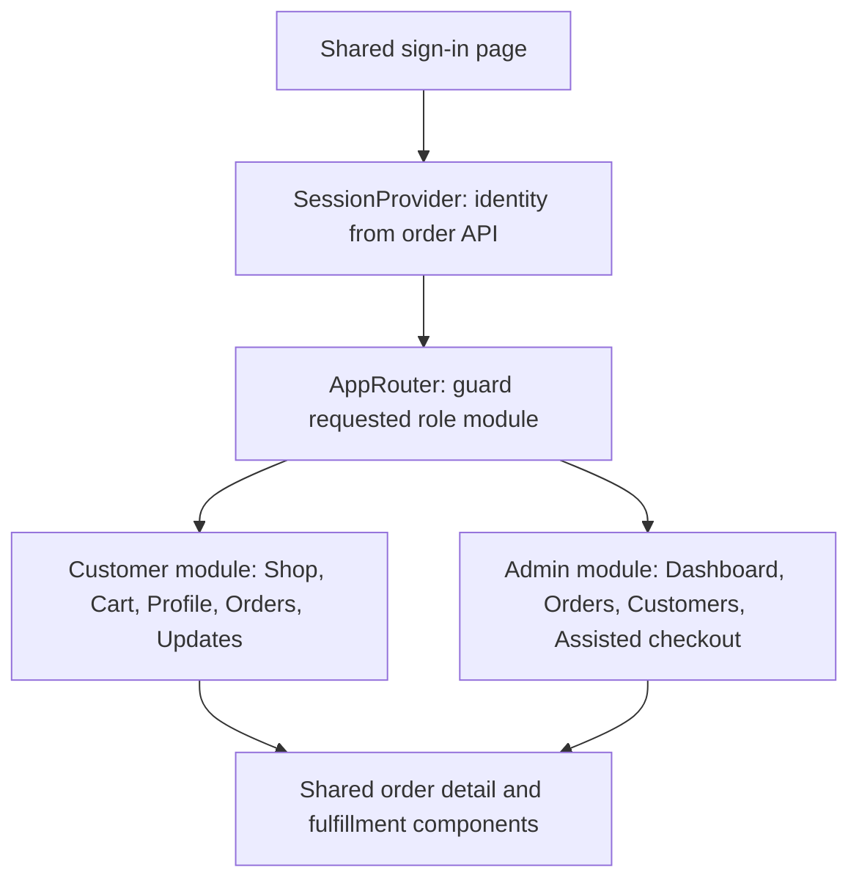

# Frontend modules and cart state

## Problem and scenario

One portal serves customers and administrators, but their pages and actions differ.
Mixing every screen into one component makes responsibilities difficult to follow.
The application shares authentication and reusable order views while keeping
role-specific navigation and pages separate.

## 1. Authenticate once, then select a module

`SessionProvider` loads identity from `/api/orders/security/me` after Keycloak login.
The router checks those returned roles before mounting the selected module:

Excerpt from [AppRouter.jsx](../../ecom-ui/src/app/AppRouter.jsx) (surrounding code omitted):

```jsx
const CustomerModule = lazy(() => import('../modules/customer/CustomerModule'));
const AdminModule = lazy(() => import('../modules/admin/AdminModule'));
```

Excerpt from [AppRouter.jsx](../../ecom-ui/src/app/AppRouter.jsx) (surrounding code omitted):

```jsx
// Guard before mounting/importing a module or its order data provider.
if (!canEnterModule(roles, module))
```

Customer pages live under `src/modules/customer`; admin pages under
`src/modules/admin`. Shared authentication, layout and order views live under
`src/shared`. Admin-only identities do not implicitly receive customer access.



Both role modules mount `OrdersProvider`, which loads `/api/orders`. Consequently
even a profile screen needs order-service for the current portal initialization.
The admin Customers page summarizes order data; it does not query a user directory.

## 2. Browser cart is a convenience, not a trusted order

Excerpt from [CartProvider.jsx](../../ecom-ui/src/modules/customer/shopping/CartProvider.jsx) (surrounding code omitted):

```javascript
const key = `ecom:cart:${identity.tenant}:${identity.subject}`;
```

Excerpt from [CartProvider.jsx](../../ecom-ui/src/modules/customer/shopping/CartProvider.jsx) (surrounding code omitted):

```javascript
useEffect(() => {
  localStorage.setItem(key, JSON.stringify(items));
}, [items, key]);
```

The key includes subject and tenant so different signed-in identities do not share
the same saved cart entry. Quantity changes recalculate a display total using
integer cents. No cart microservice or Redis is involved; there is no cross-device
cart synchronization, and local storage is editable by the browser user.

When Cart opens, it refreshes product prices through PGS. Pay now stays disabled
until that refresh succeeds. Order-service still re-quotes on submission.

## 3. Preserve retry identity until checkout is accepted

Excerpt from [CartPage.jsx](../../ecom-ui/src/modules/customer/pages/CartPage.jsx) (surrounding code omitted):

```javascript
const idempotencyKey =
  saved.signature === signature ? saved.idempotencyKey : crypto.randomUUID();
sessionStorage.setItem(key, JSON.stringify({ signature, idempotencyKey, address }));
const order = await request('/api/orders/checkout', 'POST', {
  items,
  address: address.trim(),
  idempotencyKey,
  expectedAmount: cart.total,
});
```

The same cart/address signature reuses its saved key after a failed request. On
acceptance, the UI clears the cart and navigates to the saved order. Server-side
key locking, payload comparison and price validation remain necessary because a
browser can send arbitrary data. See [checkout implementation](shopping-and-fulfillment.md).

## 4. Verify module isolation and state

Use [manual verification](manual-verification.md): customer navigation should show
Shop/Cart/Profile/Orders/Updates, and admin navigation should show the separate
management pages. Enter an admin URL as a customer and expect Access restricted.
Then call a protected API directly with that customer's token: backend denial is
the actual security proof. Hiding a button alone is insufficient.

The [React README](../../ecom-ui/README.md) maps routes and source folders.
[Application setup](../infra-setup/commerce-setup.md) owns Node, Vite, gateway URL and
Keycloak configuration instructions.
