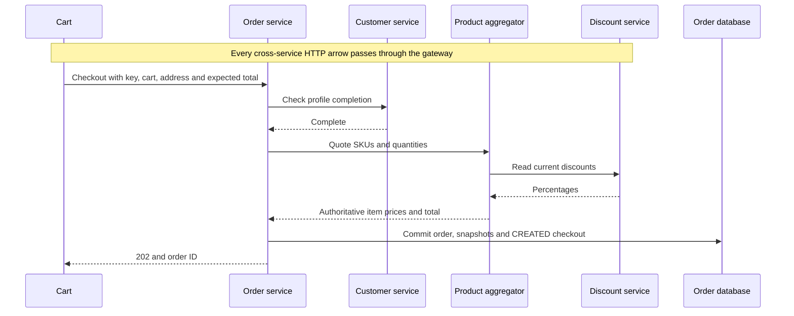
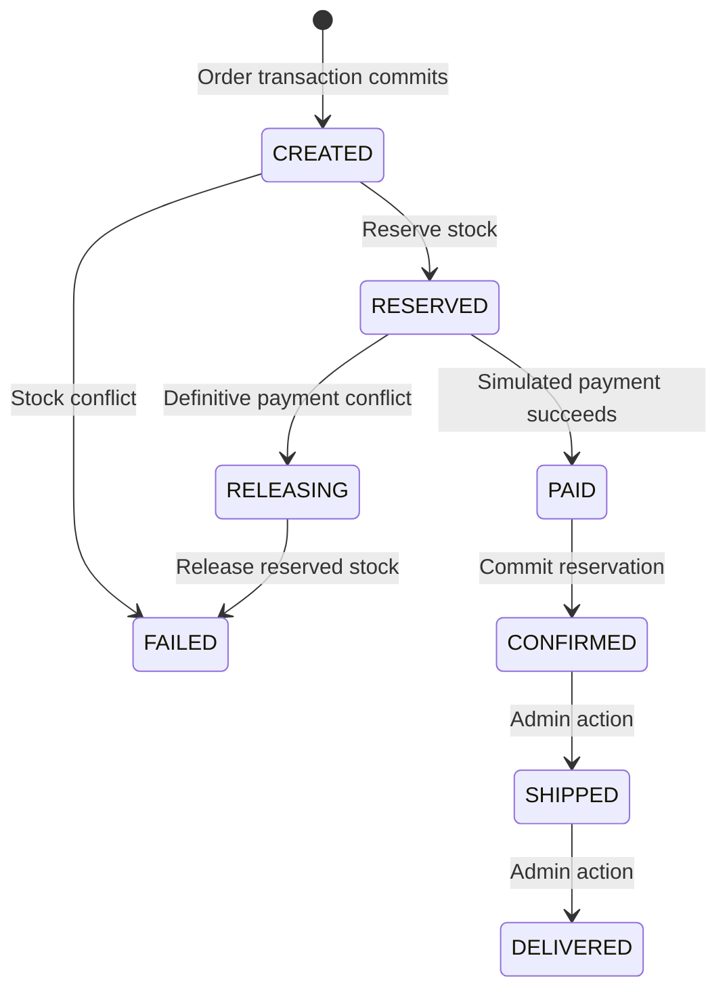

# Checkout: authoritative prices, idempotency and durable orchestration

## 1. Problem and business scenario

A customer clicks Pay now. The browser may retry, stock can change concurrently,
and a dependency can fail after accepting a request. We need one order, one
simulated successful payment, and stock that is neither oversold nor released
while payment success is uncertain.

Order-service coordinates the workflow. PGS supplies a price quote, inventory
owns stock, payment owns payments, and Kafka distributes committed order updates.
See [required running services](business-flows-and-service-dependencies.md) and
[setup](../infra-setup/commerce-setup.md) before running the examples.

## 2. Checkout acceptance: validate and snapshot the authoritative price

React sends SKUs, quantities, address, an idempotency key and an expected total.
It does not decide the charged price. Order-service verifies the customer/profile,
then obtains a new quote through gateway:

Excerpt from [CheckoutService.java](../../order-service/src/main/java/com/tip/ecommerce/order/service/CheckoutService.java) (surrounding code omitted):

```java
// Never trust browser totals: server obtains current prices and snapshots each line.
var quote = gateway.post("/api/products/quote", Map.of("items", req.items()));
if (req.expectedAmount() == null
    || quote.path("amount").decimalValue().compareTo(req.expectedAmount()) != 0)
  throw new ResponseStatusException(
      HttpStatus.CONFLICT, "Prices changed; refresh your cart before paying");
```

PGS applies the current discounts and returns line items:

Excerpt from [CatalogController.java](../../product-aggregator-service/src/main/java/com/tip/ecommerce/product/CatalogController.java) (surrounding code omitted):

```java
  var subtotal =
      ((BigDecimal) p.get("price"))
          .multiply(BigDecimal.valueOf(input.quantity()));
  line.put("subtotal", subtotal);
  lines.add(line);
  total = total.add(subtotal);
}
```

Order-service persists `orders`, `order_item` price/category/name snapshots and a
`checkout` row with state CREATED in one local transaction. HTTP **202 Accepted**
means those records exist; it does not mean payment or stock commit has finished.
Snapshot prices explain why an old order is unchanged by tomorrow's discount.



## 3. Idempotency: retry the same action without repeating its effect

**Problem:** the server commits, but the response is lost. Retrying with a fresh
key would create another order. React saves a key for the same cart/address;
order-service serializes matching keys across replicas using PostgreSQL.

Excerpt from [CheckoutService.java](../../order-service/src/main/java/com/tip/ecommerce/order/service/CheckoutService.java) (surrounding code omitted):

```java
// Serialize identical checkout keys across replicas; retries cannot create duplicate orders.
db.queryForObject(
    "SELECT pg_advisory_xact_lock(hashtextextended(?,0))",
    Object.class,
    caller.tenant() + ":" + owner + ":" + req.idempotencyKey());
String fingerprint =
    json.writeValueAsString(
        List.of(
            req.items().stream().sorted(Comparator.comparing(Line::sku)).toList(),
            req.address().strip()));
var existing =
    db.queryForList(
        "SELECT order_id,request_hash FROM checkout WHERE tenant=? AND customer_id=? AND"
            + " idempotency_key=?",
        caller.tenant(),
        owner,
        req.idempotencyKey());
if (!existing.isEmpty()) {
  if (!existing.get(0).get("request_hash").equals(fingerprint))
    throw new ResponseStatusException(
        HttpStatus.CONFLICT, "Checkout key already used for a different cart");
  return detail(((Number) existing.get(0).get("order_id")).longValue(), caller);
}
```

The key scope is tenant + customer + key. The stored fingerprint compares sorted
items and the normalized address. Same key/same payload returns the previous
order. Same key/different cart or address returns 409. The expected total is checked
for a new order; replay returns the original stored outcome. A new key is a new
business request, so idempotency cannot deduplicate every similar purchase.

## 4. Inventory: atomic reservation under concurrent demand

**Problem:** two checkouts both see one remaining unit. A read-then-write sequence
can oversell. Inventory applies a conditional decrement inside a transaction:

Excerpt from [InventoryController.java](../../inventory-service/src/main/java/com/tip/ecommerce/inventory/controller/InventoryController.java) (surrounding code omitted):

```java
for (var line : sorted)
  if (db.update(
          "UPDATE stock SET available=available-? WHERE sku=? AND available>=?",
          line.quantity(),
          line.sku(),
          line.quantity())
      != 1)
    throw new ResponseStatusException(HttpStatus.CONFLICT, "Insufficient stock: " + line.sku());
```

Only an update with sufficient remaining stock succeeds. A failure throws and
rolls back **all lines** in that reservation. SKU sorting makes lock acquisition
consistent. Reservation identity is `(tenant, order_id)` and the stored item payload
is checked on retry, so the same order cannot reserve twice or change its contents.

`commit` marks the already-decremented reservation COMMITTED; it does not decrement
again. `release` restores quantities once. Both use a row lock and refuse conflicting
finalization. See [InventoryController](../../inventory-service/src/main/java/com/tip/ecommerce/inventory/controller/InventoryController.java).

## 5. Durable checkout state machine

This is a small **orchestrated saga**: order-service stores progress and calls
participants; it is not one transaction spanning three databases.



The scheduled worker locks one eligible workflow so concurrent workers do not
advance the same row simultaneously:

Excerpt from [CheckoutWorker.java](../../order-service/src/main/java/com/tip/ecommerce/order/service/CheckoutWorker.java) (surrounding code omitted):

```java
@Transactional(rollbackFor = Exception.class)
public void step() throws Exception {
  var rows =
      db.queryForList(
          "SELECT * FROM checkout WHERE state IN ('CREATED','RESERVED','PAID','RELEASING') AND"
              + " next_attempt<=now() ORDER BY order_id LIMIT 1 FOR UPDATE SKIP LOCKED");
```

`FOR UPDATE SKIP LOCKED` lets another worker select a different row. CREATED calls
reserve, RESERVED calls payment, PAID calls commit, and RELEASING calls release.
The gateway and Keycloak are dependencies for those machine calls.

On mapped dependency failures the worker sets eligibility to `now() + 10 seconds`.
PostgreSQL `now()` is transaction-start time, so a slow call can leave less than
ten seconds after the failure before retry. See [the timeout/retry guide](../api-gateway/06-timeouts-safe-retries-and-idempotency.md#5-safe-retries-the-saved-checkout-worker-owns-the-decision).
Other exceptions roll the transaction back and are retried by subsequent scheduler
runs. A RESERVED 409 enters compensation; a timeout is **not** proof of payment
failure, so it retries instead of releasing stock. There is no refund implementation.

Remote calls happen while a local database transaction/lock is open. This is a
simple durable learning implementation, with throughput and lock-duration costs;
it is not a full workflow engine with leases, bounded attempts and an operations UI.

## 6. Payment: independent protection against duplicate charges

The order worker can crash after payment commits but before it records PAID.
Payment-service must therefore make that repeat safe independently:

Excerpt from [PaymentServiceImpl.java](../../payment-service/src/main/java/com/tip/ecommerce/payment/service/impl/PaymentServiceImpl.java) (surrounding code omitted):

```java
db.queryForObject("SELECT pg_advisory_xact_lock(?)", Object.class, request.orderId());
var previous =
    paymentRepository.findByOrderIdAndStatus(request.orderId(), PaymentStatus.SUCCESS);
if (previous.isPresent()) {
  if (previous.get().getAmount().compareTo(request.amount()) != 0)
    throw new ResponseStatusException(HttpStatus.CONFLICT, "Payment amount differs");
  return toDto(previous.get());
}
```

The amount must match the pending order on the first payment. The service stores
SUCCESS and a payment-outbox row in one transaction. An identical retry returns
the existing payment; a different amount returns 409. The payment controller
checks user/service access before reaching this logic.

This implementation simulates success locally; no bank is contacted. A real
provider would also need a provider-side idempotency/reconciliation contract.

## 7. Shipping, delivery and events

After stock commit, order-service persists CONFIRMED and an order-outbox event.
An admin can then ship and mark delivered. `CheckoutController` requires admin
plus `orders:update`; `CheckoutService.ship` locks state and allows only
CONFIRMED → SHIPPED → DELIVERED. Repeating the current target is a no-op.

Kafka is **not on the critical path to shopping-order confirmation**. Notification
and preference consumers process order events later. Read [outbox and consumers](../kafka/kafka-notes-scenarios.md)
for the actual producer/consumer snippets and duplicate-delivery behavior.

The legacy `POST /api/orders` amount-only lab is different: its payment-completed
listener confirms the order. That listener explicitly skips orders with a checkout
row so it cannot bypass shopping stock commit.

## 8. Verification

Use [the shared manual walkthrough](manual-verification.md) for order creation,
admin-assisted checkout, shipping, dependency outages and event catch-up.
`docker/keycloak/commerce-smoke-test.py` exercises concurrent retries, price tampering,
stock conflicts and event outcomes against running applications.

## 9. Deliberate scope

There is no real payment gateway, tax, shipping charge, carrier integration,
cancellation, refund or automated dispatch. Shopping uses tenant demo. Order items
are snapshots; no cross-service database joins are used. Catalog and profile are
needed before acceptance; recovery uses saved items and does not need PGS again.
