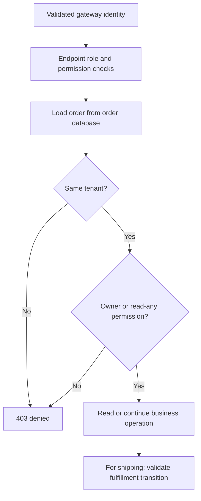

# Authorization inside a microservice: RBAC, permissions and ABAC

## Problem and scenario

Authentication proves customer1 signed in. It does not allow customer1 to ship an
order, read customer2's order, or cross a tenant boundary. The service that owns
the resource must combine identity with business data before acting.

The gateway validates tokens and forwards unsigned identity headers in this POC.
Read [the authentication flow](../api-gateway/03-gateway-security-oauth2-oidc-jwt.md)
first. Clients, grants and credentials are configured in
[Keycloak setup](../infra-setup/keycloak-setup.md), not in this guide.

## 1. RBAC and action permissions at the HTTP boundary

**RBAC** uses a business role such as `admin`. **Permissions** name actions such as
`orders:update`. Shipping requires both; an admin role alone is insufficient.

Excerpt from [CheckoutController.java](../../order-service/src/main/java/com/tip/ecommerce/order/controller/CheckoutController.java) (surrounding code omitted):

```java
  @PostMapping("/{id}/fulfillment/{action}")
  @RequireAccess(role = "admin", permissions = "orders:update")
  public Map<String, Object> advance(
      @PathVariable long id, @PathVariable String action, HttpServletRequest r) throws Exception {
    return checkout.ship(id, action, Caller.from(r));
  }
}
```

The MVC interceptor reads `@RequireAccess`. A required role and a permission rule
must both pass; an array of permissions means **any one** of those permissions.
An application handler without an annotation at method or class level is denied.

Excerpt from [HeaderAuthorizationConfig.java](../../order-service/src/main/java/com/tip/ecommerce/order/security/HeaderAuthorizationConfig.java) (surrounding code omitted):

```java
RequireAccess rule = method.getMethodAnnotation(RequireAccess.class);
if (rule == null) rule = method.getBeanType().getAnnotation(RequireAccess.class);
// Fail closed for application handlers without an explicit authorization policy.
if (rule == null) throw new ResponseStatusException(HttpStatus.FORBIDDEN, "No endpoint policy");
if (!rule.role().isEmpty() && !caller.roles().contains(rule.role()))
    throw new ResponseStatusException(HttpStatus.FORBIDDEN, "Role required");
if (rule.permissions().length > 0 && Arrays.stream(rule.permissions()).noneMatch(caller::has))
    throw new ResponseStatusException(HttpStatus.FORBIDDEN, "Permission required");
```

This pattern is also in payment, inventory, customer, discount, rating and
notification services. PGS uses its reactive `IdentityFilter`, not an MVC
interceptor; the quote controller additionally checks `catalog:quote`.

## 2. ABAC: compare caller attributes with the stored order

**ABAC** means the decision depends on attributes. Here they include the caller's
tenant and username, and the resource's tenant and owner.

Excerpt from [Caller.java](../../order-service/src/main/java/com/tip/ecommerce/order/security/Caller.java) (surrounding code omitted):

```java
    public void requireOwner(String owner, String resourceTenant, String anyPermission) {
        if (!tenant.equals(resourceTenant) || (!username.equals(owner) && !has(anyPermission))) {
            throw new ResponseStatusException(HttpStatus.FORBIDDEN, "Owner/tenant policy denied access");
        }
    }
}
```

`orders:read:any` relaxes ownership only. It does not relax the tenant comparison.
Order detail calls this policy after loading the actual order:

Excerpt from [OrderController.java](../../order-service/src/main/java/com/tip/ecommerce/order/controller/OrderController.java) (surrounding code omitted):

```java
@GetMapping("/{id}")
@RequireAccess(permissions = {"orders:read", "orders:read:any"})
public OrderDto get(@PathVariable Long id, HttpServletRequest http) {
  OrderDto order = orders.getOrder(id);
  Caller.from(http).requireOwner(order.customerId(), order.tenant(), "orders:read:any");
  return order;
}
```

Lists apply the same owner/tenant rule to every returned record. The current list
implementation loads orders before filtering; it is a small-demo approach, not
paged database-side authorization filtering for a large catalog.



Authorization and state validation are separate. An authorized admin still cannot
move CREATED directly to DELIVERED; that is a workflow conflict, not an identity failure.

## 3. Use machine privileges only after checking the user

Checkout resolves the customer from the caller unless an admin explicitly orders
for someone else. It enforces the demo tenant before using its stronger machine
permissions to read a profile or quote prices.

Excerpt from [CheckoutService.java](../../order-service/src/main/java/com/tip/ecommerce/order/service/CheckoutService.java) (surrounding code omitted):

```java
String owner = req.customerId() == null ? caller.username() : req.customerId();
if (!owner.matches("[a-zA-Z0-9@._:-]{1,200}"))
  throw new ResponseStatusException(HttpStatus.BAD_REQUEST, "Valid customer username required");
if (!owner.equals(caller.username()) && !caller.admin())
  throw new ResponseStatusException(
      HttpStatus.FORBIDDEN, "Only administrators can order for another customer");
if (!caller.tenant().equals("demo"))
  throw new ResponseStatusException(
      HttpStatus.FORBIDDEN, "Checkout currently supports demo tenant");
```

This avoids letting a customer use order-service as a proxy for arbitrary customer
lookups. The recipient sees order-service's identity, so order-service is responsible
for authorizing the initiating user. See [client credentials](../api-gateway/04-token-relay-service-to-service-security.md).

## 4. Project policy map

| Scenario                  | Owning service and policy                                                           |
| ------------------------- | ----------------------------------------------------------------------------------- |
| Read/list orders          | Order: `orders:read` or `orders:read:any`, then tenant/owner                        |
| Checkout                  | Order: `orders:create`, caller/customer relationship, demo tenant, complete profile |
| Ship/deliver              | Order: `admin` and `orders:update`, resource access, valid state transition         |
| Pay                       | Payment: `payments:create`, order ownership/tenant, exact pending total in service  |
| Browse products           | PGS: `products:read`, demo tenant                                                   |
| Internal quote            | PGS: `catalog:quote`                                                                |
| Reserve/finalize stock    | Inventory: `inventory:reserve` / `inventory:commit`                                 |
| Save my profile           | Customer: `customers:write`, identity-derived tenant/username                       |
| Read internal preferences | Customer: `customers:read:any`, caller tenant plus requested username               |
| Read discounts/ratings    | Discount/rating: `discounts:read` / `ratings:read`                                  |
| Read inbox                | Notification: identity-scoped customer/tenant query                                 |

Permission names such as `products:write` or `inventory:write` in the realm do not
imply CRUD/restocking endpoints exist. Actual endpoints are defined by controllers.
Inventory stock itself is shared by SKU; its reservation IDs include tenant/order.
The integrated machine chain is demo-scoped, not a complete multi-tenant inventory model.

## 5. Verification and limitations

Run [security checks](../api-gateway/03-gateway-security-oauth2-oidc-jwt.md#manual-verification)
for 401, 403, owner and tenant boundaries. The
[business walkthrough](../project-docs/manual-verification.md) tests admin shipping
and customer visibility with persisted orders.

`OrderAuthorizationTest` checks backend policies with supplied trusted headers;
it does not validate JWT signatures. `IdentityHeadersFilterTest` checks gateway
header replacement. The real security smoke suite joins both boundaries.

There is no downstream JWT verification, signed-header scheme, NetworkPolicy or
mTLS implementation. Direct local calls with forged headers can bypass the gateway
by design. Frontend role guards organize screens and are not API authorization.
