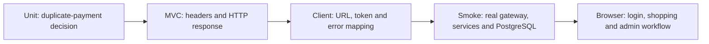

# Testing concepts through payment-service

## Problem and scenario

A duplicate Pay now request must not create another successful payment. An HTTP
response test alone cannot prove the database lock works, while a full application
run is unnecessarily broad for checking a simple service branch. Use different
layers to answer different questions.

## 1. Unit test: isolate a business decision

In a unit test, JUnit runs the test; Mockito supplies collaborators; AssertJ checks
the result. Arrange data, invoke one behavior, then assert the business outcome.

Excerpt from [PaymentServiceImplTest.java](../../payment-service/src/test/java/com/tip/ecommerce/payment/service/impl/PaymentServiceImplTest.java) (surrounding code omitted):

```java
@Test
void retryReturnsSamePayment() {
  when(payments.findByOrderIdAndStatus(1L, PaymentStatus.SUCCESS))
      .thenReturn(Optional.of(payment()));
  assertThat(service.processPayment(new CreatePaymentRequest(1L, BigDecimal.TEN)).id())
      .isEqualTo(10L);
  verify(payments, never()).save(any());
  verifyNoInteractions(orders);
}
```

The test configures a previously successful payment, repeats the request and checks
that no new save or service-layer order lookup occurs. It proves this branch of
`PaymentServiceImpl`, not the HTTP controller or a real PostgreSQL advisory lock.
The controller still does its own order authorization before calling this service.

The `cannotUnderpay` test supplies a stored order total larger than the request and
checks rejection with no payment save. `writesOutboxWithPayment` verifies an outbox
insert is requested; mocking JDBC does not prove real transaction atomicity.

## 2. MVC slice: verify the API contract and policy headers

Excerpt from [PaymentControllerTest.java](../../payment-service/src/test/java/com/tip/ecommerce/payment/controller/PaymentControllerTest.java) (surrounding code omitted):

```java
mockMvc.perform(post("/payments")
                .header("X-Auth-Subject","customer1-id")
                .header("X-Auth-Username","customer1")
                .header("X-Auth-Tenant","demo")
                .header("X-Auth-Roles","customer")
                .header("X-Auth-Permissions","payments:create")
                .contentType(MediaType.APPLICATION_JSON)
                .content(objectMapper.writeValueAsString(request)))
        .andExpect(status().isCreated())
        .andExpect(jsonPath("$.id").value(100))
        .andExpect(jsonPath("$.status").value("SUCCESS"));
```

`@WebMvcTest(PaymentController.class)` loads the MVC slice. `@MockitoBean` supplies
payment/order collaborators. Trusted headers satisfy downstream authorization,
and the test asserts 201 plus the JSON result. There is no Keycloak or gateway JWT
validation in this test. Removing a permission tests a different boundary than
corrupting a real token at the gateway.

## 3. Repository slice: verify entity mapping and derived query

Excerpt from [PaymentRepositoryTest.java](../../payment-service/src/test/java/com/tip/ecommerce/payment/repository/PaymentRepositoryTest.java) (surrounding code omitted):

```java
@Test
public void testFindByOrderIdAndStatus(){
    Payment payment = createPayment(123L,PaymentStatus.SUCCESS);
    Optional<Payment> existingPayment = paymentRepository.findByOrderIdAndStatus(123L, PaymentStatus.SUCCESS);
    assertThat(existingPayment).isPresent();
    assertThat(existingPayment.get().getId()).isEqualTo(payment.getId());
}
```

`@DataJpaTest` exercises persistence mapping and the derived repository query using
the configured test database. This project's tests use H2; they do not establish
PostgreSQL-specific lock behavior or multi-service concurrency correctness.

## 4. HTTP client test: verify the cross-service contract

[OrderServiceClientTest](../../payment-service/src/test/java/com/tip/ecommerce/payment/client/OrderServiceClientTest.java)
provides a WebClient exchange function that asserts the gateway URL and Bearer
machine token, then returns controlled JSON/status responses. It checks mapping
and request construction without contacting the real gateway or Keycloak.

## 5. Running-system tests join the boundaries



| Risk                                         | Existing verification                                  |
| -------------------------------------------- | ------------------------------------------------------ |
| Header spoofing / tenant bypass              | Gateway and order tests; real security smoke suite     |
| Wrong quote / duplicate checkout             | Commerce smoke suite against actual services           |
| Concurrent overselling / multi-line rollback | Commerce smoke suite with real PostgreSQL              |
| Kafka inbox/history outcome                  | Commerce smoke suite and manual broker-outage exercise |
| Broken role navigation / browser login       | React route tests and Playwright workflows             |

See [application setup: verification commands](../infra-setup/commerce-setup.md#6-verification-commands)
for commands/prerequisites, and [manual scenarios](../project-docs/manual-verification.md)
for observable outcomes. Running-system tests create persistent learning data.

## Limits and next exercises

These are complementary checks, not proof of every crash window. The project does
not have comprehensive Testcontainers failure injection, provider payment contracts,
DLQ replay tests or performance/load tests. A useful next test should expose a
new risk, such as a process dying after remote payment commits but before local
workflow state advances. Avoid duplicating an implementation line merely to
increase coverage.
